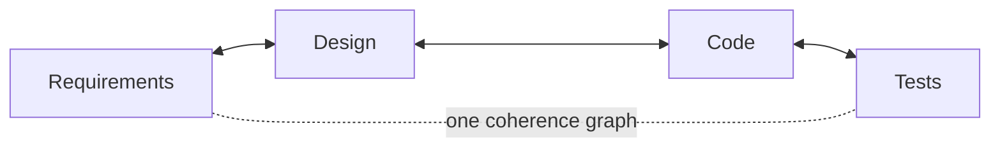

<p align="center">
  <strong>CoDD — Coherence-Driven Development</strong>
</p>

<p align="center">
  <a href="https://pypi.org/project/codd-dev/"></a>
  <a href="https://pypi.org/project/codd-dev/"></a>
  <a href="LICENSE"></a>
  <a href="https://github.com/yohey-w/codd-dev/stargazers"></a>
</p>

<p align="center">
  <a href="README_ja.md">日本語</a> | English | <a href="README_zh.md">中文</a>
</p>

<p align="center">
  <em>Treat requirements, design, code, and tests as <strong>one connected graph</strong> — so AI can build from it, every change propagates across it, and verification can never fake "green."</em>
</p>

---

## What is CoDD?

Software has a coherence problem. Requirements, design docs, code, and tests are supposed to say the same thing — but they drift apart. A change in one place silently breaks another. Documents rot. And when an AI (or a tired human) writes the code, the tests often pass while proving *nothing*.

**CoDD makes that coherence explicit and machine-checked.** It models your project as a single graph whose nodes are *every* artifact — a requirement, a design section, a source file, a config key, a DB table, a test — and whose edges are the dependencies between them (`implements`, `calls`, `reads_config`, `tested_by`, …). With that graph in place, CoDD does three things:

1. **Generate** — turn requirements into design, code, and tests (greenfield autopilot, or one document at a time).
2. **Propagate** — when *anything* changes, walk the graph to find everything affected, upstream and downstream, and reconcile it.
3. **Verify** — run the real build and tests through an **anti-false-green** harness: a run cannot be reported as passing unless it actually proved it.



The arrows go **both ways**. Edit the code and the affected design and requirements light up; add a requirement and the design, code, and tests that must change light up. That bidirectional coherence is the "Co" in CoDD.

### Why it's different

Most AI dev tools make *the model* smarter (better autocomplete, bigger context). CoDD makes *the data you feed the model* smarter: it precomputes the dependency graph so the AI sees exactly what a change touches — with evidence — instead of guessing from whatever files happen to be open. And its verification is built to **refuse false positives**: empty test suites, no-op build scripts (`"build": "true"`), missing reports, disabled checkers, and seeded source mutations all come back **RED**, never a silent pass.

---

## Install

```bash
pip install codd-dev          # Python 3.10+   ·   the command is `codd`
codd version
```

---

## Quick start

### Greenfield — requirements in, working system out

Write what you want as a Markdown requirements doc, then let the unattended autopilot run the whole pipeline (init → elicit → plan → generate → implement → verify with auto-repair → propagate → check):

```bash
codd greenfield --requirements docs/requirements/requirements.md
```

It checkpoints after every unit, so `codd greenfield --resume` picks up where it stopped; `--dry-run` previews the plan, and `--ntfy-topic <topic>` pings you with progress.

### Brownfield — point it at an existing codebase

CoDD reverse-engineers design intent from code, then keeps the two in sync:

```bash
codd init                 # set up CoDD in the repo
codd scan                 # build the dependency graph from the source
codd brownfield           # extract design docs → diff vs. reality → elicit the gaps
```

### Already shipping? Describe the change in plain words

```bash
codd fix "login error messages are confusing"
```

`codd fix [PHENOMENON]` locates the affected design docs, updates them, then flows the change **design → implementation → tests → verify** — patching only the files the graph says are involved, and rolling back exactly those files if the verify gate fails.

---

## How it works — the three pillars

| Pillar | What it does | Key commands |
| --- | --- | --- |
| **1 · Generate from intent** | Requirements → design candidates → code & test scaffolds. The AI proposes; a human chooses (Human-in-the-Loop). | `greenfield`, `generate`, `implement`, `plan` |
| **2 · Propagate change** *(the heart)* | A typed dependency graph across requirements/design/code/config/data/tests. Change anything and CoDD traces the blast radius — classified **Green** (auto-fix), **Amber** (review), **Gray** (FYI) — with the evidence for each edge. | `scan`, `impact`, `propagate`, `diff`, `dag verify` |
| **3 · Verify coherence** | The real build + tests, run so they can't lie. Failures are traced back to the artifacts that caused them. | `verify`, `check`, `coverage`, `contract verify` |

The pillars form a loop: generation decides *what* changes, propagation finds *where* it lands, verification proves it holds — and every commit feeds the graph so the next pass is sharper. (Full concept walk-through: [`docs/explainer.md`](docs/explainer.md).)

---

## What's new in v3.0 — the Contract Kernel

v3.0 makes CoDD's core **language- and framework-agnostic**. The harness no longer hard-codes `go`, `python`, `next`, or any other name — it drives everything from declarative contracts + adapters:

- **Language-free core** — Go, Python, and TypeScript are described entirely by declarative `LanguageProfile`s. Adding a new language is a profile + adapter, with **no core change** (proven by a synthetic language the core has never seen).
- **Framework-pluggable stack** — a framework (e.g. Next.js) and addons (Playwright, Prisma) *compose* with the language into one resolved stack contract that `greenfield` and `verify` consume live. A new framework plugs in the same way.
- **Anti-false-green, owned by the core** — the no-fake-pass invariant lives in the core; profiles can configure parameters but can **never weaken** it. (Verified end-to-end on a real Next.js app, on the actual toolchain, with negative controls for each false-green vector.)

This is what lets one core serve Next.js, Django, FastAPI, Rails, Go services, and more — and lets contributors add support without touching the core.

---

## Works with your AI tools

- **MCP server** — `codd mcp-server` exposes CoDD to any MCP-compatible client (e.g. Claude Code) over stdio.
- **Skills for Claude Code & Codex CLI** — `codd skills install <name> --target both` distributes bundled skills (e.g. greenfield autopilot, brownfield evolution) to `~/.claude/skills/` and `~/.agents/skills/`.
- **Git & editor hooks** — recipes under `codd/hooks/recipes/` run coherence checks after edits or block commits that break coherence.
- **Codex App Server backend** — route AI calls through a persistent JSON-RPC thread instead of per-call subprocess (`codex_app_server.enabled: true` in `codd.yaml`), with automatic subprocess fallback.

---

## Coverage lexicons

CoDD ships **39 industry-standard lexicons** as opt-in coverage axes, so `codd elicit` can find specification holes against real standards — Web (WCAG, OWASP, Web Vitals), Mobile (HIG, Material 3, MASVS), Backend (REST, GraphQL, gRPC), Data (SQL, JSON Schema), Ops (Kubernetes, Terraform, DORA), Compliance (ISO 27001, HIPAA, PCI DSS, GDPR, EU AI Act), and more. They're plug-ins: enable what fits, add your own without touching the core.

---

## Documentation

- [`docs/explainer.md`](docs/explainer.md) — the full concept, from the dependency graph to AI-driven evolution
- [`CHANGELOG.md`](CHANGELOG.md) — every release with quality metrics
- `codd --help` — full CLI reference (`codd check` is the best place to start in any project)
- [`docs/`](docs/) — architecture notes, setup guides, cookbook

---

## Contributing

Issues, PRs, and lexicon proposals are welcome — see [Issues](https://github.com/yohey-w/codd-dev/issues). CoDD is maintained by [@yohey-w](https://github.com/yohey-w), with thanks to the contributors who reported the bugs and insights that shaped it.

---

## License & links

MIT — see [LICENSE](LICENSE).

- [PyPI](https://pypi.org/project/codd-dev/)
- [GitHub Sponsors](https://github.com/sponsors/yohey-w) — support development
- [Issues](https://github.com/yohey-w/codd-dev/issues)
