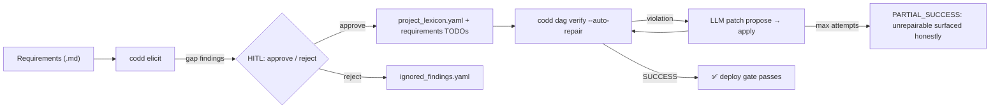
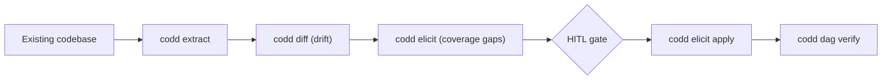

<p align="center">
  <strong>CoDD — Coherence-Driven Development</strong>
</p>

<p align="center">
  <a href="https://pypi.org/project/codd-dev/"></a>
  <a href="https://pypi.org/project/codd-dev/"></a>
  <a href="LICENSE"></a>
  <a href="https://github.com/yohey-w/codd-dev/stargazers"></a>
</p>

<p align="center">
  <a href="README_ja.md">日本語</a> | English | <a href="README_zh.md">中文</a>
</p>

> Write only functional requirements and constraints. CoDD generates the code, repairs the coherence, and verifies the result.

---

## 🌟 Why CoDD

> **"Write only functional requirements and constraints. Code is generated, repaired, and verified automatically."**

Most "AI-assisted dev" tools focus on the **generation** side. CoDD focuses on the **constraint** side: the LLM is most useful when it has a precise picture of what *must* be true. CoDD ties every artifact (requirements → design → lexicon → source → tests → runtime) into a single DAG, drives an LLM repair loop against it, and surfaces what is structurally unrepairable — honestly.

---

## 🚀 Get started in 60 seconds

```bash
pip install codd-dev

# Inside your project root
codd init --suggest-lexicons --llm-enhanced    # AI picks the lexicons that fit
codd elicit                                    # AI finds gaps in your requirements
codd dag verify --auto-repair --max-attempts 10  # AI fixes coherence violations
```

Already shipping? Describe what you want fixed:

```bash
codd fix "login error messages are hard to understand"   # natural-language phenomenon mode
```

`codd fix [PHENOMENON]` is CoDD's second entry-point: state the desired change in plain words, CoDD locates the affected design docs via lexicon + semantic scoring, updates them with an LLM, and runs the DAG verify gate before any code is touched. `--dry-run` previews, `--non-interactive` runs in CI.

---

## 🎨 Visual flow



Brownfield path:



---

## ✨ What it does

CoDD is one CLI organised in four layers. Pick what you need; the rest stays out of your way.

### Core commands

| Command | One-line summary |
| --- | --- |
| 🎯 **`codd init --suggest-lexicons --llm-enhanced`** | LLM scans code/docs, picks the right lexicon plug-ins. |
| 🔍 **`codd elicit`** | Finds *specification holes* against industry-standard lexicons. |
| 🔄 **`codd diff`** | Detects drift between requirements and actual implementation. |
| 🛠️ **`codd dag verify --auto-repair`** | Validates the full DAG; LLM proposes patches; loop until SUCCESS or MAX_ATTEMPTS. |
| 🎯 **`codd fix`** / **`codd fix [PHENOMENON]`** | Two modes — auto-detect CI failures, or describe a desired change in natural language. |
| 🌐 **`codd brownfield`** | Extract → diff → elicit pipeline for existing codebases. |

### Quality gates

| Gate | Purpose |
| --- | --- |
| 🧪 **`codd verify --runtime`** | Step 8 runtime smoke (DB up + dev server reachable + smoke HTTP + real-browser E2E). `--runtime-skip` opts out per category and records the reason. |
| 📊 **`codd lexicon list/install/diff` + `codd coverage report`** | Plug-in management + JSON / Markdown / self-contained HTML coverage matrices. |
| 🛡️ **CI gate** | `.github/workflows/codd_coverage.yml` template + `codd coverage check` exit code blocks coverage regressions on merge. |

### Skills & backends

| Capability | What it gives you |
| --- | --- |
| 🔁 **`codd skills {install,list,remove}`** | Distributes bundled skills (e.g. `codd-evolve`) to `~/.claude/skills/` and `~/.agents/skills/`. `--target {claude,codex,both}`, `--mode {symlink,copy}`, idempotent + `--force`. |
| 🪡 **codd-evolve skill** | Brownfield conversational evolution. Walks requirements → design → lexicon → source → tests → verify → propagate → Step 8 runtime smoke from a single natural-language intent. Stop-and-ask gates for new lexicon terms, breaking changes, and 1:N UI topology. |
| ⚡ **Codex App Server backend** (v2.20.0) | Set `codex_app_server.enabled: true` in `codd.yaml` to route AI calls through a persistent JSON-RPC thread instead of subprocess. `thread_strategy: per_session` amortises codex cold-start across `codd implement` / `codd verify --auto-repair` / `codd fix`. Automatic `subprocess` fallback when the binary or socket is missing. |

### Lexicon plug-ins

38 industry-standard lexicons ship as opt-in coverage axes — Web (WCAG / OWASP / Web Vitals / WebAuthn / forms / SEO / PWA), Mobile (HIG / Material 3 / a11y / MASVS), Backend (REST / GraphQL / gRPC / events), Data (SQL / JSON Schema / event sourcing / governance), Ops (CI/CD / Kubernetes / Terraform / observability / DORA), Compliance (ISO 27001 / HIPAA / PCI DSS / GDPR / EU AI Act), Process (ISO 25010 / 29119 / DDD / 12-factor / i18n / model cards / API rate-limit), and Methodology (BABOK).

---

## 📊 Case study

Dogfooded against a Next.js + Prisma + PostgreSQL multi-tenant LMS (~30 design docs, 12 DB tables, RLS-enforced isolation): `codd init --suggest-lexicons` matched 9 of 10 manually-chosen lexicons, `codd elicit` surfaced 70 spec holes, `codd dag verify --auto-repair` drove 16 unrepairable violations down to **PASS or amber-WARN with deploy allowed** — without a single line of CoDD core change per project. Project-specific concerns live entirely in `project_lexicon.yaml` and `codd_plugins/`.

---

## 🧱 Generality Gate (three-layer architecture)

| Layer | Where stack-specific names live | Examples |
| --- | --- | --- |
| **A — Core** | **Nowhere.** Zero `react`, `django`, `Stripe`, `LMS` literals. | `codd/elicit/`, `codd/dag/`, `codd/lexicon_cli/` |
| **B — Templates** | Generic placeholders only. | `codd/templates/*.j2`, `codd/templates/lexicon_schema.yaml` |
| **C — Plug-ins** | Free to name anything. | `codd_plugins/lexicons/*/`, `codd_plugins/stack_map.yaml` |

This is what lets one core work for Next.js, Django, FastAPI, Rails, Go services, mobile apps, ML model cards — and lets contributors add a lexicon without touching the core.

---

## 🧭 Roadmap

Up next:

- Auto-propagation of impl/test changes from `codd fix [PHENOMENON]` (AC #8 completion)
- App-Server-driven benchmark publication (P50 / P95 / P99 for subprocess vs JSON-RPC)
- Lexicon plug-in marketplace

Past releases (v2.11.0 → v2.20.0) live in [CHANGELOG.md](CHANGELOG.md) with quality metrics.

---

## 🤝 Contributing

CoDD is shaped by:

- **[@yohey-w](https://github.com/yohey-w)** — Maintainer / Architect
- **[@Seika86](https://github.com/Seika86)** — Sprint regex insight (PR #11)
- **[@v-kato](https://github.com/v-kato)** — Brownfield reproduction reports (Issues #17 / #18 / #19 / #20 / #21 / #22)
- **[@dev-komenzar](https://github.com/dev-komenzar)** — `source_dirs` bug reproduction (Issue #13)

Issues, PRs, and lexicon proposals are welcome — see [Issues](https://github.com/yohey-w/codd-dev/issues).

---

## 📚 Documentation

- [CHANGELOG.md](CHANGELOG.md) — every release with quality metrics
- [docs/](docs/) — architecture notes
- `codd --help` — full CLI reference

---

## 📦 Hook Integration

CoDD ships hook recipes for editor and Git workflows:

- Claude Code `PostToolUse` hook recipe for running CoDD checks after file edits
- Git `pre-commit` hook recipe for blocking commits when coherence checks fail

Recipes live under `codd/hooks/recipes/`.

---

## License

MIT — see [LICENSE](LICENSE).

## Links

- [PyPI](https://pypi.org/project/codd-dev/)
- [GitHub Sponsors](https://github.com/sponsors/yohey-w) — support development
- [Issues](https://github.com/yohey-w/codd-dev/issues)

---

> When code changes, CoDD traces the impact, detects violations, and produces evidence for merge decisions.
