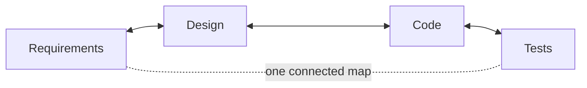

<p align="center">
  <strong>CoDD — Coherence-Driven Development</strong>
</p>

<p align="center">
  <a href="https://pypi.org/project/codd-dev/"></a>
  <a href="https://pypi.org/project/codd-dev/"></a>
  <a href="LICENSE"></a>
  <a href="https://github.com/yohey-w/codd-dev/stargazers"></a>
</p>

<p align="center">
  <a href="README_ja.md">日本語</a> | English | <a href="README_zh.md">中文</a>
</p>

<p align="center">
  <em>Write what you want. CoDD builds it from your requirements, keeps the docs and code in sync as things change, and runs the tests so they can't fake a "pass."</em>
</p>

---

## What is CoDD?

Picture a normal day on a real codebase:

- You change one function — and three other places that quietly depended on it break, because nobody remembered they were connected.
- The test suite goes green — but it never actually ran the code you just changed.
- The design doc still describes how the feature worked last month.

On a large project — or on code an AI wrote for you — this kind of drift is everywhere, and *"is everything still consistent?"* becomes impossible to answer by hand.

**CoDD turns that question into something a machine can answer.**

It builds a **map of how everything in your project connects** — which requirement is implemented by which code, which code is covered by which test, which config value switches which behavior. Once CoDD has that map, it can do three things for you:

1. **Build** — turn your requirements into design, code, and tests.
2. **Trace** — when you change anything, show everything the change affects, so nothing breaks silently.
3. **Verify** — run the real build and tests through a check that **refuses to report a fake pass**.



The map works **both ways**: edit the code, and CoDD points to the design docs and requirements that are now out of date; add a requirement, and it points to the code and tests that need to change. That two-way consistency is the "Co" (coherence) in CoDD.

### How is this different from Copilot or Cursor?

Those tools make the *AI* smarter. CoDD makes the AI's *input* smarter. It hands the AI the exact map of what a change touches — with evidence for each connection — instead of letting it guess from whatever files happen to be open. And CoDD's verification is built so it **can't lie**: an empty test suite, a build script that's secretly just `true`, a missing test report — all come back **red**, never a quiet green.

---

## Install

```bash
pip install codd-dev          # needs Python 3.10+   ·   the command is `codd`
codd version
```

---

## Try it

There are three ways to start, depending on where you are.

### 1. Start a brand-new project — `codd greenfield`

Write what you want as a plain Markdown file, then let CoDD build the whole thing unattended (design → code → tests → verify, fixing problems as it goes):

```bash
codd greenfield --requirements docs/requirements/requirements.md
```

It saves a checkpoint after every step, so `codd greenfield --resume` continues where it left off. Add `--dry-run` to preview the plan first, or `--ntfy-topic <topic>` to get progress pings on your phone.

The same one-command pipeline (`codd greenfield --requirements FILE`) also ships as three transparent, adaptable vehicles you can read and tweak: a shell script ([`examples/greenfield_autopilot.sh`](examples/greenfield_autopilot.sh)), a Claude Code workflow ([`examples/claude_workflows/codd-greenfield.js`](examples/claude_workflows/codd-greenfield.js)), and a skill (`codd skills install codd-greenfield --target both`).

### 2. Work on an existing codebase — `codd init` + `codd scan`

CoDD reads your existing code, works out the design behind it, and keeps the two in sync from then on:

```bash
codd init                 # set CoDD up in your repo
codd scan                 # build the connection map from your code
codd brownfield           # recover design docs, compare them to reality, list the gaps
```

### 3. Already shipping? Just describe the change — `codd fix`

```bash
codd fix "the login error messages are confusing"
```

CoDD finds the design docs your request touches, updates them, then carries the change through **design → code → tests → verify**. It only edits the files the map says are involved, and if the final check fails, it rolls back exactly those files — nothing else.

---

## How it works — three jobs, one map

| Job | What it does | Main commands |
| --- | --- | --- |
| **1. Build from intent** | Turns requirements into design options, then code and test scaffolding. The AI proposes; you choose (you stay in control). | `greenfield`, `generate`, `implement`, `plan` |
| **2. Trace every change** *(the core)* | A connection map across requirements, design, code, config, data, and tests. Change one thing and CoDD shows the ripple — sorted into **Green** (safe to auto-fix), **Amber** (please review), **Gray** (just so you know) — with the reason for each link. | `scan`, `impact`, `propagate`, `diff` |
| **3. Verify for real** | Runs your actual build and tests so they can't fake a pass, and traces any failure back to the artifact that caused it. | `verify`, `check`, `coverage` |

These three feed each other in a loop: building decides *what* changes, tracing finds *where* it lands, verifying proves it holds — and every commit you make sharpens the map for next time. (Want the full story? See [`docs/explainer.md`](docs/explainer.md).)

---

## New in v3.0 — the Contract Kernel

Older CoDD had knowledge of specific languages and frameworks (Go, Python, Next.js…) baked into its core. **v3.0 takes all of that out of the core** and moves it into swappable description files ("profiles") plus small adapters:

- **The core no longer knows any language or framework by name.** It just reads the profiles. So adding support for a new language or framework is a new profile + adapter — **no change to the core**.
- **Frameworks compose.** Next.js + TypeScript + Playwright + Prisma combine into one resolved description that `codd verify` runs against your project, live.
- **The "no fake green" rule belongs to the core.** A profile can adjust settings, but it can **never weaken** the anti-fake-pass guarantee. (Proven end-to-end on a real Next.js app, on the actual toolchain, with deliberate breakages that each correctly come back red.)

In short: one core now serves Next.js, Django, FastAPI, Rails, Go services, and more — and anyone can add support without touching it.

---

## Use it with your AI tools

- **MCP server** — `codd mcp-server` exposes CoDD to any MCP client (such as Claude Code) over stdio.
- **Skills for Claude Code & Codex CLI** — `codd skills install <name> --target both` drops ready-made skills (e.g. the greenfield autopilot) into `~/.claude/skills/` and `~/.agents/skills/`.
- **Codex App Server** — route AI calls through a persistent connection instead of a fresh subprocess each time (`codex_app_server.enabled: true` in `codd.yaml`), with automatic fallback.

---

## Hook Integration

CoDD ships ready-made hook recipes (under `codd/hooks/recipes/`) so coherence checks run automatically as you work:

- **Claude Code `PostToolUse` hook** — runs CoDD checks right after each file edit.
- **Git `pre-commit` hook** — blocks a commit when it would break coherence.
- **Git `post-commit` hook** and a **Codex CLI hook** — keep the connection map fresh as you commit.
- **A requirements-nudge recipe** (`claude_requirements_nudge.json`) — reminds you to re-run `codd greenfield --resume` when your requirements change (print-only; it never runs a pipeline on its own).

Copy the recipe you want from `codd/hooks/recipes/` into your editor or Git config to turn it on.

---

## Coverage lexicons

CoDD ships **39 ready-made "lexicons"** — checklists drawn from real industry standards — that you can switch on so `codd elicit` finds the gaps in your spec. They span Web (WCAG, OWASP, Web Vitals), Mobile (HIG, Material 3, MASVS), Backend (REST, GraphQL, gRPC), Data (SQL, JSON Schema), Ops (Kubernetes, Terraform, DORA), Compliance (ISO 27001, HIPAA, PCI DSS, GDPR, EU AI Act), and more. Turn on the ones that fit; add your own without touching the core.

---

## Documentation

- [`docs/explainer.md`](docs/explainer.md) — the full idea, from the connection map to AI-driven development
- [`CHANGELOG.md`](CHANGELOG.md) — every release
- `codd --help` — the full command reference (in any project, `codd check` is the best place to start)
- [`docs/`](docs/) — architecture notes, setup guides, and a cookbook

---

## Contributing

Issues, pull requests, and lexicon proposals are all welcome — see [Issues](https://github.com/yohey-w/codd-dev/issues). CoDD is maintained by [@yohey-w](https://github.com/yohey-w), with thanks to everyone who reported the bugs and ideas that shaped it.

---

## License & links

MIT — see [LICENSE](LICENSE).

- [PyPI](https://pypi.org/project/codd-dev/)
- [GitHub Sponsors](https://github.com/sponsors/yohey-w) — support development
- [Issues](https://github.com/yohey-w/codd-dev/issues)
