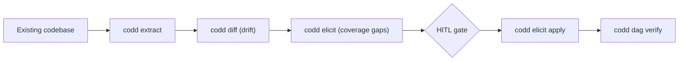

<p align="center">
  <strong>CoDD — Coherence-Driven Development</strong>
</p>

<p align="center">
  <a href="https://pypi.org/project/codd-dev/"></a>
  <a href="https://pypi.org/project/codd-dev/"></a>
  <a href="LICENSE"></a>
  <a href="https://github.com/yohey-w/codd-dev/stargazers"></a>
</p>

<p align="center">
  <a href="README_ja.md">日本語</a> | English | <a href="README_zh.md">中文</a>
</p>

---

## 🚀 Get started in 60 seconds

```bash
pip install codd-dev

# Inside your project root
codd init --suggest-lexicons --llm-enhanced   # AI picks the lexicons that fit
codd elicit                                    # AI finds gaps in your requirements
codd dag verify --auto-repair --max-attempts 10  # AI fixes coherence violations
```

That's it. Three commands, three feedback loops, one coherent project.

> Real-world: dogfooded against a Next.js + Prisma + PostgreSQL LMS. See [Case study](#-case-study-real-world-lms).

---

## ✨ What it does

| Command | One-line summary |
| --- | --- |
| 🔍 **`codd elicit`** | LLM finds **specification holes** in your requirements, scoped against industry-standard lexicons (BABOK, OWASP, WCAG, PCI DSS, ISO 25010, …). |
| 🔄 **`codd diff`** | Detects **drift** between requirements and the actual implementation (brownfield-friendly). |
| 🛠️ **`codd dag verify --auto-repair`** | Validates the requirements → design → implementation → tests DAG; an LLM proposes patches when violations appear and the loop retries until SUCCESS or MAX_ATTEMPTS. |
| 📦 **38 lexicon plug-ins** | Industry standards bundled as opt-in coverage axes — Web (WCAG / OWASP / Web Vitals / WebAuthn / forms / SEO / PWA / browser-compat / responsive), Mobile (HIG / Material 3 / a11y / MASVS), Backend (REST / GraphQL / gRPC / events), Data (SQL / JSON Schema / event sourcing / governance), Ops (CI/CD / Kubernetes / Terraform / observability / DORA), Compliance (ISO 27001 / HIPAA / PCI DSS / GDPR / EU AI Act), Process (ISO 25010 / 29119 / DDD / 12-factor / i18n / model cards / API rate-limit), and Methodology (BABOK). |
| 🌐 **`codd brownfield`** | Extract → diff → elicit pipeline: point CoDD at an existing codebase and it reverse-engineers requirements, finds drift, and surfaces gaps in one shot. |
| 🎯 **`codd init --suggest-lexicons --llm-enhanced`** | LLM reads your code/docs, identifies data types and function traits, and recommends which lexicons to install (with confidence + reasoning). |
| 📊 **`codd lexicon list/install/diff` + `codd coverage report`** | Manage plug-ins and produce JSON / Markdown / self-contained HTML coverage matrices. |
| 🛡️ CI gate | `.github/workflows/codd_coverage.yml` template + `codd coverage check` exit code make coverage regressions block merges. |

---

## 🎨 Visual flow

```mermaid
flowchart LR
    R["Requirements (.md)"] --> E["codd elicit"]
    E -->|gap findings| H{HITL: approve / reject}
    H -->|[x]| L["project_lexicon.yaml + requirements TODOs"]
    H -->|[r]| I["ignored_findings.yaml"]
    L --> V["codd dag verify --auto-repair"]
    V -->|violation| AR["LLM patch propose → apply"]
    AR --> V
    V -->|SUCCESS| D["✅ deploy gate passes"]
    AR -->|max attempts| P["PARTIAL_SUCCESS: unrepairable surfaced honestly"]
```

Brownfield path:



---

## 📊 Case study: real-world LMS

A Next.js + Prisma + PostgreSQL multi-tenant LMS (≈30 design docs, 12 DB tables, RLS-enforced isolation):

| Stage | Result |
| --- | --- |
| `codd init --suggest-lexicons --llm-enhanced` | LLM detected **data types** (PII / payment / video) and **function traits** (auth / payment / public REST), recommended 15 lexicons, 9 of which the human had already chosen — confirming the heuristic. |
| `codd elicit` (10 lexicons loaded, scope=`system_implementation`, phase=`mvp`) | **70 findings** across web a11y / data governance / SQL / security / Web Vitals / WebAuthn / API / process. Business-tier dimensions (KPI, UAT detail, risk register) auto-filtered out. |
| `codd dag verify --auto-repair` | Started with 16 unrepairable violations; through targeted core fixes (deployment chain auto-discovery, runtime-state auto-binding, mock harness no-op, scope/phase filter) the same project now reaches **PASS or amber-WARN** with deploy allowed. |
| VPS smoke (`/`, `/login`, `/api/health`) | All 3 endpoints **200 OK**. |

The full pipeline change is **zero lines of CoDD core changes per project** — every project-specific concern lives in `project_lexicon.yaml` or in `codd_plugins/` (Generality Gate, Layer A / B / C).

---

## 🌟 Why CoDD exists

> **"Write only functional requirements and constraints. Code is generated, repaired, and verified automatically."**

Most "AI-assisted dev" tools focus on the **generation** side. CoDD focuses on the **constraint** side: the LLM is most useful when it has a precise picture of what *must* be true. CoDD provides that picture as a DAG that links every artifact, plus a plug-in surface that lets industry standards (BABOK / WCAG / OWASP / PCI / ISO …) supply the constraints mechanically.

When something breaks the DAG, an LLM proposes a patch, the loop re-verifies, and either reaches SUCCESS or surfaces what is structurally unrepairable — honestly.

### Generality Gate (three-layer architecture)

| Layer | Where stack-specific names live | Examples |
| --- | --- | --- |
| **A — Core** | **Nowhere.** Zero `react`, `django`, `Stripe`, `LMS` literals. | `codd/elicit/`, `codd/dag/`, `codd/lexicon_cli/` |
| **B — Templates** | Generic placeholders only. | `codd/templates/*.j2`, `codd/templates/lexicon_schema.yaml` |
| **C — Plug-ins** | Free to name anything. | `codd_plugins/lexicons/*/`, `codd_plugins/stack_map.yaml` |

This is what lets CoDD ship one core that works for Next.js, Django, FastAPI, Rails, Go services, mobile apps, ML model cards — and that lets contributors add a lexicon without touching the core.

---

## 🧭 Roadmap

- **v2.17.0 (current)** — `node_completeness` honours `kind: common` (cmd_470). Fixes a v2.15.0 oversight: `expects` edges pointing at common (shared infrastructure) nodes were misreported as missing impl files even when the file existed. 6 new tests, 2914 total PASS, SKIP=0. See [CHANGELOG](CHANGELOG.md).
- **v2.16.0** — `codd fix [PHENOMENON]` — North Star entry-point 2 (cmd_468). Express a desired change in natural language; CoDD identifies affected design docs via Tier-1 lexicon + Tier-2 semantic scoring, updates them with LLM, runs the DAG verify gate. Full interactive HITL (candidate selection, ambiguity clarification, risk confirmation) with `--non-interactive` for CI. 66 new tests, 2908 total PASS, SKIP=0.
- **v2.15.0** — `kind: common` for shared infrastructure (cmd_467). C5 amber −79.2% on dogfood project (125 → 26). `**` glob translator fix.
- **v2.14.0** — 8 structural gaps closed (cmd_466 dogfood). Sidecar `<test>.codd.yaml` with `verified_by:` (C6) / `axis_matrix:` (C9); lexicon schema SSoT; completeness_audit batch; `scan.exclude` bug fix (−52%); `codd dag verify --auto-repair`; elicit mock-AI sentinel; AI timeout 3600 s SSoT. Red 22 → 0.
- **v2.13.0** — Opt-out protection: `OptOutPolicy` requires `justification` + `expires_at`. Silent SKIP abolished; severity preserved.
- **v2.12.0** — Test-completeness gates: C7 amber promotion + C8 `ci_health` static check.
- **v2.11.0** — Sprint-less `codd implement` (`--design <path> --output <dir>` directly).
- **v2.18.0 (next)** — impl/test auto-propagation from PHENOMENON (AC #8 completion); Codex wrapper for PHENOMENON mode.

---

## 🤝 Contributing

CoDD is shaped by the following people:

- **[@yohey-w](https://github.com/yohey-w)** — Maintainer / Architect
- **[@Seika86](https://github.com/Seika86)** — Sprint regex insight (PR #11)
- **[@v-kato](https://github.com/v-kato)** — Brownfield reproduction reports (Issues #17 / #18 / #19)
- **[@dev-komenzar](https://github.com/dev-komenzar)** — `source_dirs` bug reproduction (Issue #13)

External issues, PRs, and lexicon proposals are welcome — see [Issues](https://github.com/yohey-w/codd-dev/issues).

---

## 📚 Documentation

- [CHANGELOG.md](CHANGELOG.md) — every release with quality metrics
- [docs/](docs/) — architecture notes
- `codd --help` — full CLI reference

---

## 📦 Hook Integration

CoDD ships hook recipes for editor and Git workflows:

- Claude Code `PostToolUse` hook recipe for running CoDD checks after file edits
- Git `pre-commit` hook recipe for blocking commits when coherence checks fail

Recipes live under `codd/hooks/recipes/`.

---

## License

MIT — see [LICENSE](LICENSE).

## Links

- [PyPI](https://pypi.org/project/codd-dev/)
- [GitHub Sponsors](https://github.com/sponsors/yohey-w) — support development
- [Issues](https://github.com/yohey-w/codd-dev/issues)

---

> When code changes, CoDD traces the impact, detects violations, and produces evidence for merge decisions.
