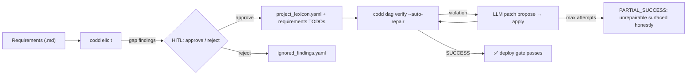
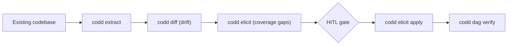

<p align="center">
  <strong>CoDD — Coherence-Driven Development</strong>
</p>

<p align="center">
  <a href="https://pypi.org/project/codd-dev/"></a>
  <a href="https://pypi.org/project/codd-dev/"></a>
  <a href="LICENSE"></a>
  <a href="https://github.com/yohey-w/codd-dev/stargazers"></a>
</p>

<p align="center">
  日本語 | <a href="README.md">English</a> | <a href="README_zh.md">中文</a>
</p>

> 機能要件と制約だけを書く。コード生成・整合性修復・検証は CoDD が行う。

---

## 🌟 なぜ CoDD なのか

> **「機能要件と制約だけ書けば、コードは自動生成・自動修復・自動検証される」**

ほとんどの「AI 支援開発」ツールは **生成** 側に注力する。CoDD は **制約** 側に注力する。LLM は「何が真であるべきか」が精緻に与えられたときに最も役立つ — CoDD はその精緻像を、要件 → 設計 → lexicon → ソース → テスト → ランタイムを 1 本につなぐ DAG として提供し、LLM 修復ループで違反を直し、構造的に直せないものは正直に表面化する。

---

## 🚀 60秒で始める

```bash
pip install codd-dev

# プロジェクトルートで
codd init --suggest-lexicons --llm-enhanced    # AI が lexicon を選定
codd elicit                                    # AI が要件の穴を発見
codd dag verify --auto-repair --max-attempts 10  # AI が整合性違反を修復
```

既存プロジェクトに使うなら、自然言語で「直したい現象」を伝える:

```bash
codd fix "ログインのエラーメッセージが分かりにくい"   # PHENOMENON モード
```

`codd fix [PHENOMENON]` は CoDD の2つ目の入口。自然言語で変更要望を伝えると、CoDD が関連設計書を lexicon + 意味類似スコアで特定し、LLM が更新、DAG verify ゲートに通してから初めてコードを触る。`--dry-run` でプレビュー、`--non-interactive` で CI 実行可。

---

## 🎨 ビジュアルフロー



Brownfield (既存資産) パス:



---

## ✨ できること

CoDD は 1 つの CLI が 4 つのレイヤーに整理されている。必要なものだけ使えばよい。

### コアコマンド

| コマンド | 一言で |
| --- | --- |
| 🎯 **`codd init --suggest-lexicons --llm-enhanced`** | LLM がコード/ドキュメントを読み、適切な lexicon プラグインを選定。 |
| 🔍 **`codd elicit`** | 業界標準 lexicon に対する *仕様の穴* を発見。 |
| 🔄 **`codd diff`** | 要件と実装の **ドリフト** を検出 (Brownfield 対応)。 |
| 🛠️ **`codd dag verify --auto-repair`** | 全 DAG を検証、LLM が patch を提案、SUCCESS または MAX_ATTEMPTS までループ。 |
| 🎯 **`codd fix`** / **`codd fix [PHENOMENON]`** | 2 モード — CI 失敗の自動検出、または自然言語での変更要望。 |
| 🌐 **`codd brownfield`** | 既存コードベース用の Extract → diff → elicit パイプライン。 |

### 品質ゲート

| ゲート | 役割 |
| --- | --- |
| 🧪 **`codd verify --runtime`** | Step 8 ランタイム smoke (DB 起動 + dev server 疎通 + smoke HTTP + 実ブラウザ E2E)。`--runtime-skip` でカテゴリ別 skip + 理由を report に記録。 |
| 📊 **`codd lexicon list/install/diff` + `codd coverage report`** | プラグイン管理 + JSON / Markdown / 自己完結 HTML カバレッジマトリクス。 |
| 🛡️ **CI ゲート** | `.github/workflows/codd_coverage.yml` テンプレ + `codd coverage check` の exit code でカバレッジ後退を merge ブロック。 |

### スキル + バックエンド

| 機能 | 概要 |
| --- | --- |
| 🔁 **`codd skills {install,list,remove}`** | 同梱スキル (例 `codd-evolve`) を `~/.claude/skills/` と `~/.agents/skills/` に配布。`--target {claude,codex,both}` / `--mode {symlink,copy}`、idempotent + `--force`。 |
| 🪡 **codd-evolve スキル** | Brownfield 対話進化。自然言語の機能変更要求から要件 → 設計 → lexicon → ソース → テスト → verify → propagate → Step 8 ランタイム smoke を 1 チェーンで実行。新語追加 / breaking change / 1:N UI トポロジ等の stop-and-ask ゲート内蔵。 |
| ⚡ **Codex App Server バックエンド** (v2.20.0) | `codd.yaml` の `codex_app_server.enabled: true` で AI 呼び出しを永続 JSON-RPC スレッド経由に切替 (subprocess の代替)。`thread_strategy: per_session` で `codd implement` / `codd verify --auto-repair` / `codd fix` 全体に codex のコールドスタートを償却。バイナリ/ソケット欠落時は自動 subprocess フォールバック。 |

### Lexicon プラグイン

業界標準 38 プラグインを opt-in カバレッジ軸として提供 — Web (WCAG / OWASP / Web Vitals / WebAuthn / フォーム / SEO / PWA)、Mobile (HIG / Material 3 / a11y / MASVS)、Backend (REST / GraphQL / gRPC / events)、Data (SQL / JSON Schema / event sourcing / governance)、Ops (CI/CD / Kubernetes / Terraform / observability / DORA)、Compliance (ISO 27001 / HIPAA / PCI DSS / GDPR / EU AI Act)、Process (ISO 25010 / 29119 / DDD / 12-factor / i18n / model cards / API rate-limit)、Methodology (BABOK)。

---

## 📊 ケーススタディ

Next.js + Prisma + PostgreSQL のマルチテナント LMS (設計書約 30 / DB テーブル 12 / RLS 強制隔離) で dogfood: `codd init --suggest-lexicons` は手動選定 10 のうち 9 を一致、`codd elicit` で仕様穴 70 件を抽出、`codd dag verify --auto-repair` で当初 16 件の修復不能違反を **PASS または amber-WARN (deploy 可)** まで圧縮 — プロジェクト個別の CoDD コア改変は **0 行**。プロジェクト固有事項は `project_lexicon.yaml` と `codd_plugins/` に完結。

---

## 🧱 Generality Gate (3層アーキテクチャ)

| Layer | スタック固有名の存在箇所 | 例 |
| --- | --- | --- |
| **A — Core** | **どこにもない。** `react` / `django` / `Stripe` / `LMS` 等のリテラル 0。 | `codd/elicit/`, `codd/dag/`, `codd/lexicon_cli/` |
| **B — Templates** | 汎用プレースホルダーのみ。 | `codd/templates/*.j2`, `codd/templates/lexicon_schema.yaml` |
| **C — Plug-ins** | 何でも自由に命名可。 | `codd_plugins/lexicons/*/`, `codd_plugins/stack_map.yaml` |

これにより 1 つのコアが Next.js / Django / FastAPI / Rails / Go サービス / モバイル / ML モデルカード等で動き、コントリビューターはコアを触らずに lexicon を追加できる。

---

## 🧭 Roadmap

次期計画:

- `codd fix [PHENOMENON]` の impl/test 自動波及完成 (AC #8)
- App Server ベンチマーク公開 (subprocess vs JSON-RPC の P50 / P95 / P99)
- lexicon プラグインマーケットプレイス

過去リリース (v2.11.0 → v2.20.0) は [CHANGELOG.md](CHANGELOG.md) に品質メトリクス付きで記録。

---

## 🤝 貢献者

CoDD は以下の方々により形作られている:

- **[@yohey-w](https://github.com/yohey-w)** — Maintainer / Architect
- **[@Seika86](https://github.com/Seika86)** — Sprint regex insight (PR #11)
- **[@v-kato](https://github.com/v-kato)** — Brownfield 再現報告 (Issues #17 / #18 / #19 / #20 / #21 / #22)
- **[@dev-komenzar](https://github.com/dev-komenzar)** — `source_dirs` bug 再現 (Issue #13)

Issue / PR / lexicon 提案歓迎 — [Issues](https://github.com/yohey-w/codd-dev/issues) を参照。

---

## 📚 ドキュメント

- [CHANGELOG.md](CHANGELOG.md) — 各リリースの品質メトリクス
- [docs/](docs/) — アーキテクチャノート
- `codd --help` — CLI 全体リファレンス

---

## 📦 Hook integration

CoDD はエディタ・Git ワークフロー向け hook レシピを同梱:

- Claude Code `PostToolUse` hook レシピ (ファイル編集後に CoDD チェック実行)
- Git `pre-commit` hook レシピ (整合性違反時に commit ブロック)

レシピは `codd/hooks/recipes/` 配下。

---

## ライセンス

MIT — [LICENSE](LICENSE) 参照。

## リンク

- [PyPI](https://pypi.org/project/codd-dev/)
- [GitHub Sponsors](https://github.com/sponsors/yohey-w) — 開発支援
- [Issues](https://github.com/yohey-w/codd-dev/issues)

---

> コードが変わると、CoDD は影響範囲を追跡し、違反を検出し、マージ判断のための証拠を生成する。
