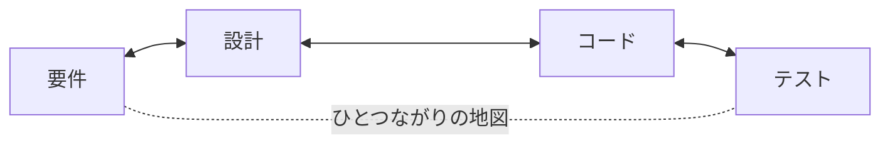

<p align="center">
  <strong>CoDD — Coherence-Driven Development</strong>
</p>

<p align="center">
  <a href="https://pypi.org/project/codd-dev/"></a>
  <a href="https://pypi.org/project/codd-dev/"></a>
  <a href="LICENSE"></a>
  <a href="https://github.com/yohey-w/codd-dev/stargazers"></a>
</p>

<p align="center">
  日本語 | <a href="README.md">English</a> | <a href="README_zh.md">中文</a>
</p>

<p align="center">
  <em>やりたいことを書くだけ。あとは CoDD が要件からシステムを組み立て、変更が起きても設計書とコードのズレを直し続け、テストが「通ったフリ」をできないように実行します。</em>
</p>

---

## CoDD とは

開発のよくある一日を思い浮かべてください。

- 関数を1つ直したら、それに依存していた別の3か所が壊れた。つながっているなんて、誰も覚えていなかった。
- テストはすべてグリーン。でも、たった今いじったコードは一度も実行されていなかった。
- 設計書には、先月のままの説明が残っている。

大きなプロジェクトでは——あるいは AI に書かせたコードでは——こういう「ズレ」があちこちで起きます。そして「全部つじつまが合っているか?」を人の手で確かめるのは、もう不可能になります。

**CoDD は、その確認を機械にやらせます。**

CoDD はまず、プロジェクトの中で「何と何がつながっているか」の地図を作ります。どの要件がどのコードで実装され、そのコードはどのテストで守られ、どの設定値がどの動きを切り替えるのか——そういう関係を一枚の地図にします。この地図さえあれば、CoDD は次の3つができます。

1. **作る** — 要件から、設計・コード・テストを生成する。
2. **追う** — どこかを変えたとき、影響が及ぶ先をすべて洗い出し、黙って壊れるのを防ぐ。
3. **検証する** — 実際のビルドとテストを、「通ったフリ」を許さない仕組みで走らせる。



この地図は**両方向**に使えます。コードを直せば「古くなった設計書・要件はここ」と教えてくれるし、要件を足せば「変えるべきコードとテストはここ」と教えてくれます。この双方向のつじつま合わせ(coherence)が、CoDD の頭文字「Co」です。

### Copilot や Cursor と何が違うのか

あれらは「AI 自体を賢くする」道具です。CoDD は「AI に渡す材料を賢くする」道具です。開いているファイルから当てずっぽうで察してもらうのではなく、その変更が触れる範囲の地図を——しかも「なぜつながっているか」の根拠つきで——AI に手渡します。さらに CoDD の検証は**ウソをつけない**作りになっています。空っぽのテスト、中身が実は `true` だけのビルドスクリプト、出てくるはずなのに無いテストレポート——どれも**レッド(失敗)**になり、こっそりグリーンになることはありません。

---

## インストール

```bash
pip install codd-dev          # Python 3.10 以上が必要   ·   コマンド名は `codd`
codd version
```

---

## 使ってみる

入り口は3つ。いま自分がどこにいるかで選んでください。

### 1. ゼロから新しく作る — `codd greenfield`

やりたいことを普通の Markdown で書いて、あとは CoDD に丸ごと組み立てさせます(設計 → コード → テスト → 検証 まで、途中でつまずいたら直しながら最後まで)。

```bash
codd greenfield --requirements docs/requirements/requirements.md
```

各ステップごとに途中経過を保存するので、`codd greenfield --resume` で止まったところから再開できます。先に計画だけ見たいなら `--dry-run`、スマホに進捗通知を飛ばすなら `--ntfy-topic <topic>` を付けてください。

### 2. すでにあるコードベースで使う — `codd init` + `codd scan`

CoDD が既存コードを読み取り、その裏にある設計を起こし、そこから先は両者のズレを直し続けてくれます。

```bash
codd init                 # リポジトリに CoDD を導入する
codd scan                 # コードからつながりの地図を作る
codd brownfield           # 設計書を復元 → 実装との差分を出す → 抜け漏れを洗い出す
```

### 3. もう動いている? 変えたいことを言葉で — `codd fix`

```bash
codd fix "ログインのエラーメッセージが分かりにくい"
```

CoDD は、その依頼が関係する設計書を見つけて更新し、変更を**設計 → コード → テスト → 検証**の順に通します。手を入れるのは地図が「関係する」と判定したファイルだけ。最後の検証に失敗したら、そのとき書き換えたファイルだけを元に戻します(ほかには触りません)。

---

## 仕組み — 1枚の地図と、3つの仕事

| 仕事 | 何をするか | 主なコマンド |
| --- | --- | --- |
| **1. 意図から作る** | 要件から設計案を出し、コードとテストの土台を生成する。提案するのは AI、選ぶのは人(主導権はあなた)。 | `greenfield`、`generate`、`implement`、`plan` |
| **2. 変更を追う** *(ここが核心)* | 要件・設計・コード・設定・データ・テストを横断する、つながりの地図。どこか1つ変えると波及先を洗い出し、**Green**(自動で直してよい)/ **Amber**(要レビュー)/ **Gray**(参考まで)に仕分けする——しかも各リンクの根拠つきで。 | `scan`、`impact`、`propagate`、`diff` |
| **3. 本気で検証する** | 実際のビルドとテストを、「通ったフリ」ができない形で走らせ、失敗があればその原因となった成果物まで遡って突き止める。 | `verify`、`check`、`coverage` |

この3つはぐるぐる回って互いを支えます。「作る」が何を変えるかを決め、「追う」がどこに着地するかを見つけ、「検証する」がそれで大丈夫だと裏づける——そしてあなたがコミットするたびに地図は賢くなり、次はもっと正確になります。(全体像はこちら: [`docs/explainer.md`](docs/explainer.md))

---

## v3.0 の新機能 — Contract Kernel

これまでの CoDD は、特定の言語やフレームワーク(Go・Python・Next.js…)の知識を中核(コア)に作り込んでいました。**v3.0 では、それを全部コアの外に追い出しました。** 差し替え可能な記述ファイル(「プロファイル」)と、小さなアダプターに移したのです。

- **コアはもう、言語名もフレームワーク名も知りません。** プロファイルを読むだけです。だから新しい言語やフレームワークへの対応は「プロファイルとアダプターを足す」だけ——**コアには一切手を入れません**。
- **フレームワークは組み合わせられます。** Next.js + TypeScript + Playwright + Prisma が1つの記述にまとまり、`codd verify` がそれをあなたのプロジェクトに対して実際に走らせます。
- **「通ったフリを許さない」ルールはコアが握ります。** プロファイルは細かい設定を変えられても、この保証を**弱めることは決してできません**。(実際の Next.js アプリで、本物のツールチェーンを使い、わざと仕込んだ不具合が一つずつ正しくレッドになるところまで確認済みです。)

ひとことで言えば——1つのコアで Next.js・Django・FastAPI・Rails・Go サービスなどに対応でき、しかもコアに触れずに対応を増やせる、ということです。

---

## 手持ちの AI ツールと組み合わせる

- **MCP サーバー** — `codd mcp-server` で、CoDD を MCP 対応クライアント(例: Claude Code)に stdio 経由で公開します。
- **Claude Code / Codex CLI 向けスキル** — `codd skills install <name> --target both` で、用意済みのスキル(例: greenfield の自動操縦)を `~/.claude/skills/` と `~/.agents/skills/` に配置します。
- **Codex App Server** — AI 呼び出しを、毎回サブプロセスを立ち上げる代わりに常駐接続経由でさばきます(`codd.yaml` で `codex_app_server.enabled: true`)。つながらない時は自動でサブプロセスに切り替わります。

---

## フック連携 (Hook Integration)

作業中に自動でつじつまチェックが走るよう、CoDD にはフックのレシピ(`codd/hooks/recipes/` 配下)が同梱されています。

- **Claude Code の `PostToolUse` フック** — ファイルを編集するたびに CoDD のチェックを走らせる。
- **Git の `pre-commit` フック** — つじつまが壊れるコミットを止める。
- **Git の `post-commit` フック**と **Codex CLI 用フック** — コミットのたびに地図を最新に保つ。

使いたいレシピを `codd/hooks/recipes/` からエディタや Git の設定にコピーすれば、有効になります。

---

## カバレッジ用の lexicon

CoDD には、実在の業界標準から起こした「チェックリスト」=**lexicon が 39 種**同梱されています。これを必要な分だけオンにすると、`codd elicit` が仕様の抜け漏れを見つけてくれます。対象は Web(WCAG・OWASP・Web Vitals)、モバイル(HIG・Material 3・MASVS)、バックエンド(REST・GraphQL・gRPC)、データ(SQL・JSON Schema)、運用(Kubernetes・Terraform・DORA)、コンプライアンス(ISO 27001・HIPAA・PCI DSS・GDPR・EU AI Act)など。自分に合うものだけ有効化すればよく、独自の lexicon もコアに触れず追加できます。

---

## ドキュメント

- [`docs/explainer.md`](docs/explainer.md) — つながりの地図から AI 主導の開発まで、CoDD の考え方の全容
- [`CHANGELOG.md`](CHANGELOG.md) — すべてのリリース履歴
- `codd --help` — コマンドの完全リファレンス(どのプロジェクトでも、まずは `codd check` から)
- [`docs/`](docs/) — アーキテクチャ解説、セットアップガイド、クックブック

---

## コントリビュート

Issue・プルリクエスト・lexicon の提案、どれも歓迎します — [Issues](https://github.com/yohey-w/codd-dev/issues) をご覧ください。CoDD は [@yohey-w](https://github.com/yohey-w) がメンテナンスしています。バグや着想を寄せてくれた皆さんに感謝します。

---

## ライセンスとリンク

MIT — [LICENSE](LICENSE) を参照。

- [PyPI](https://pypi.org/project/codd-dev/)
- [GitHub Sponsors](https://github.com/sponsors/yohey-w) — 開発を支援する
- [Issues](https://github.com/yohey-w/codd-dev/issues)
