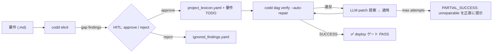
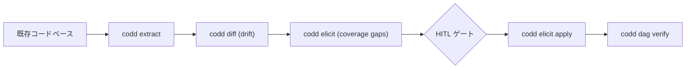

<p align="center">
  <strong>CoDD — Coherence-Driven Development</strong>
</p>

<p align="center">
  <a href="https://pypi.org/project/codd-dev/"></a>
  <a href="https://pypi.org/project/codd-dev/"></a>
  <a href="LICENSE"></a>
  <a href="https://github.com/yohey-w/codd-dev/stargazers"></a>
</p>

<p align="center">
  日本語 | <a href="README.md">English</a> | <a href="README_zh.md">中文</a>
</p>

---

## 🚀 60秒で始める

```bash
pip install codd-dev

# プロジェクトのルートで
codd init --suggest-lexicons --llm-enhanced   # AI が必要な lexicon を選定
codd elicit                                    # AI が要件の穴を発見
codd dag verify --auto-repair --max-attempts 10  # AI が整合性違反を自動修復
```

これだけ。3 コマンド、3 つのフィードバックループ、1 つの一貫したプロジェクト。

### 💡 既に運用中？直したい事象を自然言語で渡せ

```bash
codd fix "ログインエラーメッセージをわかりやすくしたい"   # 自然言語の事象起点モード
```

`codd fix [PHENOMENON]` (v2.16.0+) は CoDD 北極星の **第二の入口**。直したい変更を自然言語で渡せば、lexicon + セマンティックスコアで影響する設計書を特定、LLM が設計書を更新、コードに触れる前に DAG verify ゲートを通す。`--dry-run` でプレビュー、`--non-interactive` で CI 利用可能。

> 実プロジェクトで実証済: Next.js + Prisma + PostgreSQL の LMS で dogfooding。詳細は [ケーススタディ](#-ケーススタディ-実プロジェクト-lms)。

---

## ✨ できること

| コマンド | 一行説明 |
| --- | --- |
| 🔍 **`codd elicit`** | LLM が要件の **仕様の穴** を発見。業界標準 lexicon (BABOK / OWASP / WCAG / PCI DSS / ISO 25010 等) でスコープ。 |
| 🔄 **`codd diff`** | 要件と実装の **drift** を検出 (brownfield 対応)。 |
| 🛠️ **`codd dag verify --auto-repair`** | 要件→設計→実装→テストの DAG を検証、違反があれば LLM が patch 提案、ループで SUCCESS or MAX_ATTEMPTS まで再試行。 |
| 🎯 **`codd fix`** / **`codd fix [PHENOMENON]`** | 2 つのモード。*Legacy*: test/CI 失敗を自動検知、DAG を経由して LLM に実装 patch を出させ verify ゲートで再検証。*PHENOMENON* (v2.16.0+、北極星 入口2): 直したい事象を自然言語 (例: `"ダッシュボードの読み込みが遅い"`) で渡すと Tier-1 lexicon + Tier-2 セマンティックスコアで設計書候補を特定、LLM で設計書を更新、波及まで実施。HITL インタラクティブ + `--non-interactive` + `--dry-run`。 |
| 📦 **38 lexicon プラグイン** | 業界標準を opt-in 同梱: Web (WCAG / OWASP / Web Vitals / WebAuthn / forms / SEO / PWA / browser-compat / responsive)、Mobile (HIG / Material 3 / a11y / MASVS)、Backend (REST / GraphQL / gRPC / events)、Data (SQL / JSON Schema / event sourcing / governance)、Ops (CI/CD / Kubernetes / Terraform / observability / DORA)、Compliance (ISO 27001 / HIPAA / PCI DSS / GDPR / EU AI Act)、Process (ISO 25010 / 29119 / DDD / 12-factor / i18n / model cards / API rate-limit)、Methodology (BABOK)。 |
| 🌐 **`codd brownfield`** | extract → diff → elicit パイプライン: 既存コードベースに向けると要件を逆抽出して drift と仕様穴を一発で出す。 |
| 🎯 **`codd init --suggest-lexicons --llm-enhanced`** | LLM がコード/ドキュメントを読み、データ種別と機能特性を抽出して lexicon を推奨 (信頼度 + 理由付き)。 |
| 📊 **`codd lexicon list/install/diff` + `codd coverage report`** | プラグイン管理 + JSON / Markdown / 自己完結 HTML のカバレッジマトリクス出力。 |
| 🛡️ CI ゲート | `.github/workflows/codd_coverage.yml` テンプレ + `codd coverage check` の exit code でカバレッジ後退を merge ブロック。 |
| 🧪 **`codd verify --runtime`** | Step 8 ランタイム smoke ゲート (v2.19.0+)。DB 起動 + dev server 疎通 + smoke HTTP + 実ブラウザ E2E を「実走中のサーバー」に対して実施。`--runtime-skip {db,dev-server,connectivity,e2e,verification-test}` でカテゴリ別 skip + 理由を report に記録。 |
| 🔁 **`codd skills {install,list,remove}`** | 同梱スキル (例: `codd-evolve`) を `~/.claude/skills/` と `~/.agents/skills/` に配布。`--target {claude,codex,both}` と `--mode {symlink,copy}` 切替、idempotent + `--force` でバックアップ→置換。 |
| 🪡 **codd-evolve スキル** | Brownfield 対話進化。自然言語の機能変更要求から要件 → 設計 → lexicon → ソース → テスト → verify → propagate → Step 8 ランタイム smoke を 1 チェーンで実行。新語追加 / breaking change / 1:N UI トポロジ等の stop-and-ask ゲート内蔵、orchestrator 駆動向けの事前承認 branch も提供。 |
| ⚡ **Codex App Server バックエンド** (v2.20.0) | `codd.yaml` の `codex_app_server.enabled: true` で AI 呼び出しを永続 JSON-RPC スレッド経由に切替 (subprocess の代替)。`thread_strategy: per_session` で `codd implement` / `codd verify --auto-repair` / `codd fix` 全体に codex のコールドスタートを償却。バイナリ/ソケット欠落時は自動 subprocess フォールバック。 |

---

## 🎨 ビジュアルフロー



Brownfield (既存コード起点) パス:



---

## 📊 ケーススタディ: 実プロジェクト LMS

Next.js + Prisma + PostgreSQL のマルチテナント LMS (設計書約30本、DB 12テーブル、RLS で完全分離):

| ステージ | 結果 |
| --- | --- |
| `codd init --suggest-lexicons --llm-enhanced` | LLM が **データ種別** (個人情報 / 決済 / 動画) と **機能特性** (認証 / 決済 / public REST) を検出、15 lexicon を推奨 → 殿選定 10 のうち 9 と一致、ヒューリスティクスを実証。 |
| `codd elicit` (10 lexicon ロード、scope=`system_implementation`、phase=`mvp`) | **70 findings** (web a11y / data governance / SQL / security / Web Vitals / WebAuthn / API / process)。業務系 (KPI / UAT 詳細 / リスク登録) は scope filter で自動除外。 |
| `codd dag verify --auto-repair` | 当初 unrepairable=16 → core 改善 (deployment chain auto-discover、runtime-state auto-bind、mock harness no-op、scope/phase filter) を経て **PASS or amber-WARN (deploy 許可)** に到達。 |
| VPS smoke (`/`, `/login`, `/api/health`) | 3 エンドポイント全て **200 OK**。 |

パイプライン全体の改修において、**プロジェクト個別の修正は CoDD core に 0 行** — プロジェクト固有の関心事は全て `project_lexicon.yaml` か `codd_plugins/` (Generality Gate、Layer A/B/C) に閉じる。

---

## 🌟 なぜ CoDD が存在するのか

> **「機能要件と制約だけ書けば、コードは自動生成・自動修復・自動検証される」**

多くの「AI 支援開発」ツールは **生成側** に焦点を当てる。CoDD は **制約側** に焦点を当てる: LLM は「何が真でなければならないか」が明確なときに最も役に立つ。CoDD はその明確な像を、全成果物を結ぶ DAG として与え、業界標準 (BABOK / WCAG / OWASP / PCI / ISO) を制約として機械的に供給するプラグイン面を提供する。

DAG が壊れると LLM が patch を提案、ループが再検証、最終的に SUCCESS に到達するか、構造的に修復不可能なものを正直に提示する。

### Generality Gate (三層アーキテクチャ)

| Layer | スタック固有名がある場所 | 例 |
| --- | --- | --- |
| **A — Core** | **どこにもない。** `react`, `django`, `Stripe`, `LMS` 等 0 hardcode。 | `codd/elicit/`, `codd/dag/`, `codd/lexicon_cli/` |
| **B — Templates** | 汎用プレースホルダーのみ。 | `codd/templates/*.j2`, `codd/templates/lexicon_schema.yaml` |
| **C — Plug-ins** | 何でも自由に命名 OK。 | `codd_plugins/lexicons/*/`, `codd_plugins/stack_map.yaml` |

これにより、Next.js / Django / FastAPI / Rails / Go service / モバイル / ML モデルカードに対し **同じ core が動く**、かつ contributor は core を触らずに lexicon を追加できる。

---

## 🧭 Roadmap

- **v2.20.0 (現在)** — **Codex App Server JSON-RPC 統合** (cmd_357)。`AiCommand` Protocol + `CodexAppServerAiCommand` + `ai_command_factory.get_ai_command()` で `codd implement` / `codd verify --auto-repair` / `codd fix` を持続的 JSON-RPC セッション経由に切替可 (`codex_app_server.enabled: true`)。default は subprocess のまま完全後方互換、codex バイナリ欠落・unix socket 不通・`thread.start` エラー時は自動 fallback (WARNING ログ付き)。`thread_strategy: per_session` で 1 スレッドを turn 間で再利用しコールドスタートを償却。合計 3013 PASS、SKIP=0。
- **v2.19.0** — **CoDD 全 OSS 化** (cmd_333)。legacy `codd-pro` Pro Gate を撤廃、`codd verify` は `propagator.run_verify` を直接呼び出し。`codd review` / `codd audit` / `codd risk` を削除 (実装本体なし、影響ユーザー 0 件)。`bridge.py` は将来の verify プラグイン用に残置。加えて以下 5 つの横断機能:
  - `codd verify --runtime` (cmd_338) — Step 8 *ランタイム smoke ゲート* (DB 起動 + dev server 疎通 + smoke HTTP + 実ブラウザ E2E) が完了の最終チェックに。`--runtime-skip {db,dev-server,connectivity,e2e,verification-test}` (cmd_342) でカテゴリ別 skip + 理由を report に明示。
  - `verify.verification_timeout.{per_node_seconds,total_seconds}` (cmd_342) で個別検証 + 全体 verify 予算を制限。timeout した残ノードは `skipped: total_timeout_exceeded` として記録し red 化しない。
  - `ai_commands.impl_step_derive` 設定 + `warn_if_operation_flow_unused()` (cmd_345) — 要件に `operation_flow` を宣言しても AI コマンドが未接続だと `operation_flow_hint` が silent skip される問題に WARNING を出すことで可視化。
  - `operation_flow:` YAML frontmatter (cmd_340) — actor / verb / target / parent / ui_pattern を要件単位で宣言。`operation_flow_hint()` が `criteria_expander.py` / `impl_step_deriver.py` 経由で LLM プロンプトに注入。
  - `codd dag verify` に `ui_coherence_for_one_to_many` 追加 (cmd_340 B) — 1:N リレーションに対し master-detail / drilldown UI 証拠が無い場合に amber 警告。
- **codd skills CLI** (cmd_336) — `codd skills {install,list,remove}` で同梱スキル (例 `codd-evolve`) を `~/.claude/skills/` / `~/.agents/skills/` に配布。`--target {claude,codex,both}` / `--mode {symlink,copy}`、idempotent、`--force` でバックアップ→置換。
- **codd-evolve スキル** (skills/codd-evolve/) — Brownfield 対話進化。自然言語の機能変更要求から要件 → 設計 → lexicon → ソース → テスト → verify → propagate → Step 8 ランタイム smoke を 1 チェーンで実行。新語 lexicon 追加 / breaking change / coherence violation / scope explosion / ambiguous role / 1:N UI トポロジの 6 種 stop-and-ask ゲート、orchestrator 駆動の事前承認 branch あり。
- **v2.18.0** — [@v-kato](https://github.com/v-kato) からの Greenfield triage (cmd_473)。Issue #20: `codd implement run --language` で `project.language` を invocation 単位で上書き可能 (`codd init --language` 誤選択時の全 Wave 再生成 1h+ コストを回避)。Issue #21: `detailed_design` を `DEFAULT_NODE_PREFIXES` に追加し、`codd plan --init` が生成した node_id を自前の `codd validate` が reject する self-inconsistency を解消。Issue #22: `_strip_code_fence` を non-greedy + non-anchored 化し、LLM がコードフェンス後に追記してくる markdown 解説を切り捨て。新規 12 tests、合計 2937 PASS、SKIP=0。
- **v2.17.1** — `codd fix [PHENOMENON]` 緊急 patch (cmd_471)。Issue #23: `codd/fix/templates/*.txt` を wheel に同梱 (hatch `include` 漏れで `pip install` 後に `FileNotFoundError` 発生していた)。Issue #24: `design_update.txt` / `risk_assessment.txt` の `---` wrapper を `<document>` / `<diff>` XML-style タグに置換し、markdown frontmatter や unified-diff の `--- a/path` との衝突を解消。新規 11 tests、合計 2925 PASS、SKIP=0。
- **v2.17.0** — `node_completeness` の `kind: common` 対応 (cmd_470)。v2.15.0 で導入した共有インフラ用 `kind: common` を `node_completeness` 側が認識しておらず、`expects` edge が common node を指すと実体ファイルがあっても誤って missing 扱いされていた不具合を修正。新規 6 tests、合計 2914 PASS、SKIP=0。
- **v2.16.0** — `codd fix [PHENOMENON]` 北極星 入口2 の実装 (cmd_468)。直したい事象を自然言語で渡すと、Tier-1 lexicon + Tier-2 セマンティックスコアで関連設計書を特定・LLM で更新・DAG verify ゲート通過まで全自動。HITL インタラクティブ (候補選択/曖昧明確化/リスク確認) + `--non-interactive` (CI 用)。新規 66 tests、合計 2908 PASS、SKIP=0。
- **v2.15.0** — `kind: common` 導入 (cmd_467)。C5 amber −79.2% (125 → 26)。`**` glob translator 修正。
- **v2.14.0** — 構造欠陥 8 件一括修正 (cmd_466)。sidecar `verified_by:` (C6) / `axis_matrix:` (C9)、lexicon SSoT、scan.exclude bug fix (amber −52%)、`--auto-repair`、mock-AI、timeout 3600s。red 22 → 0。
- **v2.13.0** — opt-out 保護: `OptOutPolicy` により `justification` + `expires_at` 必須化、サイレント SKIP 廃止、severity 維持。
- **v2.12.0** — テスト完全性ゲート: C7 amber promotion + C8 `ci_health` 静的チェック新設。
- **v2.11.0** — Sprint 廃止 implement (`--design <path> --output <dir>` 直接指定)。
- **次期** — PHENOMENON の impl/test 自動波及完成 (AC #8)、App Server ベンチマーク公開、lexicon プラグインマーケットプレイス。

---

## 🤝 貢献者

CoDD は以下の方々によって形作られている:

- **[@yohey-w](https://github.com/yohey-w)** — Maintainer / Architect
- **[@Seika86](https://github.com/Seika86)** — Sprint regex 知見 (PR #11)
- **[@v-kato](https://github.com/v-kato)** — brownfield 再現報告 (Issue #17 / #18 / #19)
- **[@dev-komenzar](https://github.com/dev-komenzar)** — `source_dirs` バグ再現 (Issue #13)

外部からの issue / PR / lexicon 提案を歓迎する — [Issues](https://github.com/yohey-w/codd-dev/issues) 参照。

---

## 📚 ドキュメント

- [CHANGELOG.md](CHANGELOG.md) — 各 release の品質メトリクス
- [docs/](docs/) — アーキテクチャノート
- `codd --help` — CLI 全リファレンス

---

## 📦 Hook integration

CoDD は editor / Git ワークフロー用の hook recipe を同梱:

- Claude Code `PostToolUse` hook recipe — ファイル編集後に CoDD チェック実行
- Git `pre-commit` hook recipe — coherence check 違反時にコミットブロック

Recipes は `codd/hooks/recipes/` にある。

---

## ライセンス

MIT — [LICENSE](LICENSE) 参照。

## リンク

- [PyPI](https://pypi.org/project/codd-dev/)
- [GitHub Sponsors](https://github.com/sponsors/yohey-w) — 開発支援
- [Issues](https://github.com/yohey-w/codd-dev/issues)

---

> 「コードが変わったとき、CoDD は影響範囲を追跡し、違反を検出し、マージ判断のためのエビデンスを生成する。」
