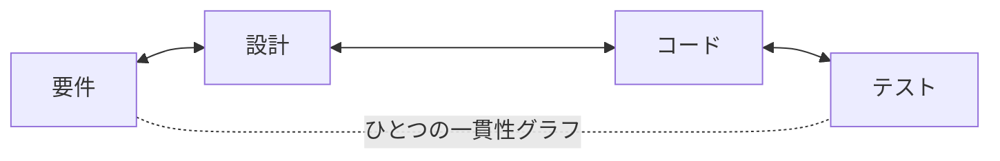

<p align="center">
  <strong>CoDD — Coherence-Driven Development</strong>
</p>

<p align="center">
  <a href="https://pypi.org/project/codd-dev/"></a>
  <a href="https://pypi.org/project/codd-dev/"></a>
  <a href="LICENSE"></a>
  <a href="https://github.com/yohey-w/codd-dev/stargazers"></a>
</p>

<p align="center">
  日本語 | <a href="README.md">English</a> | <a href="README_zh.md">中文</a>
</p>

<p align="center">
  <em>要件・設計・コード・テストを<strong>ひとつの連結したグラフ</strong>として扱う — そうすれば AI はそこから構築でき、あらゆる変更はグラフ全体に伝播し、検証は決して「green」を偽装できない。</em>
</p>

---

## CoDD とは

ソフトウェアには一貫性（coherence）の問題がある。要件、設計書、コード、テストは本来すべて同じことを語っているはずなのに、互いにずれていく。ある箇所を変更すると、別の箇所が知らぬ間に壊れる。ドキュメントは腐っていく。そして AI（あるいは疲れた人間）がコードを書くと、テストは通るのに*何も*証明していない、ということが頻繁に起きる。

**CoDD はその一貫性を明示的にし、機械でチェックできるようにする。** CoDD はプロジェクトをひとつのグラフとしてモデル化する。そのノードは*あらゆる*成果物 — ひとつの要件、設計セクション、ソースファイル、設定キー、DB テーブル、テスト — であり、エッジはそれらの間の依存関係（`implements`、`calls`、`reads_config`、`tested_by`、…）である。このグラフがあることで、CoDD は次の 3 つを行う。

1. **Generate（生成）** — 要件を設計・コード・テストへと変換する（greenfield の自動操縦、あるいは一度に 1 ドキュメントずつ）。
2. **Propagate（伝播）** — *何か*が変わったら、グラフをたどって影響を受けるすべて（上流・下流の両方）を見つけ出し、整合させる。
3. **Verify（検証）** — 実際のビルドとテストを **anti-false-green**（偽green を許さない）ハーネスを通して実行する。実際に証明できていない限り、その実行が成功として報告されることはありえない。



矢印は**双方向**に伸びる。コードを編集すれば、影響を受ける設計と要件が光る。要件を追加すれば、変更しなければならない設計・コード・テストが光る。この双方向の一貫性（coherence）こそが、CoDD の「Co」だ。

### 何が違うのか

たいていの AI 開発ツールは*モデル*のほうを賢くする（より優れた自動補完、より大きなコンテキスト）。CoDD は*モデルに与えるデータ*のほうを賢くする。依存グラフをあらかじめ計算しておくことで、たまたま開いていたファイルから推測させるのではなく、ある変更が何に触れるのかを — 根拠つきで — AI に正確に見せる。そして CoDD の検証は**偽陽性（false positive）を拒む**ように作られている。空のテストスイート、何もしないビルドスクリプト（`"build": "true"`）、欠落したレポート、無効化されたチェッカー、仕込まれたソースの変異 — これらはすべて **RED** で返り、黙って通過することは決してない。

---

## インストール

```bash
pip install codd-dev          # Python 3.10+   ·   the command is `codd`
codd version
```

---

## クイックスタート

### Greenfield — 要件を入れれば、動くシステムが出てくる

欲しいものを Markdown の要件ドキュメントとして書き、あとは無人の自動操縦にパイプライン全体（init → elicit → plan → generate → implement → 自動修復つき verify → propagate → check）を回させる。

```bash
codd greenfield --requirements docs/requirements/requirements.md
```

ユニットごとにチェックポイントを取るので、`codd greenfield --resume` は止まったところから再開できる。`--dry-run` はプランをプレビューし、`--ntfy-topic <topic>` は進捗をあなたに通知する。

### Brownfield — 既存のコードベースに向ける

CoDD はコードから設計意図をリバースエンジニアリングし、その後は両者を同期させ続ける。

```bash
codd init                 # set up CoDD in the repo
codd scan                 # build the dependency graph from the source
codd brownfield           # extract design docs → diff vs. reality → elicit the gaps
```

### すでにリリース済み？ 変更を普通の言葉で説明する

```bash
codd fix "login error messages are confusing"
```

`codd fix [PHENOMENON]` は、影響を受ける設計書を特定して更新し、その変更を **design → implementation → tests → verify** の順に流す。グラフが関与すると判定したファイルだけにパッチを当て、verify ゲートが失敗したら、まさにそれらのファイルだけをロールバックする。

---

## 仕組み — 3 本の柱

| 柱 | 何をするか | 主なコマンド |
| --- | --- | --- |
| **1 · 意図から生成する** | 要件 → 設計候補 → コード＆テストの足場。AI が提案し、人間が選ぶ（Human-in-the-Loop）。 | `greenfield`、`generate`、`implement`、`plan` |
| **2 · 変更を伝播する** *(核心)* | 要件/設計/コード/設定/データ/テストを横断する、型つきの依存グラフ。何かを変更すると、CoDD は影響範囲（blast radius）をたどり、**Green**（自動修正）、**Amber**（要レビュー）、**Gray**（参考情報）に分類する — 各エッジの根拠つきで。 | `scan`、`impact`、`propagate`、`diff`、`dag verify` |
| **3 · 一貫性を検証する** | 実際のビルド＋テストを、嘘をつけないように実行する。失敗は、それを引き起こした成果物までたどって突き止められる。 | `verify`、`check`、`coverage`、`contract verify` |

この 3 本の柱はループを成す。生成が*何を*変えるかを決め、伝播が*どこに*着地するかを見つけ、検証がそれが成り立つことを証明する — そしてコミットのたびにグラフへフィードバックされ、次のパスはさらに鋭くなる。（コンセプトの詳しい解説: [`docs/explainer.md`](docs/explainer.md)）

---

## v3.0 の新機能 — Contract Kernel

v3.0 は CoDD のコアを**言語にもフレームワークにも依存しない**ものにする。ハーネスはもはや `go`、`python`、`next` といった名前を一切ハードコードせず、宣言的なコントラクト＋アダプターからすべてを駆動する。

- **言語非依存のコア（Language-free core）** — Go、Python、TypeScript は、完全に宣言的な `LanguageProfile` で記述される。新しい言語の追加はプロファイル＋アダプターだけで済み、**コアの変更は不要**（コアが一度も見たことのない合成言語で実証済み）。
- **フレームワーク差し替え可能なスタック（Framework-pluggable stack）** — フレームワーク（例: Next.js）とアドオン（Playwright、Prisma）は言語と*合成*され、解決済みのひとつのスタックコントラクトになる。これを `greenfield` と `verify` がライブで消費する。新しいフレームワークも同じ要領で差し込める。
- **anti-false-green はコアが所有する** — 「偽の成功を許さない」という不変条件はコアに置かれる。プロファイルはパラメータを設定できるが、それを**弱めることは決してできない**。（実際の Next.js アプリ上で、実際のツールチェーンを使い、各 false-green ベクトルへのネガティブコントロール込みでエンドツーエンド検証済み。）

これこそが、ひとつのコアで Next.js、Django、FastAPI、Rails、Go サービス、その他をまかなえる理由であり、コントリビューターがコアに触れることなくサポートを追加できる理由だ。

---

## あなたの AI ツールと連携する

- **MCP サーバー** — `codd mcp-server` は、stdio 経由で任意の MCP 互換クライアント（例: Claude Code）に CoDD を公開する。
- **Claude Code & Codex CLI 向けスキル** — `codd skills install <name> --target both` は、同梱のスキル（例: greenfield 自動操縦、brownfield 進化）を `~/.claude/skills/` と `~/.agents/skills/` に配布する。
- **Git・エディタ用フック** — `codd/hooks/recipes/` 配下のレシピは、編集後に一貫性チェックを走らせたり、一貫性を壊すコミットをブロックしたりする。
- **Codex App Server バックエンド** — AI 呼び出しを、呼び出しごとのサブプロセスではなく、永続的な JSON-RPC スレッド経由でルーティングする（`codd.yaml` で `codex_app_server.enabled: true`）。サブプロセスへの自動フォールバックつき。

---

## カバレッジ用 lexicon

CoDD は**業界標準の lexicon を 39 種**、オプトイン式のカバレッジ軸として同梱している。これにより `codd elicit` は、実在する標準に照らして仕様の穴を見つけられる — Web（WCAG、OWASP、Web Vitals）、Mobile（HIG、Material 3、MASVS）、Backend（REST、GraphQL、gRPC）、Data（SQL、JSON Schema）、Ops（Kubernetes、Terraform、DORA）、Compliance（ISO 27001、HIPAA、PCI DSS、GDPR、EU AI Act）など。これらはプラグインだ。合うものを有効化すればよく、コアに触れずに自前のものを追加できる。

---

## ドキュメント

- [`docs/explainer.md`](docs/explainer.md) — 依存グラフから AI 駆動の進化まで、コンセプトの全容
- [`CHANGELOG.md`](CHANGELOG.md) — 品質メトリクスつきの全リリース履歴
- `codd --help` — CLI の完全リファレンス（どのプロジェクトでも、`codd check` から始めるのが一番よい）
- [`docs/`](docs/) — アーキテクチャノート、セットアップガイド、クックブック

---

## コントリビューション

Issue、PR、lexicon の提案を歓迎します — [Issues](https://github.com/yohey-w/codd-dev/issues) を参照してください。CoDD は [@yohey-w](https://github.com/yohey-w) がメンテナンスしており、それを形作るバグや知見を報告してくれたコントリビューターの皆さんに感謝します。

---

## ライセンス & リンク

MIT — [LICENSE](LICENSE) を参照。

- [PyPI](https://pypi.org/project/codd-dev/)
- [GitHub Sponsors](https://github.com/sponsors/yohey-w) — 開発を支援する
- [Issues](https://github.com/yohey-w/codd-dev/issues)
