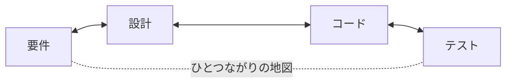

<p align="center">
  <strong>CoDD — Coherence-Driven Development</strong>
</p>

<p align="center">
  <a href="https://pypi.org/project/codd-dev/"></a>
  <a href="https://pypi.org/project/codd-dev/"></a>
  <a href="LICENSE"></a>
  <a href="https://github.com/yohey-w/codd-dev/stargazers"></a>
</p>

<p align="center">
  <strong>日本語</strong> | <a href="README.md">English</a> | <a href="README_zh.md">中文</a>
</p>

<p align="center">
  <em>やりたいことを書くだけ。あとは CoDD が要件からシステムを組み立て、変更が起きても設計書とコードのズレを直し続け、テストが「通ったフリ」をできないように実行します。</em>
</p>

---

## CoDD とは

開発のよくある一日を思い浮かべてください。

- 関数を1つ直したら、それに依存していた別の3か所が壊れた。つながっているなんて、誰も覚えていなかった。
- テストはすべてグリーン。でも、たった今いじったコードは一度も実行されていなかった。
- 設計書には、先月のままの説明が残っている。

大きなプロジェクトでは——あるいは AI に書かせたコードでは——こういう「ズレ」があちこちで起きます。そして「全部つじつまが合っているか?」を人の手で確かめるのは、もう不可能になります。

**CoDD は、その確認を機械にやらせます。**

CoDD はまず、プロジェクトの中で「何と何がつながっているか」の地図を作ります。どの要件がどのコードで実装され、そのコードはどのテストで守られ、どの設定値がどの動きを切り替えるのか——そういう関係を一枚の地図にします。この地図さえあれば、CoDD は次の3つができます。

1. **作る** — 要件から、設計・コード・テストを生成する。
2. **追う** — どこかを変えたとき、影響が及ぶ先をすべて洗い出し、黙って壊れるのを防ぐ。
3. **検証する** — 実際のビルドとテストを、「通ったフリ」を許さない仕組みで走らせる。


```mermaid
flowchart LR
    R["要件"] <--> D["設計"]
    D <--> C["コード"]
    C <--> T["テスト"]
    R -. "ひとつながりの地図" .- T
```

この地図は**両方向**に使えます。コードを直せば「古くなった設計書・要件はここ」と教えてくれるし、要件を足せば「変えるべきコードとテストはここ」と教えてくれます。この双方向のつじつま合わせ(coherence)が、CoDD の頭文字「Co」です。

### Copilot や Cursor と何が違うのか

あれらは「AI 自体を賢くする」道具です。CoDD は「AI に渡す材料を賢くする」道具です。開いているファイルから当てずっぽうで察してもらうのではなく、その変更が触れる範囲の地図を——しかも「なぜつながっているか」の根拠つきで——AI に手渡します。さらに CoDD の検証は**ウソをつけない**作りになっています。空っぽのテスト、中身が実は `true` だけのビルドスクリプト、出てくるはずなのに無いテストレポート——どれも**レッド(失敗)**になり、こっそりグリーンになることはありません。

---

## インストール

```bash
pip install codd-dev          # Python 3.10 以上が必要   ·   コマンド名は `codd`
codd version                  # インストールを確認
```

### 前提

- **Python 3.10 以上**。
- **AI CLI**（設計・コード・テストを生成/更新する `greenfield` `fix` `generate` `implement` `brownfield` などで使用）。既定は `claude --print`。`--ai-cmd "<コマンド>"` または `codd.yaml` の `ai_command:` で Codex CLI などに差し替えられます。
- **AI 不要のコマンド**（`init` `scan` `check` `doctor` `measure` `impact` `validate` `plan`（表示）`contract verify` `dag verify` `lexicon` `version` など）は、AI CLI が無くてもそのまま動きます。

---

## クイックスタート（1分・AI 不要）

既存リポジトリに CoDD を入れて、つながりの地図を作り、健全性をチェックするところまで。ここまでは AI CLI 不要で、そのままコピペで通ります。

```bash
pip install codd-dev

cd path/to/your-repo
codd init myproject --language python   # CoDD の設定を作成（codd/codd.yaml）
codd scan                                # コードから「つながりの地図」を作る
codd check                               # 健全性チェック — まずはここから
```

`codd check` は、`doctor`（設定診断）→ `dag verify`（つながりの完全性）→ `contract verify`（成果物契約）をまとめて走らせる入口です。詳細を掘るなら `codd doctor`、指標を見るなら `codd measure`。

次に「ゼロから作る」「既存コードに設計を起こす」「動いているものを直す」——目的別の入り口は次のとおりです。

---

## 3つの入り口

いま自分がどこにいるかで選んでください。

### 1. ゼロから新しく作る — `codd greenfield`

やりたいことを普通の Markdown で書いて、あとは CoDD に丸ごと組み立てさせます(設計 → コード → テスト → 検証 まで、途中でつまずいたら直しながら最後まで)。

```bash
codd greenfield --requirements docs/requirements/requirements.md \
                --project-name myapp --language python
```

各ステップごとに途中経過を保存するので、`codd greenfield --resume` で止まったところから再開できます。先に計画だけ見たいなら `--dry-run`(AI を呼ばず実行計画だけ表示)、スマホに進捗通知を飛ばすなら `--ntfy-topic <topic>` を付けてください。

> **現時点の言語カバレッジ:** 放任実行の greenfield を、同一の中立要件仕様（マルチモジュール電卓ライブラリ、15〜20ファイル）から**トップ6言語すべて — Python・TypeScript・JavaScript・Java・C++・C# — でエンドツーエンド実証済み**です。検証は実行ベースで、各実行の検証可能振る舞いを言語ネイティブのテストレポート（pytest / vitest / surefire / ctest / dotnet-trx）と突き合わせ、収束しない実行は偽の合格とせず正直に停止します。反復回数は一律ではなく、TypeScript と Python は独立した green 実行が3回中2回以上、JavaScript・Java・C++・C# は n≥1 です。これはパイプラインの言語横断配線と収束機構をライブラリ規模で実証するもので、エンタープライズ規模の複雑性はまだ主張しません（後続の real-spec キャンペーンが対象）。

この同じワンコマンドのパイプライン(`codd greenfield --requirements FILE`)は、中身を読んで手を加えられる3つの形でも用意しています — シェルスクリプト([`examples/greenfield_autopilot.sh`](examples/greenfield_autopilot.sh))、Claude Code ワークフロー([`examples/claude_workflows/codd-greenfield.js`](examples/claude_workflows/codd-greenfield.js))、そしてスキル(`codd skills install codd-greenfield --target both`)。

### 2. すでにあるコードベースで使う — `codd init` + `codd scan`

CoDD が既存コードを読み取り、その裏にある設計を起こし、そこから先は両者のズレを直し続けてくれます。

```bash
codd init                 # リポジトリに CoDD を導入する
codd scan                 # コードからつながりの地図を作る
codd brownfield .         # 設計書を復元 → 実装との差分を出す → 抜け漏れを洗い出す
```

### 3. もう動いている? 変えたいことを言葉で — `codd fix`

```bash
codd fix "ログインのエラーメッセージが分かりにくい"
```

CoDD は、その依頼が関係する設計書を見つけて更新し、変更を**設計 → コード → テスト → 検証**の順に通します。手を入れるのは地図が「関係する」と判定したファイルだけ。最後の検証に失敗したら、そのとき書き換えたファイルだけを元に戻します(ほかには触りません)。

引数なしの `codd fix` は、失敗しているテストや CI をそのまま拾って直すレガシーモードです(`codd fix --ci` / `--local` / `--dry-run`)。

---

## 仕組み — 1枚の地図と、3つの仕事

| 仕事 | 何をするか | 主なコマンド |
| --- | --- | --- |
| **1. 意図から作る** | 要件から設計案を出し、コードとテストの土台を生成する。提案するのは AI、選ぶのは人(主導権はあなた)。 | `greenfield`、`plan`、`generate`、`implement`、`fix` |
| **2. 変更を追う** *(ここが核心)* | 要件・設計・コード・設定・データ・テストを横断する、つながりの地図。どこか1つ変えると波及先を洗い出し、**Green**(自動で直してよい)/ **Amber**(要レビュー)/ **Gray**(参考まで)に仕分けする——しかも各リンクの根拠つきで。 | `scan`、`impact`、`propagate`、`diff` |
| **3. 本気で検証する** | 実際のビルドとテストを、「通ったフリ」ができない形で走らせ、失敗があればその原因となった成果物まで遡って突き止める。 | `verify`、`check`、`coverage` |

この3つはぐるぐる回って互いを支えます。「作る」が何を変えるかを決め、「追う」がどこに着地するかを見つけ、「検証する」がそれで大丈夫だと裏づける——そしてあなたがコミットするたびに地図は賢くなり、次はもっと正確になります。(全体像はこちら: [`docs/explainer.md`](docs/explainer.md))

---

## コマンド早見表

よく使うものを目的別にまとめました。完全な一覧は `codd --help`、各コマンドの詳細は `codd <command> --help` で見られます。

| 目的 | コマンド |
| --- | --- |
| **作る** | `greenfield`(全自動) · `plan`(タスク導出) · `generate`(設計/テスト生成) · `implement`(実装生成) · `assemble`(断片を組み上げ) · `fix`(現象から修正) |
| **追う** | `scan`(地図を更新) · `impact`(差分の波及) · `propagate`(コード→設計へ反映) · `diff`(実装 vs 要件) · `watch`(変更監視) · `drift`(URL/設計のズレ) |
| **検証する** | `verify`(ビルド+テスト) · `check`(健全性・まずここ) · `doctor`(設定診断) · `dag`(完全性ゲート) · `contract`(成果物契約) · `coverage`(カバレッジゲート) · `measure`(指標) · `policy`(ポリシー) · `validate`(frontmatter検証) |
| **引き出す・整える** | `elicit`(仕様の抜け発見) · `lexicon`(業界標準チェックリスト) · `brownfield`(既存コードから復元) · `extract` / `require` / `restore`(事実→設計) · `qc`(基準の評価) · `preflight`(タスク事前検査) |
| **連携・公開** | `mcp-server`(MCP公開) · `skills`(スキル導入) · `hooks`(Gitフック) · `deploy`(デプロイ) · `e2e`(E2E生成) |

---

## Contract Kernel（v3.0 で導入）

これまでの CoDD は、特定の言語やフレームワーク(Go・Python・Next.js…)の知識を中核(コア)に作り込んでいました。**v3.0 で、それを全部コアの外に追い出しました。** 差し替え可能な記述ファイル(「プロファイル」)と、小さなアダプターに移したのです。

- **コアはもう、言語名もフレームワーク名も知りません。** プロファイルを読むだけです。だから新しい言語やフレームワークへの対応は「プロファイルとアダプターを足す」だけ——**コアには一切手を入れません**。同梱プロファイル: Python / TypeScript / JavaScript / Java / C++ / C# / Go。
- **フレームワークは組み合わせられます。** Next.js + TypeScript + Playwright + Prisma が1つの記述にまとまり、`codd verify` がそれをあなたのプロジェクトに対して実際に走らせます。
- **「通ったフリを許さない」ルールはコアが握ります。** プロファイルは細かい設定を変えられても、この保証を**弱めることは決してできません**。(実際の Next.js アプリで、本物のツールチェーンを使い、わざと仕込んだ不具合が一つずつ正しくレッドになるところまで確認済みです。)

ひとことで言えば——1つのコアで Next.js・Django・FastAPI・Rails・Go サービスなどに対応でき、しかもコアに触れずに対応を増やせる、ということです。

---

## 手持ちの AI ツールと組み合わせる

- **MCP サーバー** — `codd mcp-server` で、CoDD を MCP 対応クライアント(例: Claude Code、Cursor)に stdio 経由で公開します。Claude Code 側の設定例:
  ```json
  "mcpServers": { "codd": { "command": "codd", "args": ["mcp-server"] } }
  ```
- **Claude Code / Codex CLI 向けスキル** — `codd skills install <name> --target both` で、用意済みのスキル(例: greenfield の自動操縦)を `~/.claude/skills/` と `~/.agents/skills/` に配置します。`codd skills list` で確認、`codd skills remove <name>` で削除。
- **Codex App Server** — AI 呼び出しを、毎回サブプロセスを立ち上げる代わりに常駐接続経由でさばきます(`codd.yaml` で `codex_app_server.enabled: true`)。つながらない時は自動でサブプロセスに切り替わります。

---

## フック連携 (Hook Integration)

作業中に自動でつじつまチェックが走るよう、CoDD にはフックのレシピ(`codd/hooks/recipes/` 配下)が同梱されています。

- **Claude Code の `PostToolUse` フック**(`claude_settings_example.json`)— ファイルを編集するたびに CoDD のチェックを走らせる。
- **Git の `pre-commit` フック**(`git_pre_commit.sh`)— つじつまが壊れるコミットを止める。`codd hooks install` でワンコマンド導入も可能。
- **Git の `post-commit` フック**(`git_post_commit.sh`)と **Codex CLI 用フック**(`codex_hook.sh`)— コミットのたびに地図を最新に保つ。
- **要件変更リマインダーのレシピ**(`claude_requirements_nudge.json`)— 要件が変わったら `codd greenfield --resume` の再実行を促す(表示のみ。勝手にパイプラインは走らせない)。

使いたいレシピを `codd/hooks/recipes/` からエディタや Git の設定にコピーすれば、有効になります。

---

## カバレッジ用の lexicon

CoDD には、実在の業界標準から起こした「チェックリスト」=**lexicon が 39 種**同梱されています。これを必要な分だけオンにすると、`codd elicit` が仕様の抜け漏れを見つけてくれます。対象は Web(WCAG・OWASP・Web Vitals)、モバイル(HIG・Material 3・MASVS)、バックエンド(REST・GraphQL・gRPC)、データ(SQL・JSON Schema)、運用(Kubernetes・Terraform・DORA)、コンプライアンス(ISO 27001・HIPAA・PCI DSS・GDPR・EU AI Act)など。`codd lexicon list` で一覧、`codd lexicon install <name>` で有効化。自分に合うものだけ入れればよく、独自の lexicon もコアに触れず追加できます。

---

## FAQ・トラブルシュート

**Q. `codd: command not found` になる。**
A. pip の実行ファイル置き場が PATH に入っていません。`pip install --user` なら `~/.local/bin` を PATH に追加してください。手っ取り早くは `python -m codd ...` でも同じことができます。

**Q. どの AI CLI が必要?**
A. 既定は `claude --print`。`--ai-cmd "<コマンド>"` か `codd.yaml` の `ai_command:` で Codex CLI などに差し替えられます。`init` `scan` `check` `doctor` `measure` などは AI 不要です。

**Q. `greenfield` が途中で止まった/失敗した。**
A. `codd greenfield --resume` で、最後に成功したステップの続きから再開します(チェックポイントは `.codd/greenfield_session.yaml`)。

**Q. `codd check` が SKIP や「vacuous(空検証)」ばかり。**
A. まだ設計書やテストが無い新規状態では正常です。`scan` → `generate`/`implement` と進めば、実データを見るチェックが順に有効化されます。

**Q. 設定ファイルはどこ?**
A. 既定は `codd/codd.yaml`。ソースディレクトリが `codd/` の場合は `codd init --config-dir .codd` として `.codd/` に置けます。

**Q. `verify` がグリーンなはずなのに落ちる。**
A. それが anti-false-green(通ったフリの検出)です。空テスト・中身が `true` だけのビルド・欠落したテストレポートは、意図的に**レッド**にします。テストが本当にコードを実行しているか確認してください。

**Q. 新しい言語やフレームワークに対応したい。**
A. プロファイル(＋小さなアダプター)を足すだけで、コアには手を入れません(Contract Kernel)。同梱プロファイルは Python / TypeScript / JavaScript / Java / C++ / C# / Go。

**Q. 更新・アンインストールは?**
A. 更新は `pip install -U codd-dev`、アンインストールは `pip uninstall codd-dev`。

---

## ドキュメント

- [`docs/explainer.md`](docs/explainer.md) — つながりの地図から AI 主導の開発まで、CoDD の考え方の全容([English](docs/explainer.en.md) · [简体中文](docs/explainer.zh.md))
- [`docs/positioning.md`](docs/positioning.md) — Spec Kit / コーディングエージェント / Copilot と CoDD の位置づけを false-green 軸で比較
- [`CHANGELOG.md`](CHANGELOG.md) — すべてのリリース履歴
- `codd --help` — コマンドの完全リファレンス(どのプロジェクトでも、まずは `codd check` から)
- [`docs/`](docs/) — アーキテクチャ解説、セットアップガイド、クックブック

---

## コントリビュート

Issue・プルリクエスト・lexicon の提案、どれも歓迎します — [Issues](https://github.com/yohey-w/codd-dev/issues) をご覧ください。CoDD は [@yohey-w](https://github.com/yohey-w) がメンテナンスしています。バグや着想を寄せてくれた皆さんに感謝します。

---

## ライセンスとリンク

MIT — [LICENSE](LICENSE) を参照。

- [PyPI](https://pypi.org/project/codd-dev/)
- [GitHub Sponsors](https://github.com/sponsors/yohey-w) — 開発を支援する
- [Issues](https://github.com/yohey-w/codd-dev/issues)
