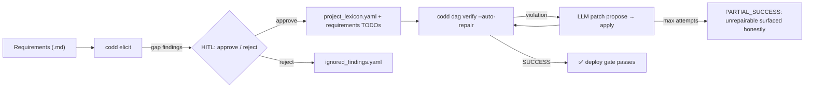
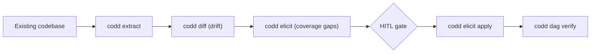

<p align="center">
  <strong>CoDD — Coherence-Driven Development</strong>
</p>

<p align="center">
  <a href="https://pypi.org/project/codd-dev/"></a>
  <a href="https://pypi.org/project/codd-dev/"></a>
  <a href="LICENSE"></a>
  <a href="https://github.com/yohey-w/codd-dev/stargazers"></a>
</p>

<p align="center">
  <a href="README_ja.md">日本語</a> | <a href="README.md">English</a> | 中文
</p>

> 只写功能需求与约束。代码生成、整合修复、验证都交给 CoDD。

---

## 🌟 为何 CoDD

> **「只写功能需求与约束，代码就会自动生成、自动修复、自动验证。」**

大多数「AI 辅助开发」工具关注 **生成** 侧，CoDD 关注 **约束** 侧。LLM 在「什么必须为真」被精确给出时最有用 —— CoDD 把这种精确图景以连接 requirements → design → lexicon → source → tests → runtime 的单一 DAG 形式提供，驱动 LLM 修复循环来消除违规，并把结构上无法修复的部分诚实地暴露出来。

---

## 🚀 60 秒上手

```bash
pip install codd-dev

# 在项目根目录中
codd init --suggest-lexicons --llm-enhanced    # AI 选定合适的 lexicon
codd elicit                                    # AI 发现需求中的漏洞
codd dag verify --auto-repair --max-attempts 10  # AI 自动修复一致性违规
```

如果项目已经在跑，用自然语言描述「想修的现象」即可:

```bash
codd fix "登录的错误信息不够清晰"   # PHENOMENON 模式
```

`codd fix [PHENOMENON]` 是 CoDD 的第二个入口。用自然语言陈述想做的变更，CoDD 通过 lexicon + 语义评分定位受影响的设计文档，由 LLM 更新，并在改任何代码之前先跑 DAG verify 网关。`--dry-run` 预览，`--non-interactive` 适配 CI。

---

## 🎨 可视化流程



Brownfield (从现有代码起步) 路径:



---

## ✨ 能做什么

CoDD 是一根 CLI，整理在 4 个层级里。需要哪一层就用哪一层，其余的不会出现在视野里。

### 核心命令

| 命令 | 一句话 |
| --- | --- |
| 🎯 **`codd init --suggest-lexicons --llm-enhanced`** | LLM 扫描代码/文档，选定合适的 lexicon 插件。 |
| 🔍 **`codd elicit`** | 针对行业标准 lexicon 发现 *规格漏洞*。 |
| 🔄 **`codd diff`** | 检测需求与实现之间的 **drift** (兼容 brownfield)。 |
| 🛠️ **`codd dag verify --auto-repair`** | 校验整张 DAG，LLM 提交 patch 提案，循环至 SUCCESS 或 MAX_ATTEMPTS。 |
| 🎯 **`codd fix`** / **`codd fix [PHENOMENON]`** | 两种模式 —— 自动检测 CI 失败，或用自然语言描述想做的变更。 |
| 🌐 **`codd brownfield`** | 面向现有代码库的 Extract → diff → elicit 流水线。 |

### 质量网关

| 网关 | 作用 |
| --- | --- |
| 🧪 **`codd verify --runtime`** | Step 8 运行时 smoke (DB 启动 + dev server 可达 + smoke HTTP + 真实浏览器 E2E + 通过 `runtime.crud_flow_targets` opt-in 的 CRUD 反映验证)。`--runtime-skip` 按类别 opt-out 并把原因记录到 report。 |
| 📊 **`codd lexicon list/install/diff` + `codd coverage report`** | 插件管理 + JSON / Markdown / 自包含 HTML 的覆盖矩阵。 |
| 🛡️ **CI 网关** | `.github/workflows/codd_coverage.yml` 模板 + `codd coverage check` 退出码使覆盖率回退在 merge 时被阻挡。 |

### Skill 与后端

| 能力 | 提供什么 |
| --- | --- |
| 🔁 **`codd skills {install,list,remove}`** | 将内置 skill (例 `codd-evolve`) 分发至 `~/.claude/skills/` 与 `~/.agents/skills/`。`--target {claude,codex,both}` / `--mode {symlink,copy}`，幂等 + `--force`。 |
| 🪡 **codd-evolve skill** | Brownfield 对话式演进。从自然语言意图一次走完 requirements → design → lexicon → source → tests → verify → propagate → Step 8 runtime smoke。内置新词条 / breaking change / 1:N UI 拓扑等 stop-and-ask 网关。 |
| ⚡ **Codex App Server 后端** (v2.20.0) | `codd.yaml` 中 `codex_app_server.enabled: true` 时把 AI 调用经由持久 JSON-RPC thread 转发 (替代 subprocess)。`thread_strategy: per_session` 在 `codd implement` / `codd verify --auto-repair` / `codd fix` 间摊销 codex 冷启动。当二进制或 socket 缺失时自动回退到 subprocess。 |

### Lexicon 插件

38 个行业标准 lexicon 作为 opt-in 覆盖轴附带 —— Web (WCAG / OWASP / Web Vitals / WebAuthn / forms / SEO / PWA)、Mobile (HIG / Material 3 / a11y / MASVS)、Backend (REST / GraphQL / gRPC / events)、Data (SQL / JSON Schema / event sourcing / governance)、Ops (CI/CD / Kubernetes / Terraform / observability / DORA)、Compliance (ISO 27001 / HIPAA / PCI DSS / GDPR / EU AI Act)、Process (ISO 25010 / 29119 / DDD / 12-factor / i18n / model cards / API rate-limit)、Methodology (BABOK)。

---

## 📊 案例研究

在 Next.js + Prisma + PostgreSQL 多租户 LMS (设计文档约 30 份 / DB 表 12 张 / RLS 强制隔离) 上 dogfood: `codd init --suggest-lexicons` 在人工选择的 10 个 lexicon 中命中 9 个，`codd elicit` 抽出 70 个规格漏洞，`codd dag verify --auto-repair` 把最初的 16 件不可修复违规压缩到 **PASS 或 amber-WARN (deploy 允许)** —— 整条流水线中针对 CoDD core 的项目专属修改是 **0 行**。项目特有事项完整地封闭在 `project_lexicon.yaml` 与 `codd_plugins/` 中。

---

## 🧱 Generality Gate (三层架构)

| Layer | 栈固有名出现在哪里 | 例 |
| --- | --- | --- |
| **A — Core** | **不在任何地方。** 零 `react` / `django` / `Stripe` / `LMS` 字面量。 | `codd/elicit/`, `codd/dag/`, `codd/lexicon_cli/` |
| **B — Templates** | 仅通用占位符。 | `codd/templates/*.j2`, `codd/templates/lexicon_schema.yaml` |
| **C — Plug-ins** | 可自由命名。 | `codd_plugins/lexicons/*/`, `codd_plugins/stack_map.yaml` |

正因如此，同一个 core 能跑 Next.js / Django / FastAPI / Rails / Go service / 移动应用 / ML 模型卡，贡献者无需触碰 core 即可新增 lexicon。

---

## 🧭 Roadmap

下一步:

- `codd fix [PHENOMENON]` 的 impl/test 自动波及完成 (AC #8)
- App Server 基准测试公开 (subprocess vs JSON-RPC 的 P50 / P95 / P99)
- lexicon 插件市场

历次 release (v2.11.0 → v2.20.0) 连同质量指标记录在 [CHANGELOG.md](CHANGELOG.md) 中。

---

## 🤝 贡献者

CoDD 由以下成员塑造:

- **[@yohey-w](https://github.com/yohey-w)** — Maintainer / Architect
- **[@Seika86](https://github.com/Seika86)** — Sprint regex 见解 (PR #11)
- **[@v-kato](https://github.com/v-kato)** — Brownfield 复现报告 (Issues #17 / #18 / #19 / #20 / #21 / #22)
- **[@dev-komenzar](https://github.com/dev-komenzar)** — `source_dirs` bug 复现 (Issue #13)

欢迎 issue / PR / lexicon 提议 —— 详见 [Issues](https://github.com/yohey-w/codd-dev/issues)。

---

## 📚 文档

- [CHANGELOG.md](CHANGELOG.md) — 各 release 的质量指标
- [docs/](docs/) — 架构笔记
- `codd --help` — CLI 完整参考

---

## 📦 Hook integration

CoDD 同捆 editor / Git 工作流的 hook recipe:

- Claude Code `PostToolUse` hook recipe (文件编辑后运行 CoDD 检查)
- Git `pre-commit` hook recipe (一致性检查违规时阻挡 commit)

Recipe 位于 `codd/hooks/recipes/`。

---

## 许可证

MIT — 详见 [LICENSE](LICENSE)。

## 链接

- [PyPI](https://pypi.org/project/codd-dev/)
- [GitHub Sponsors](https://github.com/sponsors/yohey-w) — 开发支援
- [Issues](https://github.com/yohey-w/codd-dev/issues)

---

> 代码一旦发生变化，CoDD 就追踪影响范围、检测违规，并为 merge 判断生成证据。
