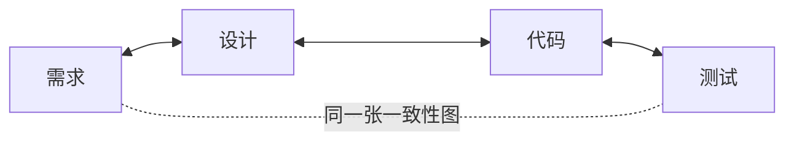

<p align="center">
  <strong>CoDD — Coherence-Driven Development</strong>
</p>

<p align="center">
  <a href="https://pypi.org/project/codd-dev/"></a>
  <a href="https://pypi.org/project/codd-dev/"></a>
  <a href="LICENSE"></a>
  <a href="https://github.com/yohey-w/codd-dev/stargazers"></a>
</p>

<p align="center">
  <a href="README_ja.md">日本語</a> | <a href="README.md">English</a> | 中文
</p>

<p align="center">
  <em>将需求、设计、代码和测试视为<strong>同一张相互关联的图</strong>——这样 AI 就能据此构建系统，每一次改动都会在图上传播，而验证也永远无法伪造「绿色通过」。</em>
</p>

---

## CoDD 是什么？

软件存在一个一致性问题。需求、设计文档、代码和测试本应表达同一件事——但它们会逐渐分歧。一处的改动会悄无声息地破坏另一处。文档会腐烂。而当 AI（或一个疲惫的人类）编写代码时，测试往往通过了，却*什么都没有证明*。

**CoDD 让这种一致性变得显式、且可被机器检查。** 它把你的项目建模成一张图，图中的节点是*每一个*工件——一条需求、一个设计章节、一个源文件、一个配置键、一张数据库表、一个测试——而图中的边则是它们之间的依赖关系（`implements`、`calls`、`reads_config`、`tested_by` 等）。有了这张图之后，CoDD 会做三件事：

1. **生成（Generate）**——把需求转化为设计、代码和测试（绿地项目自动驾驶，或一次处理一份文档）。
2. **传播（Propagate）**——当*任何东西*发生改变时，遍历这张图，找出所有受影响的部分（上游与下游），并让它们重新保持一致。
3. **验证（Verify）**——通过一套**拒绝虚假通过（anti-false-green）**的检验框架运行真实的构建与测试：一次运行除非真正证明了自己通过，否则不会被报告为通过。



箭头是**双向的**。改动代码，受影响的设计和需求就会亮起；新增一条需求，那些必须随之改变的设计、代码和测试就会亮起。这种双向一致性（Coherence）就是 CoDD 中的「Co」。

### 它有何不同

大多数 AI 开发工具让*模型*变得更聪明（更好的自动补全、更大的上下文）。CoDD 则让*你喂给模型的数据*变得更聪明：它预先算好依赖图，让 AI 能够准确看到一处改动会触及什么——并附带证据——而不是仅凭恰好打开的那些文件去猜测。而它的验证机制天生就被设计成**拒绝误报**：空的测试套件、空操作的构建脚本（`"build": "true"`）、缺失的报告、被禁用的检查器，以及被植入的源码变异，统统会返回**红色（RED）**，绝不会悄无声息地通过。

---

## 安装

```bash
pip install codd-dev          # Python 3.10+   ·   the command is `codd`
codd version
```

---

## 快速上手

### 绿地项目——输入需求，产出可运行的系统

把你想要的东西写成一份 Markdown 需求文档，然后让无人值守的自动驾驶运行整条流水线（init → elicit → plan → generate → implement → verify 并自动修复 → propagate → check）：

```bash
codd greenfield --requirements docs/requirements/requirements.md
```

它会在每个单元之后建立检查点，因此 `codd greenfield --resume` 会从中断处接着跑；`--dry-run` 会预览计划，而 `--ntfy-topic <topic>` 会向你推送进度通知。

### 棕地项目——把它指向一个已有的代码库

CoDD 会从代码中逆向工程出设计意图，然后让两者保持同步：

```bash
codd init                 # set up CoDD in the repo
codd scan                 # build the dependency graph from the source
codd brownfield           # extract design docs → diff vs. reality → elicit the gaps
```

### 已经在持续交付了？用大白话描述改动

```bash
codd fix "login error messages are confusing"
```

`codd fix [PHENOMENON]` 会定位受影响的设计文档、更新它们，然后让改动沿着**设计 → 实现 → 测试 → 验证**的路径流动——只修补图所认定涉及的那些文件，并且在验证关卡失败时，精确地回滚那些文件。

---

## 工作原理——三大支柱

| 支柱 | 它做什么 | 关键命令 |
| --- | --- | --- |
| **1 · 从意图生成** | 需求 → 设计候选方案 → 代码与测试脚手架。AI 提出方案；由人类抉择（Human-in-the-Loop，人在回路）。 | `greenfield`、`generate`、`implement`、`plan` |
| **2 · 传播改动** *(核心所在)* | 一张横跨需求／设计／代码／配置／数据／测试的带类型依赖图。改动任何东西，CoDD 都会追踪其影响半径——分类为**绿（Green，自动修复）**、**黄（Amber，需审查）**、**灰（Gray，仅供参考）**——并为每条边附上证据。 | `scan`、`impact`、`propagate`、`diff`、`dag verify` |
| **3 · 验证一致性** | 真实的构建 + 测试，以无法撒谎的方式运行。失败会被追溯回导致它的那些工件。 | `verify`、`check`、`coverage`、`contract verify` |

这些支柱构成一个闭环：生成决定*改什么*，传播找出它*落在何处*，验证则证明它依然成立——而每一次提交都会反哺这张图，让下一轮处理更加精准。（完整的概念讲解：[`docs/explainer.md`](docs/explainer.md)。）

---

## v3.0 有何新意——Contract Kernel（契约内核）

v3.0 让 CoDD 的核心做到**与语言和框架无关**。检验框架不再硬编码 `go`、`python`、`next` 或任何其他名称——它完全由声明式契约 + 适配器来驱动一切：

- **无语言核心**——Go、Python 和 TypeScript 完全由声明式的 `LanguageProfile` 来描述。新增一门语言只需一份 profile + 一个适配器，**无需改动核心**（这一点已由一门核心从未见过的合成语言所验证）。
- **可插拔框架技术栈**——一个框架（例如 Next.js）与若干插件（Playwright、Prisma）会与语言*组合*成一份解析后的技术栈契约，供 `greenfield` 和 `verify` 实时消费。新增一个框架也以同样的方式接入。
- **拒绝虚假通过（anti-false-green），由核心掌控**——「不许伪造通过」这一不变式存在于核心之中；profile 可以配置参数，但**永远无法削弱**它。（已在一个真实的 Next.js 应用上端到端验证——参见 [`dogfood/v3_nextjs_live_e2e.md`](dogfood/v3_nextjs_live_e2e.md)。）

正是这一点，让同一个核心能够服务于 Next.js、Django、FastAPI、Rails、Go 服务等等——并让贡献者无需触碰核心即可添加支持。

---

## 与你的 AI 工具协同

- **MCP 服务器**——`codd mcp-server` 通过 stdio 将 CoDD 暴露给任何兼容 MCP 的客户端（例如 Claude Code）。
- **面向 Claude Code 与 Codex CLI 的 Skills**——`codd skills install <name> --target both` 会把打包好的 skills（例如绿地自动驾驶、棕地演进）分发到 `~/.claude/skills/` 和 `~/.agents/skills/`。
- **Git 与编辑器钩子**——`codd/hooks/recipes/` 下的配方会在编辑后运行一致性检查，或拦截那些破坏一致性的提交。
- **Codex App Server 后端**——让 AI 调用通过一个持久的 JSON-RPC 线程，而非每次调用都起一个子进程（在 `codd.yaml` 中设置 `codex_app_server.enabled: true`），并带有自动回退到子进程的机制。

---

## 覆盖词典（Coverage lexicons）

CoDD 内置 **39 部行业标准词典**，作为可选启用的覆盖维度，让 `codd elicit` 能够对照真实标准找出规格中的漏洞——Web（WCAG、OWASP、Web Vitals）、移动端（HIG、Material 3、MASVS）、后端（REST、GraphQL、gRPC）、数据（SQL、JSON Schema）、运维（Kubernetes、Terraform、DORA）、合规（ISO 27001、HIPAA、PCI DSS、GDPR、EU AI Act）等等。它们都是插件：按需启用合适的部分，也可以在不触碰核心的情况下添加你自己的词典。

---

## 文档

- [`docs/explainer.md`](docs/explainer.md) ——完整的概念，从依赖图一直讲到 AI 驱动的演进
- [`CHANGELOG.md`](CHANGELOG.md) ——每一个版本及其质量指标
- `codd --help` ——完整的 CLI 参考（在任何项目里，`codd check` 都是最佳的起点）
- [`docs/`](docs/) ——架构笔记、安装指南、操作手册

---

## 参与贡献

欢迎提交 Issue、PR 以及词典提案——参见 [Issues](https://github.com/yohey-w/codd-dev/issues)。CoDD 由 [@yohey-w](https://github.com/yohey-w) 维护，并衷心感谢那些报告了缺陷与洞见、从而塑造了本项目的贡献者们。

---

## 许可证与链接

MIT——参见 [LICENSE](LICENSE)。

- [PyPI](https://pypi.org/project/codd-dev/)
- [GitHub Sponsors](https://github.com/sponsors/yohey-w) ——支持本项目的开发
- [Issues](https://github.com/yohey-w/codd-dev/issues)
