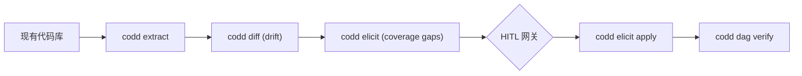

<p align="center">
  <strong>CoDD — Coherence-Driven Development</strong>
</p>

<p align="center">
  <a href="https://pypi.org/project/codd-dev/"></a>
  <a href="https://pypi.org/project/codd-dev/"></a>
  <a href="LICENSE"></a>
  <a href="https://github.com/yohey-w/codd-dev/stargazers"></a>
</p>

<p align="center">
  <a href="README_ja.md">日本語</a> | <a href="README.md">English</a> | 中文
</p>

---

## 🚀 60 秒上手

```bash
pip install codd-dev

# 在项目根目录中
codd init --suggest-lexicons --llm-enhanced   # AI 选定合适的 lexicon
codd elicit                                    # AI 发现需求中的漏洞
codd dag verify --auto-repair --max-attempts 10  # AI 自动修复一致性违规
```

仅此而已。3 条命令，3 个反馈循环，1 个一致的项目。

### 💡 已经在运行？用自然语言描述要修的现象

```bash
codd fix "登录错误信息不够清晰"   # 自然语言 现象起点模式
```

`codd fix [PHENOMENON]` (v2.16.0+) 是 CoDD 北极星的 **第二个入口**: 把想做的修改用自然语言传入，CoDD 通过 lexicon + 语义评分定位受影响的设计文档，由 LLM 更新设计，然后在改任何代码之前先跑 DAG verify 网关。加 `--dry-run` 预览，`--non-interactive` 适配 CI。

> 真实项目验证: 在 Next.js + Prisma + PostgreSQL LMS 上 dogfooding。详见 [案例研究](#-案例研究-真实-lms)。

---

## ✨ 能做什么

| 命令 | 一行说明 |
| --- | --- |
| 🔍 **`codd elicit`** | LLM 发现需求中的 **规格漏洞**，按照行业标准 lexicon (BABOK / OWASP / WCAG / PCI DSS / ISO 25010 等) 划定范围。 |
| 🔄 **`codd diff`** | 检测需求与实际实现之间的 **drift** (兼容 brownfield)。 |
| 🛠️ **`codd dag verify --auto-repair`** | 验证需求 → 设计 → 实现 → 测试的 DAG; 出现违规时 LLM 提交 patch 提案，循环重试直到 SUCCESS 或 MAX_ATTEMPTS。 |
| 🎯 **`codd fix`** / **`codd fix [PHENOMENON]`** | 两种模式。*Legacy*: 自动检测测试/CI 失败，映射到 DAG，让 LLM 给实现打补丁，再走 verify 网关。*PHENOMENON* (v2.16.0+，北极星入口 2): 把要修的现象用自然语言 (例: `"仪表盘加载缓慢"`) 传入，通过 Tier-1 lexicon + Tier-2 语义评分定位候选设计文档，LLM 更新设计并波及到下游。完整 HITL 交互 + `--non-interactive` + `--dry-run`。 |
| 📦 **38 个 lexicon 插件** | 行业标准作为 opt-in 同捆: Web (WCAG / OWASP / Web Vitals / WebAuthn / forms / SEO / PWA / browser-compat / responsive)、Mobile (HIG / Material 3 / a11y / MASVS)、Backend (REST / GraphQL / gRPC / events)、Data (SQL / JSON Schema / event sourcing / governance)、Ops (CI/CD / Kubernetes / Terraform / observability / DORA)、Compliance (ISO 27001 / HIPAA / PCI DSS / GDPR / EU AI Act)、Process (ISO 25010 / 29119 / DDD / 12-factor / i18n / model cards / API rate-limit)、Methodology (BABOK)。 |
| 🌐 **`codd brownfield`** | extract → diff → elicit 流水线: 指向现有代码库就能逆向抽取需求、找出 drift、提示规格漏洞，一气呵成。 |
| 🎯 **`codd init --suggest-lexicons --llm-enhanced`** | LLM 读取代码/文档，识别数据类型与功能特性，推荐应安装的 lexicon (附置信度 + 推理过程)。 |
| 📊 **`codd lexicon list/install/diff` + `codd coverage report`** | 插件管理 + JSON / Markdown / 自包含 HTML 的覆盖矩阵报告。 |
| 🛡️ CI 网关 | `.github/workflows/codd_coverage.yml` 模板 + `codd coverage check` 退出码使覆盖率回退被 merge 阻挡。 |

---

## 🎨 可视化流程

```mermaid
flowchart LR
    R["需求 (.md)"] --> E["codd elicit"]
    E -->|gap findings| H{HITL: approve / reject}
    H -->|[x]| L["project_lexicon.yaml + 需求 TODO"]
    H -->|[r]| I["ignored_findings.yaml"]
    L --> V["codd dag verify --auto-repair"]
    V -->|违规| AR["LLM 提交 patch → 应用"]
    AR --> V
    V -->|SUCCESS| D["✅ deploy 网关通过"]
    AR -->|max attempts| P["PARTIAL_SUCCESS: 诚实地暴露不可修复项"]
```

Brownfield (从现有代码起步) 路径:



---

## 📊 案例研究: 真实 LMS

Next.js + Prisma + PostgreSQL 多租户 LMS (≈30 份设计文档、12 张数据库表、RLS 强制隔离):

| 阶段 | 结果 |
| --- | --- |
| `codd init --suggest-lexicons --llm-enhanced` | LLM 检测到 **数据类型** (个人信息 / 支付 / 视频) 与 **功能特性** (认证 / 支付 / 公开 REST)，推荐 15 个 lexicon —— 与人工选择的 10 个中有 9 个吻合，验证了启发式推断。 |
| `codd elicit` (加载 10 个 lexicon、scope=`system_implementation`、phase=`mvp`) | **70 个 finding** (web a11y / data governance / SQL / security / Web Vitals / WebAuthn / API / process)。业务向维度 (KPI / UAT 细节 / 风险登记) 因 scope filter 自动剔除。 |
| `codd dag verify --auto-repair` | 起初 unrepairable=16 → 通过定向 core 改进 (deployment chain auto-discover、runtime-state auto-bind、mock harness no-op、scope/phase filter)，同一项目现在到达 **PASS 或 amber-WARN，deploy 允许**。 |
| VPS smoke (`/`, `/login`, `/api/health`) | 全部 3 个端点 **200 OK**。 |

整条流水线的改进中，**对 CoDD core 的项目专属修改为 0 行** —— 项目个性都封闭在 `project_lexicon.yaml` 或 `codd_plugins/` (Generality Gate, Layer A/B/C) 里。

---

## 🌟 CoDD 为何存在

> **「只写功能需求和约束。代码自动生成、自动修复、自动验证。」**

大多数「AI 辅助开发」工具关注 **生成** 侧。CoDD 关注 **约束** 侧: LLM 在「什么必须为真」清晰时最有用。CoDD 把这种清晰图景以连接所有产物的 DAG 形式给出，并提供让行业标准 (BABOK / WCAG / OWASP / PCI / ISO) 以机械方式供给约束的插件面。

当 DAG 被破坏时，LLM 提交 patch，循环重新校验，最终要么到达 SUCCESS，要么把结构上不可修复的部分诚实地暴露出来。

### Generality Gate (三层架构)

| Layer | 栈固有名在哪里 | 例 |
| --- | --- | --- |
| **A — Core** | **不在任何地方。** 零 `react`、`django`、`Stripe`、`LMS` 字面量。 | `codd/elicit/`, `codd/dag/`, `codd/lexicon_cli/` |
| **B — Templates** | 仅通用占位符。 | `codd/templates/*.j2`, `codd/templates/lexicon_schema.yaml` |
| **C — Plug-ins** | 自由命名。 | `codd_plugins/lexicons/*/`, `codd_plugins/stack_map.yaml` |

这就是为什么同一个 core 能跑 Next.js、Django、FastAPI、Rails、Go service、移动应用、ML 模型卡 —— 并且贡献者无需触碰 core 即可新增 lexicon。

---

## 🧭 Roadmap

- **v2.18.0 (当前)** — 来自 [@v-kato](https://github.com/v-kato) 的 Greenfield triage (cmd_473)。Issue #20: `codd implement run --language` 可按调用粒度覆盖 `project.language` (避免 `codd init --language` 选错时的全 Wave 重生成 1h+ 成本)。Issue #21: 将 `detailed_design` 加入 `DEFAULT_NODE_PREFIXES`，消除 `codd plan --init` 生成的 node_id 被自家 `codd validate` 拒绝的自相矛盾。Issue #22: `_strip_code_fence` 改为非贪婪 + 不锚定行尾，截掉 LLM 在闭合 fence 之后追加的 markdown 解说。新增 12 项测试，合计 2937 PASS，SKIP=0。
- **v2.17.1** — `codd fix [PHENOMENON]` 紧急补丁 (cmd_471)。Issue #23: 把 `codd/fix/templates/*.txt` 重新打进 wheel (hatch `include` 遗漏导致 `pip install` 后出现 `FileNotFoundError`)。Issue #24: 将 `design_update.txt` / `risk_assessment.txt` 中的 `---` 包裹改为 `<document>` / `<diff>` XML 风格标签，避免与 markdown frontmatter 及 unified-diff 的 `--- a/path` 冲突。新增 11 项测试，合计 2925 PASS，SKIP=0。
- **v2.17.0** — `node_completeness` 支持 `kind: common` (cmd_470)。修复 v2.15.0 引入的疏漏：当 `expects` 边指向 common（共享基础设施）节点时，即使实体文件存在，`node_completeness` 仍会误报为 missing。新增 6 项测试，合计 2914 PASS，SKIP=0。
- **v2.16.0** — `codd fix [PHENOMENON]` 北极星入口2 实现 (cmd_468)。用自然语言描述想修复的现象，CoDD 通过 Tier-1 lexicon + Tier-2 语义评分定位相关设计文档、LLM 更新、DAG verify 全自动。含交互式 HITL（候选选择/模糊澄清/风险确认）+ `--non-interactive`（CI 用）。66 个新测试，合计 2908 PASS，SKIP=0。
- **v2.15.0** — 引入 `kind: common` (cmd_467)。C5 amber −79.2%（125 → 26）。`**` glob translator 修复。
- **v2.14.0** — 结构缺陷 8 件一次修复 (cmd_466)。sidecar `verified_by:` (C6) / `axis_matrix:` (C9)、lexicon SSoT、scan.exclude bug fix (amber −52%)、`--auto-repair`、mock-AI、timeout 3600s。red 22 → 0。
- **v2.13.0** — opt-out 保护：`OptOutPolicy` 要求提供 `justification` + `expires_at`。废除静默 SKIP，保留 severity。
- **v2.12.0** — 测试完整性门控：C7 amber 提升 + C8 `ci_health` 静态检查新增。
- **v2.11.0** — 废弃 sprint 的 implement（`--design <path> --output <dir>` 直接指定）。
- **v2.19.0 (规划中)** — PHENOMENON 的 impl/test 自动波及完成 (AC #8)、Codex wrapper。

---

## 🤝 贡献者

CoDD 由以下成员塑造:

- **[@yohey-w](https://github.com/yohey-w)** — Maintainer / Architect
- **[@Seika86](https://github.com/Seika86)** — Sprint regex 见解 (PR #11)
- **[@v-kato](https://github.com/v-kato)** — brownfield 复现报告 (Issues #17 / #18 / #19)
- **[@dev-komenzar](https://github.com/dev-komenzar)** — `source_dirs` bug 复现 (Issue #13)

欢迎来自外部的 issue / PR / lexicon 提议 —— 详见 [Issues](https://github.com/yohey-w/codd-dev/issues)。

---

## 📚 文档

- [CHANGELOG.md](CHANGELOG.md) —— 各 release 的质量指标
- [docs/](docs/) —— 架构笔记
- `codd --help` —— CLI 完整参考

---

## 📦 Hook integration

CoDD 同捆 editor / Git 工作流的 hook recipe:

- Claude Code `PostToolUse` hook recipe —— 文件编辑后运行 CoDD 检查
- Git `pre-commit` hook recipe —— 一致性检查违规时阻挡 commit

Recipe 位于 `codd/hooks/recipes/`。

---

## 许可证

MIT —— 详见 [LICENSE](LICENSE)。

## 链接

- [PyPI](https://pypi.org/project/codd-dev/)
- [GitHub Sponsors](https://github.com/sponsors/yohey-w) —— 开发支援
- [Issues](https://github.com/yohey-w/codd-dev/issues)

---

> 「代码改变时，CoDD 追踪影响范围、检测违规、为 merge 判断生成证据。」
