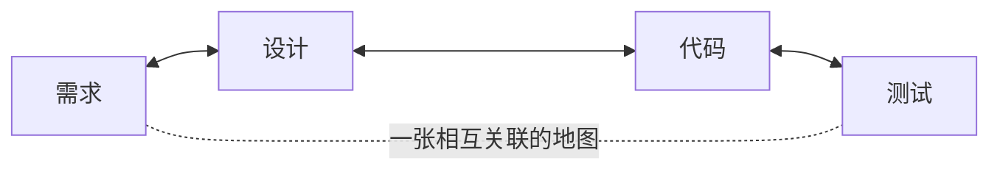

<p align="center">
  <strong>CoDD — Coherence-Driven Development</strong>
</p>

<p align="center">
  <a href="https://pypi.org/project/codd-dev/"></a>
  <a href="https://pypi.org/project/codd-dev/"></a>
  <a href="LICENSE"></a>
  <a href="https://github.com/yohey-w/codd-dev/stargazers"></a>
</p>

<p align="center">
  <a href="README_ja.md">日本語</a> | <a href="README.md">English</a> | 中文
</p>

<p align="center">
  <em>写下你想要的东西就好。CoDD 会根据你的需求把它构建出来，在后续的改动中让文档和代码始终保持同步，并真正跑通测试——让它无法伪造「通过」。</em>
</p>

---

## CoDD 是什么？

设想一下真实代码库里再普通不过的一天：

- 你改了一个函数——结果另外三处悄悄依赖它的地方坏掉了，因为没人记得它们之间还有这层关联。
- 测试套件亮起了绿灯——可它压根没跑到你刚改过的那段代码。
- 设计文档里写的，还是这个功能上个月的样子。

在大型项目里——或者在 AI 替你写的代码里——这种「逐渐失准」的现象到处都是，于是*「现在一切还一致吗？」*这个问题，靠人工根本无从回答。

**CoDD 把这个问题变成了机器能够回答的问题。**

它会构建出一张**记录项目中所有东西如何彼此关联的地图**——哪条需求由哪段代码实现，哪段代码被哪个测试覆盖，哪个配置项会切换哪种行为。一旦 CoDD 拥有了这张地图，它就能为你做三件事：

1. **构建**——把你的需求转化为设计、代码和测试。
2. **追踪**——当你改动任何东西时，把这次改动会波及的一切都标出来，让任何东西都不会悄无声息地坏掉。
3. **验证**——通过一套**拒绝伪造通过**的检验机制，运行真实的构建与测试。



这张地图是**双向**的：改动代码，CoDD 就会指出哪些设计文档和需求已经过时；新增一条需求，它就会指出哪些代码和测试需要随之改动。这种双向的一致性，正是 CoDD 中的「Co」（coherence，一致性）。

### 它和 Copilot 或 Cursor 有什么不同？

那些工具让 *AI* 本身变得更聪明，CoDD 则让喂给 AI 的*输入*变得更聪明。它把一次改动究竟会触及什么，连同每条关联的证据，作为一张精确的地图直接交给 AI——而不是让 AI 仅凭恰好打开的那几个文件去猜。而且 CoDD 的验证机制天生就**无法撒谎**：空的测试套件、其实只是个 `true` 的构建脚本、缺失的测试报告——统统会返回**红色**，绝不会悄悄变成绿灯。

---

## 安装

```bash
pip install codd-dev          # needs Python 3.10+   ·   the command is `codd`
codd version
```

---

## 试一试

根据你所处的阶段，有三种入手方式。

### 1. 全新项目从零开始——`codd greenfield`

把你想要的东西写成一份普通的 Markdown 文件，然后让 CoDD 无人值守地把整个东西构建出来（设计 → 代码 → 测试 → 验证，一路上自行修复遇到的问题）：

```bash
codd greenfield --requirements docs/requirements/requirements.md
```

它会在每一步之后保存检查点，因此 `codd greenfield --resume` 会从上次中断的地方接着跑。加上 `--dry-run` 可以先预览计划，或用 `--ntfy-topic <topic>` 把进度通知推送到你的手机上。

> **当前的语言覆盖：** 无人值守的 greenfield 已从同一份中立需求规格（一个多模块计算器库，15–20 个文件）在**全部六种主流语言 — Python、TypeScript、JavaScript、Java、C++ 和 C# — 上完成端到端实证验证**。验证基于实际执行：每次运行的可验证行为都与该语言的原生测试报告（pytest / vitest / surefire / ctest / dotnet-trx）交叉核对，未收敛的运行会诚实地停止，而不会报告为虚假通过。重复次数并不一致——TypeScript 和 Python 有 3 次中至少 2 次独立的 green 运行，JavaScript、Java、C++、C# 为 n≥1。这验证了流水线在库规模上的跨语言接线与收敛机制，但**尚未**主张企业级复杂度（那是后续 real-spec 战役的目标）。

这套同样的一条命令的流水线（`codd greenfield --requirements FILE`）还以三种可阅读、可改写的形式提供：一个 shell 脚本（[`examples/greenfield_autopilot.sh`](examples/greenfield_autopilot.sh)）、一个 Claude Code 工作流（[`examples/claude_workflows/codd-greenfield.js`](examples/claude_workflows/codd-greenfield.js)），以及一个 skill（`codd skills install codd-greenfield --target both`）。

### 2. 在已有代码库上工作——`codd init` + `codd scan`

CoDD 会读取你现有的代码，推断出其背后的设计，然后从此让两者保持同步：

```bash
codd init                 # set CoDD up in your repo
codd scan                 # build the connection map from your code
codd brownfield           # recover design docs, compare them to reality, list the gaps
```

### 3. 已经在持续交付了？只需描述这次改动——`codd fix`

```bash
codd fix "the login error messages are confusing"
```

CoDD 会找出你的请求所触及的设计文档，更新它们，再让这次改动一路贯穿**设计 → 代码 → 测试 → 验证**。它只会编辑地图所认定相关的那些文件；如果最终检查没通过，它只回滚那些文件——绝不波及其他。

---

## 工作原理——三件事，一张地图

| 职责 | 它做什么 | 主要命令 |
| --- | --- | --- |
| **1. 从意图构建** | 把需求转化为设计候选方案，再生成代码和测试脚手架。AI 提出方案，由你来抉择（主动权始终在你手上）。 | `greenfield`、`generate`、`implement`、`plan` |
| **2. 追踪每一次改动** *(核心所在)* | 一张横跨需求、设计、代码、配置、数据和测试的关联地图。改动一处，CoDD 就会把波及的连锁反应标出来——并归类为**绿色**（可放心自动修复）、**黄色**（请审查）、**灰色**（仅供知会）——每条关联都附带原因。 | `scan`、`impact`、`propagate`、`diff` |
| **3. 真正地验证** | 运行你真实的构建与测试，让它们无法伪造通过，并把任何失败追溯回导致它的那个工件。 | `verify`、`check`、`coverage` |

这三件事在一个闭环里彼此驱动：构建决定*改什么*，追踪找出它*落在何处*，验证则证明它确实成立——而你每提交一次，都会让这张地图为下一轮变得更精准。（想了解完整脉络？参见 [`docs/explainer.md`](docs/explainer.md)。）

---

## v3.0 新特性——Contract Kernel（契约内核）

旧版 CoDD 把对特定语言和框架（Go、Python、Next.js……）的认知硬编码进了核心。**v3.0 把这一切全部从核心中抽离出来**，转而放进可替换的描述文件（「profile」）外加若干小型适配器：

- **核心不再认得任何语言或框架的名字。** 它只负责读取这些 profile。因此，新增对某门语言或某个框架的支持，就是写一份新的 profile 加一个适配器——**核心无需任何改动**。
- **框架可以组合。** Next.js + TypeScript + Playwright + Prisma 会组合成一份解析后的描述，供 `codd verify` 实时对照你的项目运行。
- **「拒绝伪造通过」这条规则属于核心。** profile 可以调整参数，但**永远无法削弱**这条不允许伪造通过的保证。（已在一个真实的 Next.js 应用上、使用真实的工具链端到端验证过：每一处刻意植入的破坏，都正确地返回了红色。）

一句话概括：如今同一个核心就能服务于 Next.js、Django、FastAPI、Rails、Go 服务等等——而且任何人都能在不触碰它的前提下添加新的支持。

---

## 与你的 AI 工具协同

- **MCP 服务器**——`codd mcp-server` 通过 stdio 把 CoDD 暴露给任意 MCP 客户端（例如 Claude Code）。
- **面向 Claude Code 与 Codex CLI 的 Skills**——`codd skills install <name> --target both` 会把现成的 skills（例如绿地自动驾驶）安装到 `~/.claude/skills/` 和 `~/.agents/skills/`。
- **Codex App Server**——让 AI 调用走一条持久连接，而不是每次都重新起一个子进程（在 `codd.yaml` 中设置 `codex_app_server.enabled: true`），并带有自动回退机制。

---

## Hook 集成

CoDD 自带现成的 hook 配方（位于 `codd/hooks/recipes/` 下），让一致性检查能在你工作的同时自动运行：

- **Claude Code `PostToolUse` hook**——在每次文件编辑之后立刻运行 CoDD 检查。
- **Git `pre-commit` hook**——当某次提交会破坏一致性时，拦截这次提交。
- **Git `post-commit` hook** 以及一个 **Codex CLI hook**——在你提交的同时，让这张关联地图始终保持最新。
- **需求变更提醒配方**（`claude_requirements_nudge.json`）——当需求发生变化时，提醒你重新运行 `codd greenfield --resume`（仅打印提示，绝不会自行运行流水线）。

从 `codd/hooks/recipes/` 里把你想要的那份配方复制到你的编辑器或 Git 配置中，即可启用。

---

## 覆盖词典（Coverage lexicons）

CoDD 内置了 **39 部现成的「词典」**——这些清单取自真实的行业标准——你可以按需启用，让 `codd elicit` 帮你找出规格中的漏洞。它们涵盖 Web（WCAG、OWASP、Web Vitals）、移动端（HIG、Material 3、MASVS）、后端（REST、GraphQL、gRPC）、数据（SQL、JSON Schema）、运维（Kubernetes、Terraform、DORA）、合规（ISO 27001、HIPAA、PCI DSS、GDPR、EU AI Act）等诸多领域。启用适合你的那些；也可以在不触碰核心的情况下添加你自己的词典。

---

## 文档

- [`docs/explainer.md`](docs/explainer.md) ——完整的理念，从关联地图一直讲到 AI 驱动的开发
- [`CHANGELOG.md`](CHANGELOG.md) ——每一个版本
- `codd --help` ——完整的命令参考（在任何项目里，`codd check` 都是最好的起点）
- [`docs/`](docs/) ——架构笔记、安装指南，以及一本操作手册

---

## 参与贡献

欢迎提交 Issue、Pull Request 以及词典提案——参见 [Issues](https://github.com/yohey-w/codd-dev/issues)。CoDD 由 [@yohey-w](https://github.com/yohey-w) 维护，并衷心感谢每一位报告缺陷、贡献想法、从而塑造了本项目的朋友。

---

## 许可证与链接

MIT——参见 [LICENSE](LICENSE)。

- [PyPI](https://pypi.org/project/codd-dev/)
- [GitHub Sponsors](https://github.com/sponsors/yohey-w) ——支持本项目的开发
- [Issues](https://github.com/yohey-w/codd-dev/issues)
