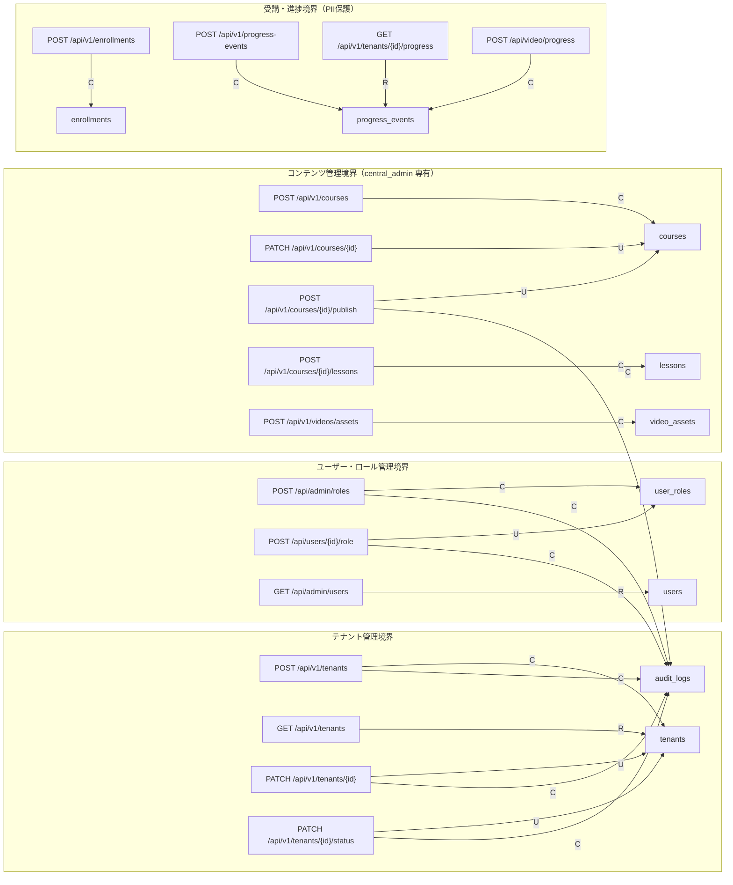
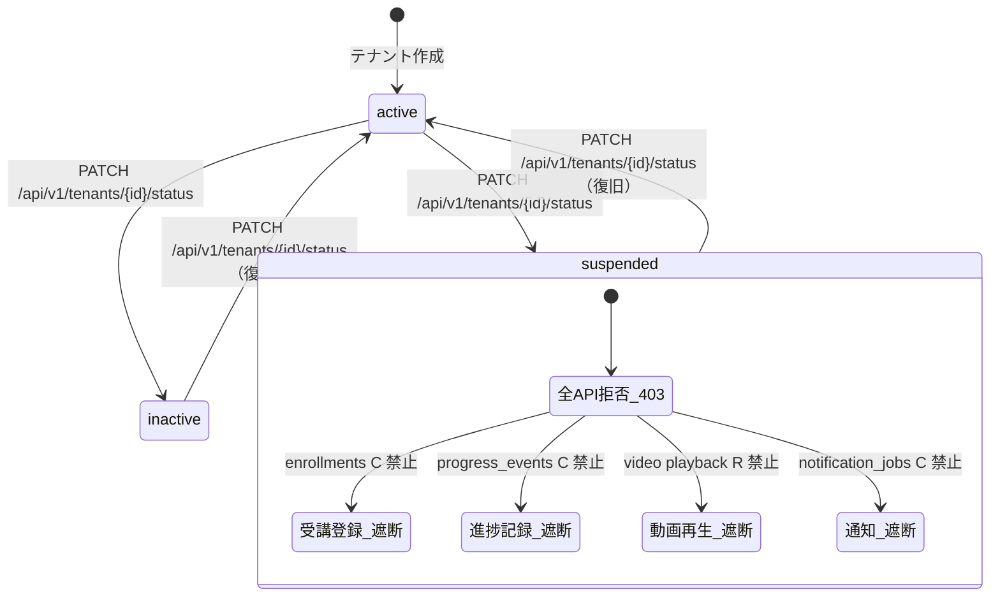
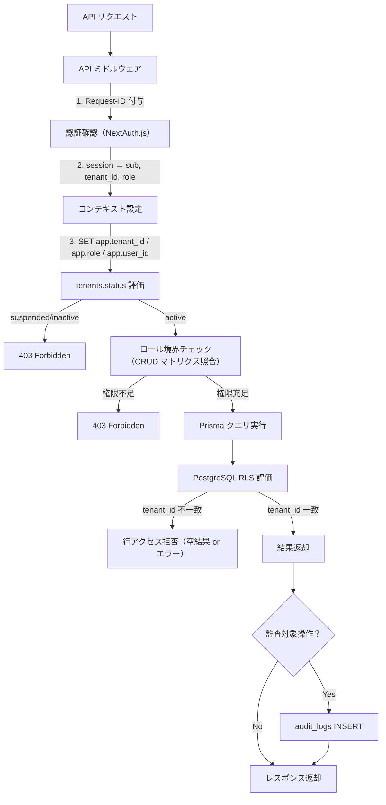
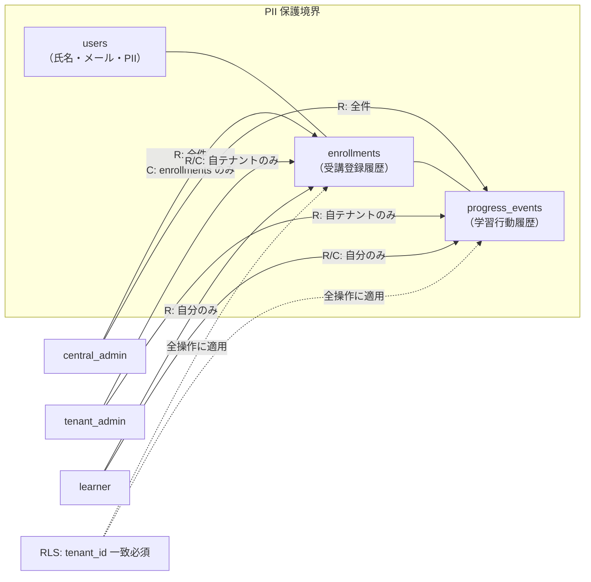

---
codd:
  node_id: design:data-access-crud-matrix
  type: design
  depends_on:
  - id: design:database-design
    relation: depends_on
    semantic: technical
  - id: design:api-design
    relation: depends_on
    semantic: technical
  - id: design:auth-authorization-design
    relation: depends_on
    semantic: technical
  conventions:
  - targets:
    - db:rls_policies
    - db_table:tenants
    - db_table:user_roles
    - db_table:audit_logs
    reason: 各モジュールの CRUD 権限と RLS 境界を一意にし、監査ログ記録責務を明示すること。
  - targets:
    - db_table:enrollments
    - db_table:progress_events
    reason: 個人情報・学習履歴を扱うテーブルは read/write ownership を限定し、越境アクセス防止を保証すること。
---

# データアクセスCRUD責務設計書

Node ID: `design:data-access-crud-matrix`
タイトル: `データアクセスCRUD責務設計書`
対象: `lms.4ms-system.com`
最終審査目標: `2026-09-01`

## 1. Overview

本設計書は `design:database-design`、`design:api-design`、`design:auth-authorization-design` を統合し、全テーブルに対する CRUD 操作の責務境界をロール×テーブル×操作の三軸で一意に定義する。

目的は以下の3点に集約される。

1. **CRUD 権限の一意化**: どのロールがどのテーブルに対してどの操作（Create / Read / Update / Delete）を実行可能かを曖昧さなく定義し、実装時のロール判定ロジックと RLS ポリシーの根拠とする
2. **RLS 境界との整合**: PostgreSQL RLS（`app.tenant_id`, `app.role`, `app.user_id`）による行レベル制御と、API ミドルウェアによるアプリケーション層ガードの二重防御を CRUD 単位で明示する
3. **監査ログ記録責務の明示**: `audit_logs` への書込トリガーとなる操作を特定し、監査漏れを防止する

本書の CRUD マトリクスは RLS ポリシー実装、API ミドルウェア実装、`test:test_tenant_isolation` テストケース設計の正式入力とする。

## 2. CRUD マトリクス全体図

### 2.1 テナント管理・設定系

| テーブル | 操作 | `central_admin` | `tenant_admin` | `learner` | 監査対象 | RLS 制約 |
|---|---|---|---|---|---|---|
| `tenants` | **C** | 可 | 不可 | 不可 | 記録 | `tenant_id` 一致（central は全件） |
| `tenants` | **R** | 全件 | 自テナントのみ | 不可 | - | 同上 |
| `tenants` | **U** | 可（status 含む） | 不可 | 不可 | 記録 | 同上 |
| `tenants` | **D** | 論理削除のみ | 不可 | 不可 | 記録 | 同上 |
| `tenant_settings` | **C** | 可（テナント作成時） | 不可 | 不可 | 記録 | `tenant_id` 一致 |
| `tenant_settings` | **R** | 全件 | 自テナントのみ | 自テナントのみ | - | 同上 |
| `tenant_settings` | **U** | 可 | 自テナントのみ（限定項目） | 不可 | 記録 | 同上 |
| `tenant_settings` | **D** | 不可（テナント連動） | 不可 | 不可 | - | - |

### 2.2 ユーザー・ロール系

| テーブル | 操作 | `central_admin` | `tenant_admin` | `learner` | 監査対象 | RLS 制約 |
|---|---|---|---|---|---|---|
| `users` | **C** | 可 | 自テナントのみ | 不可 | 記録 | `tenant_id` 一致 |
| `users` | **R** | 全件 | 自テナントのみ | 自分のみ | - | 同上 |
| `users` | **U** | 可 | 自テナント所属者のみ | 自分のみ（限定項目） | 記録 | 同上 |
| `users` | **D** | 論理削除（`deleted_at`） | 不可 | 不可 | 記録 | 同上 |
| `user_roles` | **C** | 可 | 不可 | 不可 | 記録 | `tenant_id` 一致 |
| `user_roles` | **R** | 全件 | 自テナントのみ | 自分のみ | - | 同上 |
| `user_roles` | **U** | 可（revoke 含む） | 不可 | 不可 | 記録 | 同上 |
| `user_roles` | **D** | 論理削除（`revoked_at`） | 不可 | 不可 | 記録 | 同上 |

### 2.3 コース・モジュール・レッスン系

| テーブル | 操作 | `central_admin` | `tenant_admin` | `learner` | 監査対象 | RLS 制約 |
|---|---|---|---|---|---|---|
| `courses` | **C** | 可 | 不可 | 不可 | 記録 | `tenant_id` 一致 |
| `courses` | **R** | 全件 | 配信割当済みのみ | 受講登録済みのみ | - | 同上 |
| `courses` | **U** | 可 | 不可 | 不可 | 記録 | 同上 |
| `courses` | **D** | 可 | 不可 | 不可 | 記録 | 同上 |
| `modules` | **C** | 可 | 不可 | 不可 | - | `tenant_id` 一致 |
| `modules` | **R** | 全件 | 配信割当コースのみ | 受講コースのみ | - | 同上 |
| `modules` | **U** | 可 | 不可 | 不可 | - | 同上 |
| `modules` | **D** | 可 | 不可 | 不可 | - | 同上 |
| `lessons` | **C** | 可 | 不可 | 不可 | - | `tenant_id` 一致 |
| `lessons` | **R** | 全件 | 配信割当コースのみ | 受講コースのみ | - | 同上 |
| `lessons` | **U** | 可 | 不可 | 不可 | - | 同上 |
| `lessons` | **D** | 可 | 不可 | 不可 | - | 同上 |

### 2.4 受講・進捗系（PII 保護対象）

| テーブル | 操作 | `central_admin` | `tenant_admin` | `learner` | 監査対象 | RLS 制約 |
|---|---|---|---|---|---|---|
| `enrollments` | **C** | 可 | 自テナントのみ | 不可 | 記録 | `tenant_id` 一致 + `unique(user_id, course_id, tenant_id)` |
| `enrollments` | **R** | 全件 | 自テナントのみ | 自分のみ | - | 同上 |
| `enrollments` | **U** | 可（完了処理） | 自テナントのみ（完了処理） | 自分のみ（完了処理） | 記録 | 同上 |
| `enrollments` | **D** | 不可（履歴保全） | 不可 | 不可 | - | - |
| `progress_events` | **C** | 不可 | 自テナントのみ | 自分のみ | - | `tenant_id` 一致 + `enrollment_id` 参照整合 |
| `progress_events` | **R** | 全件 | 自テナントのみ | 自分のみ | - | 同上 |
| `progress_events` | **U** | 不可（イベント不変） | 不可 | 不可 | - | - |
| `progress_events` | **D** | 不可（履歴保全） | 不可 | 不可 | - | - |

### 2.5 評価・修了証系

| テーブル | 操作 | `central_admin` | `tenant_admin` | `learner` | 監査対象 | RLS 制約 |
|---|---|---|---|---|---|---|
| `assessments` | **C** | 可 | 不可 | 不可 | - | `tenant_id` 一致 |
| `assessments` | **R** | 全件 | 自テナントのみ | 受講コースのみ | - | 同上 |
| `assessments` | **U** | 可 | 不可 | 不可 | - | 同上 |
| `assessments` | **D** | 可 | 不可 | 不可 | - | 同上 |
| `certificates` | **C** | 可（発行処理） | 不可 | 不可（システム発行） | 記録 | `tenant_id` 一致 |
| `certificates` | **R** | 全件 | 自テナントのみ | 自分のみ | - | 同上 |
| `certificates` | **U** | 可（ステータス変更） | 不可 | 不可 | 記録 | 同上 |
| `certificates` | **D** | 不可（発行済み保全） | 不可 | 不可 | - | - |

### 2.6 監査・セッション・配信割当系

| テーブル | 操作 | `central_admin` | `tenant_admin` | `learner` | 監査対象 | RLS 制約 |
|---|---|---|---|---|---|---|
| `audit_logs` | **C** | システム自動（API ミドルウェア） | システム自動 | システム自動 | - | `tenant_id` 一致 |
| `audit_logs` | **R** | 全件 | 自テナントのみ | 不可 | - | 同上 |
| `audit_logs` | **U** | 不可（更新禁止） | 不可 | 不可 | - | - |
| `audit_logs` | **D** | 日次バッチのみ（90日ローテーション） | 不可 | 不可 | - | - |
| `session_store` | **C** | システム自動（NextAuth） | システム自動 | システム自動 | - | 条件付き |
| `session_store` | **R** | システム自動 | システム自動 | システム自動 | - | 同上 |
| `session_store` | **U** | システム自動 | システム自動 | システム自動 | - | 同上 |
| `session_store` | **D** | システム自動（有効期限） | システム自動 | システム自動 | - | 同上 |
| `tenant_course_assignments` | **C** | 可 | 不可 | 不可 | 記録 | `tenant_id` 一致 |
| `tenant_course_assignments` | **R** | 全件 | 自テナントのみ | 不可 | - | 同上 |
| `tenant_course_assignments` | **U** | 可 | 不可 | 不可 | 記録 | 同上 |
| `tenant_course_assignments` | **D** | 可 | 不可 | 不可 | 記録 | 同上 |

### 2.7 通知・連携・決済系

| テーブル | 操作 | `central_admin` | `tenant_admin` | `learner` | 監査対象 | RLS 制約 |
|---|---|---|---|---|---|---|
| `notification_jobs` | **C** | 可 | 自テナントのみ | 不可 | - | `tenant_id` 一致 |
| `notification_jobs` | **R** | 全件 | 自テナントのみ | 不可 | - | 同上 |
| `notification_jobs` | **U** | 可（ステータス更新） | 不可 | 不可 | - | 同上 |
| `notification_jobs` | **D** | 不可（履歴保全） | 不可 | 不可 | - | - |
| `line_delivery_events` | **C** | システム自動（連携ジョブ） | システム自動 | 不可 | - | `tenant_id` 一致 |
| `line_delivery_events` | **R** | 全件 | 自テナントのみ | 不可 | - | 同上 |
| `line_delivery_events` | **U** | 不可（イベント不変） | 不可 | 不可 | - | - |
| `line_delivery_events` | **D** | 不可（トレース保全） | 不可 | 不可 | - | - |
| `payments` | **C** | システム自動（Stripe Webhook） | 不可 | 不可 | 記録 | `tenant_id` 一致 |
| `payments` | **R** | 全件 | 自テナントのみ | 不可 | - | 同上 |
| `payments` | **U** | システム自動（Stripe Webhook） | 不可 | 不可 | 記録 | 同上 |
| `payments` | **D** | 不可（決済履歴保全） | 不可 | 不可 | - | - |

### 2.8 配信制御・動画系

| テーブル | 操作 | `central_admin` | `tenant_admin` | `learner` | 監査対象 | RLS 制約 |
|---|---|---|---|---|---|---|
| `drip_schedules` | **C** | 可 | 不可 | 不可 | - | `tenant_id` 一致 |
| `drip_schedules` | **R** | 全件 | 自テナントのみ | 不可 | - | 同上 |
| `drip_schedules` | **U** | 可 | 不可 | 不可 | - | 同上 |
| `drip_schedules` | **D** | 可 | 不可 | 不可 | - | 同上 |
| `course_deadlines` | **C** | 可 | 不可 | 不可 | - | `tenant_id` 一致 |
| `course_deadlines` | **R** | 全件 | 自テナントのみ | 自受講コースのみ | - | 同上 |
| `course_deadlines` | **U** | 可 | 不可 | 不可 | - | 同上 |
| `course_deadlines` | **D** | 可 | 不可 | 不可 | - | 同上 |
| `video_assets` | **C** | 可 | 不可 | 不可 | - | `tenant_id` 一致 |
| `video_assets` | **R** | 全件 | 自テナントのみ | 受講レッスンのみ | - | 同上 |
| `video_assets` | **U** | 可 | 不可 | 不可 | - | 同上 |
| `video_assets` | **D** | 可 | 不可 | 不可 | - | 同上 |

## 3. CRUD-API マッピング図

**所有権の明示**: コンテンツ管理境界（`courses`, `modules`, `lessons`, `video_assets` の CUD 操作）は `central_admin` が唯一のオーナーである。`tenant_admin` と `learner` は Read のみ許可され、`tenant_course_assignments` を通じて配信されたコースに限定される。受講・進捗境界の Write オーナーは `learner`（自身の学習行為）と `tenant_admin`（受講登録代行）であり、`central_admin` は参照と受講登録のみ実行する。

## 4. テナント停止時の CRUD 遮断マトリクス

`tenants.status` が `suspended` または `inactive` の場合、API ミドルウェアと DB 書込ガードの二重制御で以下の操作を遮断する。

| テーブル | 操作 | active 時 | suspended/inactive 時 | 遮断レイヤー |
|---|---|---|---|---|
| `enrollments` | **C** | 許可 | 遮断（`403`） | API ミドルウェア + DB ガード |
| `enrollments` | **R** | 許可 | 遮断（`403`） | API ミドルウェア |
| `progress_events` | **C** | 許可 | 遮断（`403`） | API ミドルウェア + DB ガード |
| `progress_events` | **R** | 許可 | 遮断（`403`） | API ミドルウェア |
| `video_assets` | **R**（再生URL発行） | 許可 | 遮断（`403`） | API ミドルウェア |
| `notification_jobs` | **C** | 許可 | 遮断（通知停止） | API ミドルウェア + ジョブスケジューラ |
| `line_delivery_events` | **C** | 許可 | 遮断（通知停止） | 連携ジョブ側ガード |
| `audit_logs` | **C** | 自動記録 | 自動記録（停止操作自体を監査） | 常時有効 |

遮断時の応答は一貫して `403 Forbidden` とし、`200` での情報漏えいを許容しない。エラー文言は日本語で「このテナントは現在停止中です。復旧については管理者にお問い合わせください。」等の再開手順を含む文言を返却する。

## 5. RLS ポリシーと CRUD 境界の整合

**二重防御の責務分担**:
- **API ミドルウェア層**: ロール判定（CRUD マトリクスの権限カラムに基づく）、テナント停止判定、Request-ID 付与を担当する。CRUD マトリクスの「不可」判定は本層で `403` を返す
- **PostgreSQL RLS 層**: `app.tenant_id` による行レベルフィルタリングを担当する。ミドルウェアを迂回した場合のフェイルセーフとして機能し、`central_admin` は `app.tenant_id IS NULL` で全テナント参照を許可、`tenant_admin` / `learner` は一致 `tenant_id` のみ許可
- **サービスアカウント/ジョブ**: `tenant_admin` の権限をエミュレートせず、実行時に明示的な `tenant_id` をセットして RLS コンテキストを確立する

## 6. 監査ログ記録責務マトリクス

`audit_logs` への INSERT トリガーとなる操作を網羅的に定義する。`audit_logs` 自体は更新・削除禁止であり、`02:00 JST` の日次バッチで `created_at < NOW() - INTERVAL '90 day'` のレコードのみ削除する。

| 対象テーブル | 監査トリガー操作 | 記録項目 | API エンドポイント例 |
|---|---|---|---|
| `tenants` | C / U / D | `action`, `before_state`, `after_state` | `POST /api/v1/tenants`, `PATCH /api/v1/tenants/{id}` |
| `tenants` (status) | U（停止/復旧） | `before_state.status`, `after_state.status` | `PATCH /api/v1/tenants/{id}/status` |
| `tenant_settings` | U（重要設定変更） | 変更前後の設定値 | `PATCH /api/v1/tenants/{id}/settings` |
| `user_roles` | C / U（付与/剥奪） | `role`, `granted_by_user_id`, `reason` | `POST /api/admin/roles`, `POST /api/users/{id}/role` |
| `users` | C / U / D（論理削除） | `email`（マスク）, `status` | `POST /api/admin/users` |
| `courses` | C / U / D | `title`, `published` | `POST /api/v1/courses`, `POST /api/v1/courses/{id}/publish` |
| `enrollments` | C / U（完了処理） | `user_id`, `course_id`, `status` | `POST /api/v1/enrollments` |
| `certificates` | C / U | `user_id`, `course_id`, `status` | システム発行処理 |
| `tenant_course_assignments` | C / U / D | `tenant_id`, `course_id` | `POST /api/v1/tenants/{id}/courses/{id}/assign` |
| `payments` | C / U（Webhook経由） | `stripe_subscription_id`, `status` | `POST /api/payments/stripe/webhook` |
| （5XX発生時） | システムエラー | `actor_user_id`, `endpoint`, `request_id` | 全 API エンドポイント |

**監査ログの必須フィールド**: `actor_user_id`, `actor_role`, `tenant_id`, `action`, `resource_type`, `resource_id`, `before_state`, `after_state`, `request_id`, `ip_hash`, `user_agent`, `endpoint`, `created_at`

**所有権**: `audit_logs` の Write は API ミドルウェアの監査フック（リクエスト後処理）が唯一のオーナーである。アプリケーションコードからの直接 INSERT は禁止し、ミドルウェアの `afterHandler` で統一的に記録する。

## 7. PII 保護テーブルのアクセス制限設計

`enrollments` と `progress_events` は `users` テーブルの個人情報（氏名・メールアドレス）および学習履歴と直結するため、Read/Write ownership を厳格に限定する。

**越境アクセス防止の保証**:
- `enrollments` は `unique(user_id, course_id, tenant_id)` 制約と RLS の組み合わせにより、他テナントの受講情報への参照・書込を物理的に遮断する
- `progress_events` は `enrollment_id` への外部キー参照整合により、`enrollments` の RLS 境界を継承する。`tenant_id` 不一致の `enrollment_id` を指定した INSERT は外部キー違反で拒否される
- `users` テーブルの `email`, `display_name` は API レスポンスで最小表示化し、ログには `ip_hash` のみ保存する（生 IP 不保存）
- `progress_events` は追記専用（UPDATE/DELETE 不可）とし、学習履歴の改竄を防止する

## 8. テーブル別 CRUD オーナーシップサマリ

全テーブルの「誰が何を書けるか」を単一参照点として提供する。

| テーブル | Create オーナー | Read オーナー | Update オーナー | Delete オーナー |
|---|---|---|---|---|
| `tenants` | `central_admin` | `central_admin`, `tenant_admin`（自） | `central_admin` | `central_admin`（論理） |
| `tenant_settings` | `central_admin`（テナント作成時） | 全ロール（自テナント） | `central_admin`, `tenant_admin`（自・限定） | 不可 |
| `users` | `central_admin`, `tenant_admin`（自） | 全ロール（スコープ付き） | `central_admin`, `tenant_admin`（自）, `learner`（自・限定） | `central_admin`（論理） |
| `user_roles` | `central_admin` | 全ロール（スコープ付き） | `central_admin` | `central_admin`（論理） |
| `courses` | `central_admin` | 全ロール（配信/受講スコープ） | `central_admin` | `central_admin` |
| `modules` | `central_admin` | 全ロール（コーススコープ） | `central_admin` | `central_admin` |
| `lessons` | `central_admin` | 全ロール（コーススコープ） | `central_admin` | `central_admin` |
| `enrollments` | `central_admin`, `tenant_admin`（自） | 全ロール（スコープ付き） | `central_admin`, `tenant_admin`（自）, `learner`（自・完了のみ） | 不可 |
| `progress_events` | `tenant_admin`（自）, `learner`（自） | 全ロール（スコープ付き） | 不可（追記専用） | 不可 |
| `assessments` | `central_admin` | 全ロール（コーススコープ） | `central_admin` | `central_admin` |
| `certificates` | `central_admin`（システム発行） | 全ロール（スコープ付き） | `central_admin` | 不可 |
| `audit_logs` | API ミドルウェア（自動） | `central_admin`, `tenant_admin`（自） | 不可 | バッチジョブ（90日） |
| `session_store` | NextAuth（自動） | NextAuth（自動） | NextAuth（自動） | NextAuth（自動・有効期限） |
| `tenant_course_assignments` | `central_admin` | `central_admin`, `tenant_admin`（自） | `central_admin` | `central_admin` |
| `notification_jobs` | `central_admin`, `tenant_admin`（自） | `central_admin`, `tenant_admin`（自） | `central_admin` | 不可 |
| `line_delivery_events` | 連携ジョブ（自動） | `central_admin`, `tenant_admin`（自） | 不可 | 不可 |
| `payments` | Stripe Webhook（自動） | `central_admin`, `tenant_admin`（自） | Stripe Webhook（自動） | 不可 |
| `drip_schedules` | `central_admin` | `central_admin`, `tenant_admin`（自） | `central_admin` | `central_admin` |
| `course_deadlines` | `central_admin` | `central_admin`, `tenant_admin`（自）, `learner`（自受講） | `central_admin` | `central_admin` |
| `video_assets` | `central_admin` | 全ロール（レッスンスコープ） | `central_admin` | `central_admin` |

## 9. 実装への影響

### 9.1 Prisma ミドルウェア実装指針

CRUD マトリクスの判定ロジックは Prisma のミドルウェア拡張として単一モジュール（`lib/middleware/crud-guard.ts`）に集約する。各テーブルの CRUD 許可条件を本設計書のマトリクスから機械的に変換し、ロール×操作×テナント条件の判定を一元化する。

### 9.2 RLS ポリシー生成

RLS ポリシーは `prisma/rls-policies.sql` に集約し、本設計書の RLS 制約カラムに基づいて全テーブルの `SELECT / INSERT / UPDATE / DELETE` ポリシーを定義する。`central_admin` の `app.tenant_id IS NULL` 許可、`tenant_admin` / `learner` の `tenant_id` 一致要件を SQL レベルで実装する。

### 9.3 監査フック実装

監査対象操作（セクション6のマトリクス）は `lib/middleware/audit-hook.ts` に集約し、API ミドルウェアの後処理として `audit_logs` への INSERT を実行する。アプリケーションコードからの直接 INSERT は禁止する。

### 9.4 テスト戦略との接続

`test:test_tenant_isolation` は本 CRUD マトリクスの全セル（テーブル×操作×ロール）をテストケースの入力とする。「不可」と定義されたセルは全て越境テストの対象とし、成功率 `0%` を CI で保証する。

## 10. Conventions / Invariants Compliance

### 10.1 `db:rls_policies` / `db_table:tenants` / `db_table:user_roles` / `db_table:audit_logs`

本設計書は全19テーブルの CRUD 権限をロール別に一意に定義し、RLS 境界を全テーブルの `tenant_id` 一致要件として明示した（セクション2）。`tenants` のステータス変更が CRUD 遮断に直結する制御フローを状態遷移図で定義した（セクション4）。`user_roles` の CUD は `central_admin` 専有とし、付与/剥奪の全操作を `audit_logs` 監査対象に指定した（セクション6）。`audit_logs` は更新・削除禁止、`02:00 JST` の日次バッチで `90日` 超過レコードのみ削除するルールを明記した。

### 10.2 `db_table:enrollments` / `db_table:progress_events`

`enrollments` と `progress_events` の Read/Write ownership を PII 保護テーブルとして独立セクション（セクション7）で定義し、以下を保証した。
- `enrollments` の Write は `central_admin` と `tenant_admin`（自テナント）に限定し、`learner` による受講登録の直接作成は禁止
- `progress_events` は追記専用（UPDATE/DELETE 不可）とし、Write は `tenant_admin`（自テナント）と `learner`（自分のみ）に限定
- 越境アクセスは `unique(user_id, course_id, tenant_id)` 制約 + RLS + `enrollment_id` 外部キー参照整合の三層で防止
- `users` の PII（氏名・メール）は API レスポンスで最小表示化、IP はハッシュ化して `audit_logs.ip_hash` のみ保存

## 11. Open Questions

- `tenant_admin` の `tenant_settings` 更新可能項目の具体的フィールドリスト（`notification_flags`, `branding_json` 等）を `2026-04-30` までに確定するか。現時点では「限定項目」として扱い、`central_admin` のみが全項目を更新可能とする
- `enrollments` の Delete を完全禁止（履歴保全）としているが、GDPR 等のデータ削除要求への対応方針を `2026-04-15` までに法務確認し、必要に応じて `central_admin` のみに限定的な物理削除権限を付与するか
- `progress_events` の追記専用制約を DB レベル（`BEFORE UPDATE/DELETE` トリガーで `RAISE EXCEPTION`）で実装するか、アプリケーション層のみで制御するかを `2026-04-30` までに決定する
- `tenant_course_assignments` のテナント停止→復旧時の再適用ルール（自動復旧 vs 手動再割当）を `2026-04-15` までに確定する
