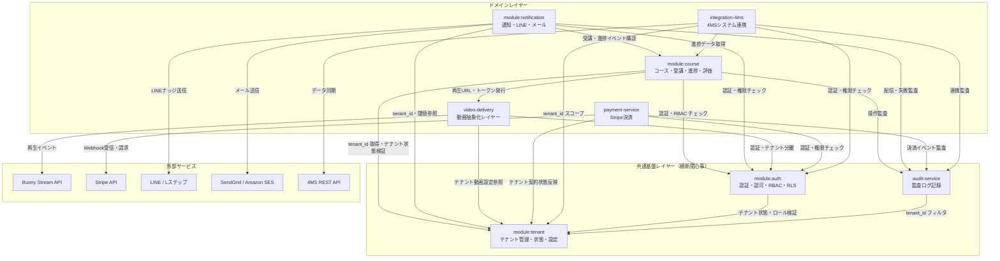
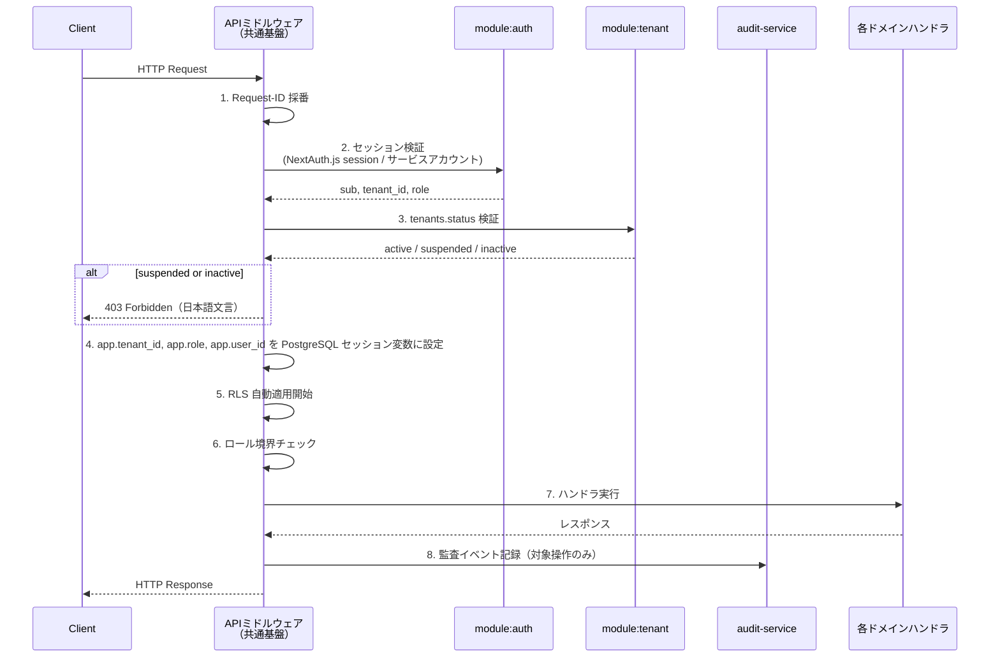
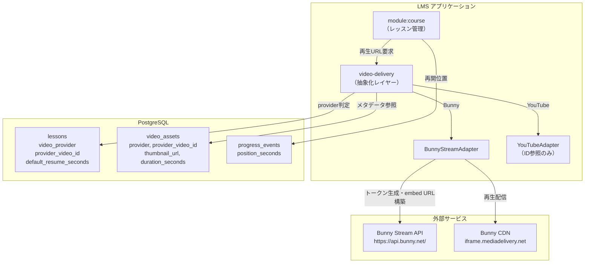
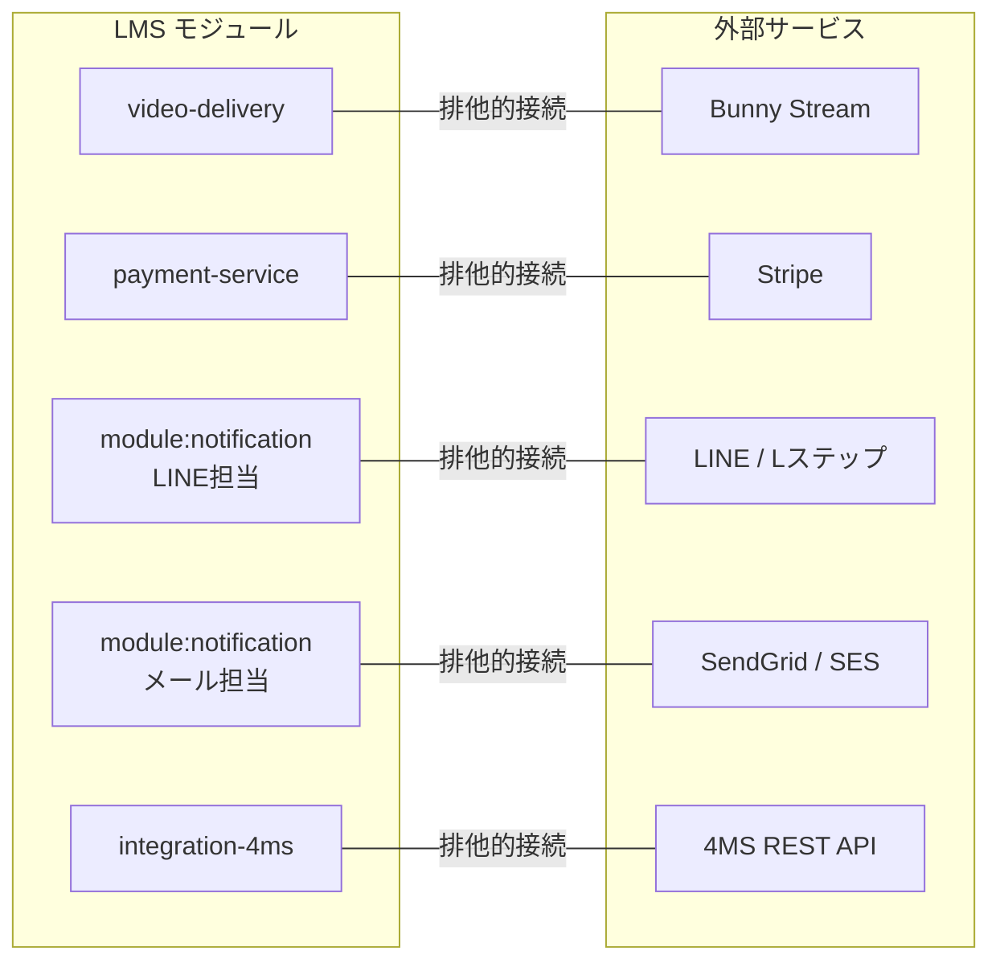
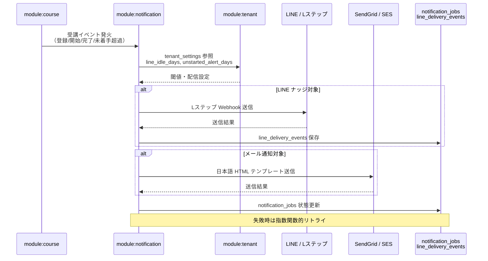
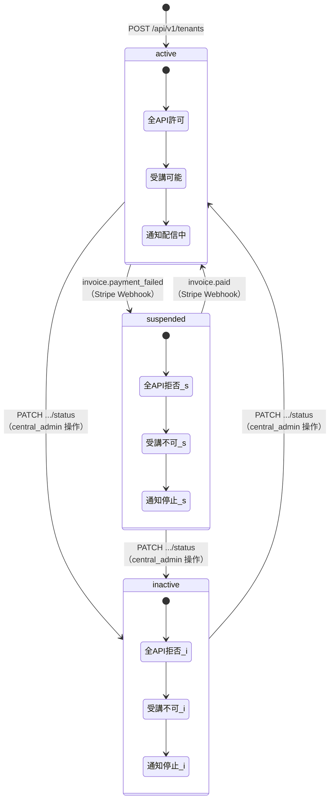

---
codd:
  node_id: design:module-dependency-map
  type: design
  depends_on:
  - id: design:system-design
    relation: derives_from
    semantic: technical
  - id: design:api-design
    relation: derives_from
    semantic: technical
  - id: design:auth-authorization-design
    relation: derives_from
    semantic: technical
  - id: design:integration-design
    relation: derives_from
    semantic: technical
  conventions:
  - targets:
    - module:auth
    - module:tenant
    - module:course
    - module:notification
    reason: import 方向と共通ライブラリ境界を固定し、横断関心事の再実装を防止すること。
  - targets:
    - design:video-delivery
    - config:bunny_stream
    reason: 外部連携・動画配信の依存境界と抽象化レイヤーをコンポーネント図で固定すること。
---

# モジュール依存境界設計書

Node ID: `design:module-dependency-map`
対象: `lms.4ms-system.com`
最終審査目標: 2026-09-01

## 1. Overview

本設計書は、the-app・ラボ LMS v2.0 を構成する論理モジュール間の依存方向、所有権境界、共通ライブラリの利用規則を定義する。目的は以下の3点である。

1. **import 方向の固定**: 上位モジュールから下位モジュールへの単方向依存を強制し、循環依存を禁止する
2. **横断関心事の一元化**: 認証・テナント分離・RLS・監査など複数モジュールが必要とする機能を共通基盤として単一所有し、再実装を防止する
3. **外部連携の抽象化境界の固定**: Bunny Stream、Stripe、LINE/Lステップ、SendGrid/SES、4MS との連携を抽象化レイヤーで隔離し、プロバイダ差し替え時の影響範囲を局所化する

対象モジュールは `module:auth`、`module:tenant`、`module:course`、`module:notification` を中核とし、`design:video-delivery`（`config:bunny_stream`）、`payment-service`、`integration-4ms`、`audit-service` を周辺モジュールとして扱う。

技術スタックは Next.js + TypeScript + Prisma ORM + NextAuth.js + Azure Database for PostgreSQL で統一し、全モジュールは単一 Next.js アプリケーション内の論理分割として実装する。

## 2. モジュール一覧と所有権

| モジュール ID | 正式名称 | 所有範囲 | 主要テーブル | 主要 API プレフィックス |
|---|---|---|---|---|
| `module:auth` | auth-service | 認証・認可・セッション・RBAC・RLS設定 | `users`, `user_roles`, `session_store` | `/api/auth/*`, `/api/admin/users`, `/api/admin/roles`, `/api/users/{id}/role` |
| `module:tenant` | tenant-service | テナント CRUD・状態管理・設定・プラン | `tenants`, `tenant_settings`, `tenant_course_assignments` | `/api/v1/tenants/*`, `/api/tenant-settings`, `/api/tenant-admins` |
| `module:course` | course-service | コース・モジュール・レッスン・受講・進捗・評価・修了証・ドリップ・期限 | `courses`, `modules`, `lessons`, `enrollments`, `progress_events`, `assessments`, `certificates`, `drip_schedules`, `course_deadlines` | `/api/v1/courses/*`, `/api/v1/enrollments/*`, `/api/v1/progress-events`, `/api/v1/assessments/*`, `/api/certificates/*` |
| `module:notification` | notification-service | 通知ジョブ管理・メール・LINE配信・配信イベント追跡 | `notification_jobs`, `line_delivery_events` | `/api/v1/notifications/*`, `/api/notifications`, `/api/integrations/line/events` |
| `video-delivery` | video-delivery（抽象化レイヤー） | 動画プロバイダ抽象化・再生URL生成・トークン管理・再生進捗 | `video_assets`, `lessons.video_provider`, `lessons.provider_video_id` | `/api/v1/videos/*`, `/api/video/*` |
| `payment-service` | payment-service | Stripe 連携・請求・契約状態管理 | `payments` | `/api/payments/*`, `/api/payment/*`, `/api/v1/payments/*` |
| `integration-4ms` | integration-4ms | 4MS システムとの REST 連携 | （外部システム参照） | `/api/v1/integrations/4ms/*`, `/api/integrations/4ms/sync` |
| `audit-service` | audit-service | 監査ログ記録・ローテーション・閲覧 | `audit_logs` | `/api/audit-logs`, `/api/audit/logs` |

## 3. 依存方向マップ

### 3.1 モジュール依存グラフ

**依存方向の規則:**

- **共通基盤レイヤー** (`module:auth`, `module:tenant`, `audit-service`) はドメインレイヤーに依存しない。`module:auth` が `module:tenant` を参照する（`tenants.status` 再評価）のが唯一の基盤内依存であり、逆方向は禁止する
- **ドメインレイヤー** は共通基盤レイヤーを import できるが、ドメイン間の依存は `module:notification` → `module:course`（受講イベント購読）と `integration-4ms` → `module:course`（進捗データ取得）のみ許可する
- **外部サービス** への接続はそれぞれの担当モジュールのみが保持し、他モジュールが直接外部 API を呼ぶことを禁止する

### 3.2 import 方向制約マトリクス

| 依存元 ＼ 依存先 | auth | tenant | course | notification | video-delivery | payment | 4ms | audit |
|---|---|---|---|---|---|---|---|---|
| **auth** | - | **読取** | 禁止 | 禁止 | 禁止 | 禁止 | 禁止 | 禁止 |
| **tenant** | 禁止 | - | 禁止 | 禁止 | 禁止 | 禁止 | 禁止 | 禁止 |
| **course** | **参照** | **参照** | - | 禁止 | **参照** | 禁止 | 禁止 | **書込** |
| **notification** | **参照** | **参照** | **読取** | - | 禁止 | 禁止 | 禁止 | **書込** |
| **video-delivery** | **参照** | **参照** | 禁止 | 禁止 | - | 禁止 | 禁止 | 禁止 |
| **payment** | **参照** | **書込** | 禁止 | 禁止 | 禁止 | - | 禁止 | **書込** |
| **4ms** | **参照** | **参照** | **読取** | 禁止 | 禁止 | 禁止 | - | **書込** |
| **audit** | 禁止 | **参照** | 禁止 | 禁止 | 禁止 | 禁止 | 禁止 | - |

- **参照**: 認証チェック・テナントコンテキスト取得等の読み取り専用利用
- **読取**: ドメインデータの読み取り（書込は禁止）
- **書込**: 監査ログ等の書き込み
- **禁止**: import を許可しない

## 4. 共通基盤レイヤー詳細

### 4.1 共通ミドルウェアチェーン

**所有権**: 共通ミドルウェアチェーンは `module:auth` が所有する。各ステップの実装責任は以下の通り。

| ステップ | 所有モジュール | 説明 |
|---|---|---|
| Request-ID 採番 | `module:auth` | `X-Request-ID` ヘッダを生成し、全後続処理で追跡キーとして使用 |
| セッション検証 | `module:auth` | NextAuth.js の session 検証、`sub`, `tenant_id`, `role` の抽出 |
| テナント状態検証 | `module:tenant` | `tenants.status` を評価し、`suspended`/`inactive` を即時拒否 |
| RLS セッション変数設定 | `module:auth` | `app.tenant_id`, `app.role`, `app.user_id` を PostgreSQL に設定 |
| ロール境界チェック | `module:auth` | `central_admin`/`tenant_admin`/`learner` の API 権限マッチング |
| 監査イベント記録 | `audit-service` | 管理者操作・外部連携失敗・5XX を `audit_logs` に保存 |

**再実装の禁止**: 各ドメインモジュールが独自に認証チェック、テナント状態検証、RLS設定を行うことを禁止する。全ドメインハンドラは共通ミドルウェアを通過した後に実行される。

### 4.2 module:auth の公開インターフェース

`module:auth` は以下の機能を他モジュールに提供する。他モジュールはこれらのインターフェースのみを通じて認証・認可機能にアクセスする。

| 公開機能 | 利用元 | 説明 |
|---|---|---|
| `getCurrentSession()` | 全ドメインモジュール | `sub`, `tenant_id`, `role` を含むセッション情報を返却 |
| `requireRole(role[])` | 全ドメインモジュール | 指定ロールに該当しない場合 `403` を返却するガード |
| `requireActiveTenant()` | 全ドメインモジュール | `tenants.status` が `active` でない場合 `403` を返却 |
| `setRLSContext(tenant_id, role, user_id)` | 共通ミドルウェア内部のみ | PostgreSQL セッション変数を設定（外部呼び出し禁止） |

パスワードハッシュは `Argon2id` を使用し、`module:auth` 内部に閉じる。セッション cookie は `Secure / HttpOnly / SameSite=Strict` 属性を強制し、最小クレーム（`sub`, `tenant_id`, `role`）のみ保持する。無操作タイムアウトは `maxAge=1800`（30分）。

### 4.3 module:tenant の公開インターフェース

| 公開機能 | 利用元 | 説明 |
|---|---|---|
| `getTenantStatus(tenantId)` | `module:auth`（ミドルウェア） | テナントの `active`/`suspended`/`inactive` 状態を返却 |
| `getTenantSettings(tenantId)` | `module:notification`, `video-delivery` | `line_idle_days`, `unstarted_alert_days`, `stream_token_ttl` 等の設定値を返却 |
| `getTenantPlan(tenantId)` | `payment-service`, `module:course` | `tenants.plan` に基づく機能制限情報を返却 |
| `assignCourseToTenant(tenantId, courseId)` | `module:course` | `tenant_course_assignments` への配信割当を登録 |

`tenant_settings` の変更は `audit_logs` に必ず記録する。`tenants.status` が `suspended`/`inactive` に変更された場合、全 API の即時拒否、受講不可、動画再生不可、通知停止を同期的に反映する。

### 4.4 audit-service の公開インターフェース

| 公開機能 | 利用元 | 説明 |
|---|---|---|
| `recordAuditEvent(event)` | 全ドメインモジュール | `audit_logs` にイベントを挿入（更新・削除は禁止） |
| `queryAuditLogs(filters)` | `module:auth`（管理画面経由） | `tenant_id` スコープ付きの監査ログ検索 |

`audit_logs` は `created_at < NOW() - INTERVAL '90 day'` を毎日 02:00 JST に自動削除する。レコードの UPDATE/DELETE は原則禁止であり、ローテーションジョブのみが削除権を持つ。

## 5. 外部連携の依存境界

### 5.1 動画配信抽象化コンポーネント図

**所有権と境界規則:**

- `video-delivery` モジュールが `video_assets` テーブルと動画プロバイダアダプタの全体を単独所有する
- `module:course` は `video-delivery` の公開インターフェース（`getPlaybackUrl(lessonId)`, `syncVideoProgress(lessonId, positionSeconds)`）のみを利用し、`Bunny Stream API` や `video_assets` テーブルに直接アクセスしない
- `lessons` テーブルの `video_provider`, `provider_video_id`, `default_resume_seconds` カラムは `video-delivery` が管理し、`module:course` はレッスン CRUD 時にこれらのカラムを `video-delivery` 経由で書き込む
- 再生 URL は `https://iframe.mediadelivery.net/embed/{libraryId}/{videoId}` 形式で動的に生成し、固定 URL をDBに保存しない
- 再生トークンは短寿命とし、`tenant_settings.stream_token_ttl` で有効期間を制御する
- YouTube ID 参照は過去資産互換のために保持するが、新規登録は Bunny Stream を既定とする

### 5.2 外部サービス接続の排他的所有

| 外部サービス | 排他的所有モジュール | 接続方式 | 認証方式 |
|---|---|---|---|
| Bunny Stream | `video-delivery` | REST API + CDN embed | トークン認証（短寿命） |
| Stripe | `payment-service` | Webhook 受信 + API 呼び出し | 署名検証（`invoice.paid`, `invoice.payment_failed`, `subscription.created`） |
| LINE / Lステップ | `module:notification` | Webhook 受信 + イベント送信 | 署名検証 |
| SendGrid / Amazon SES | `module:notification` | SMTP / API | API キー認証 |
| 4MS REST API | `integration-4ms` | REST API | サービスアカウント + `tenant_id` スコープ |

**排他的所有の意味**: 他のモジュールが外部サービスの SDK、API クライアント、Webhook ハンドラを独自に実装することを禁止する。外部サービスの機能が必要な場合は、排他的所有モジュールの公開インターフェースを経由する。

### 5.3 Bunny Stream 障害時のグレースフルデグラデーション

Bunny Stream API に障害が発生した場合、`video-delivery` モジュールは障害状態を検知し、以下の振る舞いを保証する。

| モジュール | 障害時の振る舞い |
|---|---|
| `video-delivery` | 再生 URL 生成を停止し、エラー状態を返却。`POST /api/video/webhooks/bunny` はタイムアウト応答 |
| `module:course` | テキストコンテンツ・クイズ・進捗保存を継続。再生不可状態を UI に表示（「動画は一時的に利用できません。テキスト・クイズは引き続き利用可能です」） |
| `module:auth` | 認証基盤は独立稼働。影響なし |
| `module:notification` | 通知作成・配信は継続。動画関連の通知テンプレートのみ一時的にテキスト代替 |
| `payment-service` | 影響なし |
| `audit-service` | Bunny 障害イベントを `audit_logs` に記録 |

## 6. ドメインモジュール間の連携

### 6.1 module:course の依存と公開インターフェース

`module:course` は最も多くのテーブルを所有するドメインモジュールである。

**依存先:**
- `module:auth`: 認証・RBAC チェック（共通ミドルウェア経由）
- `module:tenant`: テナント状態検証、配信割当（`tenant_course_assignments`）
- `video-delivery`: 再生 URL 生成、動画メタデータ参照
- `audit-service`: コース公開/編集/削除等の監査記録

**公開インターフェース（他モジュールへ提供）:**

| 公開機能 | 利用元 | 説明 |
|---|---|---|
| `getEnrollmentStatus(userId, courseId)` | `module:notification` | 受講状態（未着手/進行中/完了）の判定 |
| `getProgressSummary(tenantId)` | `integration-4ms` | テナント単位の進捗集計データ |
| `getLessonMeta(lessonId)` | `video-delivery` | レッスンの `video_provider`, `provider_video_id` 参照 |

### 6.2 module:notification のイベント購読

`module:notification` は `module:course` が発生させる受講イベントを購読し、テナント別設定に基づいて通知を発火する。

**イベント購読の規則:**
- `module:notification` は `module:course` のイベントを読み取り専用で購読する。`enrollments` や `progress_events` への書き込み権限は持たない
- 通知判定に必要なテナント別閾値（`line_idle_days`, `unstarted_alert_days`）は `module:tenant` から取得する
- 配信結果は `line_delivery_events` と `notification_jobs` に保存し、失敗時は指数関数的リトライを実施する
- テナント停止時（`tenants.status = suspended/inactive`）は通知発火を即時停止する

### 6.3 payment-service とテナント状態連動

**連携規則:**
- `payment-service` は Stripe Webhook（`invoice.paid`, `invoice.payment_failed`, `subscription.created`）を排他的に受信する
- 決済状態の変更は `payments` テーブルに記録した後、`module:tenant` の `tenants.status` を更新する
- `tenants.status` 変更のカスケード効果（API 拒否、受講不可、通知停止）は共通ミドルウェア（`module:auth` 所有）が自動適用するため、`payment-service` が各ドメインモジュールに個別通知する必要はない
- 事業所単位の月額課金であり、`tenants.plan` によって機能制限と課金額が変動する

## 7. 共通型・共通ライブラリの所有権

### 7.1 共有型定義

| 型 / 定数 | 所有モジュール | 利用元 | 説明 |
|---|---|---|---|
| `Role` (`central_admin` / `tenant_admin` / `learner`) | `module:auth` | 全モジュール | RBAC ロール列挙型 |
| `TenantStatus` (`active` / `suspended` / `inactive`) | `module:tenant` | `module:auth`, `payment-service` | テナント状態列挙型 |
| `VideoProvider` (`bunny_stream` / `youtube`) | `video-delivery` | `module:course` | 動画プロバイダ列挙型 |
| `AuditEvent` 構造体 | `audit-service` | 全モジュール | `actor_user_id`, `action`, `resource_type`, `resource_id`, `before_state`, `after_state`, `request_id`, `ip_hash`, `endpoint` |
| `EnrollmentStatus` (`enrolled` / `in_progress` / `completed`) | `module:course` | `module:notification`, `integration-4ms` | 受講状態列挙型 |
| `NotificationChannel` (`line` / `email`) | `module:notification` | （内部利用のみ） | 通知チャネル列挙型 |

**再実装の禁止**: 上記の共有型は所有モジュールが定義・エクスポートし、利用元は import のみ行う。同じ意味の型を別モジュールで再定義することを禁止する。

### 7.2 Prisma スキーマの所有分割

単一の `schema.prisma` ファイルを使用するが、テーブル定義の所有権は論理的に分割する。

| テーブル群 | スキーマ所有モジュール |
|---|---|
| `users`, `user_roles`, `session_store` | `module:auth` |
| `tenants`, `tenant_settings`, `tenant_course_assignments` | `module:tenant` |
| `courses`, `modules`, `lessons`, `enrollments`, `progress_events`, `assessments`, `certificates`, `drip_schedules`, `course_deadlines` | `module:course` |
| `notification_jobs`, `line_delivery_events` | `module:notification` |
| `video_assets` | `video-delivery` |
| `payments` | `payment-service` |
| `audit_logs` | `audit-service` |

スキーマ変更は所有モジュールの責任者が行い、他モジュール所有のテーブルにカラム追加・変更を行う場合は所有モジュールとの合意を必須とする。

## 8. RLS とテナント分離の実装境界

### 8.1 RLS 適用対象テーブル（全量）

`db:rls_policies` に基づき、以下の全テーブルで `SELECT/INSERT/UPDATE/DELETE` に RLS を適用する。

`tenants`, `tenant_settings`, `users`, `user_roles`, `courses`, `modules`, `lessons`, `enrollments`, `progress_events`, `assessments`, `certificates`, `audit_logs`, `tenant_course_assignments`, `line_delivery_events`, `notification_jobs`, `payments`, `drip_schedules`, `course_deadlines`, `video_assets`

### 8.2 RLS セッション変数の設定責任

| 変数 | 設定責任 | 設定タイミング |
|---|---|---|
| `app.tenant_id` | `module:auth`（共通ミドルウェア） | 全リクエストの認証完了後 |
| `app.role` | `module:auth`（共通ミドルウェア） | 全リクエストの認証完了後 |
| `app.user_id` | `module:auth`（共通ミドルウェア） | 全リクエストの認証完了後 |

- `central_admin` は `app.tenant_id IS NULL` を許可し、全テナント横断アクセスが可能
- `tenant_admin` と `learner` は `tenant_id` 一致行のみアクセス可能
- 越境アクセスは `403` または空応答で拒否し、`200` でのデータ漏洩を禁止する（越境成功率 0%）
- サービスアカウント/バッチジョブは `tenant_admin` エミュレート不可。実行時に明示的な `tenant_id` を必須設定する

### 8.3 テナント停止時の即時拒否対象 API

`tenants.status` が `suspended` または `inactive` の場合、共通ミドルウェアで以下を拒否する。

| 拒否対象 API | 所有モジュール |
|---|---|
| `POST /api/v1/enrollments`, `POST /api/enrollments` | `module:course` |
| `POST /api/v1/progress-events`, `POST /api/learn/progress` | `module:course` |
| `POST /api/video/progress` | `video-delivery` |
| `GET /api/v1/videos/playback/{lessonId}`, `GET /api/video/lesson/{lessonId}` | `video-delivery` |
| `POST /api/v1/notifications/email`, `POST /api/notifications` | `module:notification` |
| `POST /api/v1/notifications/line/webhook` | `module:notification` |

拒否判定は `module:auth` が所有する共通ミドルウェアで一括実施し、各ドメインモジュールが個別に停止判定を実装することを禁止する。

## 9. 実装上の制約と指針

### 9.1 循環依存の検出と防止

- CI パイプラインで依存方向の静的解析を実施し、本設計書の import 方向制約マトリクス（§3.2）に違反する import を検出した場合はビルドを失敗させる
- `module:course` → `module:notification` 方向の依存は禁止する。通知トリガはイベント発火パターン（`module:course` がイベントを発行し、`module:notification` が購読する）で実現する

### 9.2 テスト境界

- `test:test_tenant_isolation` を CI 必須とし、全 RLS 対象テーブルで越境 `SELECT/INSERT/UPDATE/DELETE` の成功率 0% を検証する
- 各モジュールの単体テストはモジュール境界内で完結させ、依存モジュールはインターフェースレベルでモックする
- 外部サービス（Bunny Stream, Stripe, LINE, SendGrid/SES, 4MS）の結合テストは排他的所有モジュール内で実施する

### 9.3 API エンドポイントの所有権

各 API エンドポイントは単一モジュールが所有し、複数モジュールが同一エンドポイントのハンドラを実装することを禁止する。共通ミドルウェア（認証・テナント検証・監査）は `module:auth` と `audit-service` が横断的に適用するが、ハンドラ本体の所有権は以下の通り。

| API プレフィックス | 所有モジュール |
|---|---|
| `/api/auth/*` | `module:auth` |
| `/api/admin/users`, `/api/admin/roles`, `/api/users/*` | `module:auth` |
| `/api/v1/tenants/*`, `/api/tenants/*`, `/api/tenant-settings`, `/api/tenant-admins` | `module:tenant` |
| `/api/v1/courses/*`, `/api/courses/*`, `/api/modules`, `/api/lessons/*` | `module:course` |
| `/api/v1/enrollments/*`, `/api/enrollments`, `/api/v1/progress-events`, `/api/learn/progress`, `/api/progress` | `module:course` |
| `/api/v1/assessments/*`, `/api/assessments/*` | `module:course` |
| `/api/certificates/*` | `module:course` |
| `/api/v1/videos/*`, `/api/video/*`, `/api/tenants/{tenantId}/video-settings` | `video-delivery` |
| `/api/v1/notifications/*`, `/api/notifications`, `/api/integrations/line/events` | `module:notification` |
| `/api/payments/*`, `/api/payment/*`, `/api/v1/payments/*` | `payment-service` |
| `/api/v1/integrations/4ms/*`, `/api/integrations/4ms/sync` | `integration-4ms` |
| `/api/audit-logs`, `/api/audit/logs` | `audit-service` |
| `/api/health`, `/api/v1/health`, `/api/metrics`, `/api/v1/metrics` | 運用基盤（`module:auth` 管理下） |

## 10. 非機能要件への影響

### 10.1 性能（`nfr:performance`）

- 共通ミドルウェアチェーン（認証 → テナント検証 → RLS設定 → ロールチェック）のオーバーヘッドを含め、全 API エンドポイントで p95 `200ms` 以内を維持する
- Webhook（Bunny, Stripe, LINE）応答も p95 `200ms` 以内
- 主要画面初回表示は 4G 環境で `2秒` 以内
- 同時接続: 初期 `20`、中期 `50`、同時視聴 `50`

### 10.2 可用性（`nfr:availability`）

- 稼働率 `99.5%` 以上（月間停止時間 `3.6時間` 以内）
- DB + コンテンツメタデータの日次バックアップを `7日` 保持
- DR: 別リージョン想定、`24時間` 以内復旧
- Bunny Stream 障害時は動画再生のみ停止し、LMS 本体（認証・コーステキスト・クイズ・進捗・通知・決済）は継続稼働

### 10.3 セキュリティ

- HTTPS/TLS1.2+ を Azure Front Door 経由で強制
- RBAC + RLS + tenant context の三層防御
- 個人情報（氏名・メール・学習履歴）は最小表示、`ip_hash` のみ監査保存
- `audit_logs` は 90日保持、更新・削除禁止
- 月次セキュリティパッチ適用（緊急時は随時）
- アカウント共有防止（セッション短命化 30 分、Cookie 堅牢化、`ip_hash` による追跡）

## 11. Conventions / Invariants Compliance

### 11.1 `module:auth`, `module:tenant`, `module:course`, `module:notification` の import 方向と共通ライブラリ境界

本設計書は §3（依存方向マップ）で 4 モジュール間の import 方向を単方向に固定し、§3.2（import 方向制約マトリクス）で禁止方向を明示した。共通基盤レイヤー（`module:auth`, `module:tenant`, `audit-service`）はドメインモジュールに依存せず、ドメインモジュール間の依存は `module:notification` → `module:course`（イベント購読）と `integration-4ms` → `module:course`（進捗読取）のみに限定した。§7（共通型・共通ライブラリ）で型の単一所有を定義し、再実装を防止した。

### 11.2 `design:video-delivery`, `config:bunny_stream` の依存境界と抽象化レイヤー

本設計書は §5.1（動画配信抽象化コンポーネント図）で `video-delivery` モジュールが Bunny Stream との接続を排他的に所有することを図示し、§5.2（外部サービス接続の排他的所有）で他モジュールからの直接接続を禁止した。§5.3（グレースフルデグラデーション）で Bunny 障害時のモジュール別振る舞いを定義し、LMS 本体の継続稼働を保証した。`provider + provider_video_id` による URL 抽象化により、プロバイダ差し替えを運用設定変更のみで吸収する設計を §5.1 で明示した。

## 12. Open Questions

1. **依存方向の静的解析ツール選定**: import 方向制約マトリクス（§3.2）の CI 自動検証に使用する静的解析ツール（ESLint プラグイン / カスタムルール）の選定を 2026-04-15 までに確定する
2. **イベント発火パターンの実装方式**: `module:course` → `module:notification` のイベント購読を関数呼び出し/内部イベントバス/キューのいずれで実装するかを 2026-04-30 までに確定する
3. **Prisma スキーマの物理分割**: 単一 `schema.prisma` を維持するか、モジュール別に分割して `prisma merge` するかを 2026-04-15 までに確定する
4. **4MS 連携の `export-progress` と `sync` の同時実行方針**: 同時実行か時間分離かを 2026-07-31 までに確定する
5. **Bunny 障害時の代替表示文言テンプレート**: テキスト＋クイズ継続画面の文言を 2026-07-31 までに定義する
6. **`tenant_settings` の初期値確定**: `line_idle_days`, `unstarted_alert_days`, 未受講メッセージ文言を 2026-04-30 までに中央管理者画面で確定する
