---
codd:
  node_id: design:request-lifecycle-sequences
  type: design
  depends_on:
  - id: design:system-design
    relation: derives_from
    semantic: technical
  - id: design:api-design
    relation: derives_from
    semantic: technical
  - id: design:auth-authorization-design
    relation: derives_from
    semantic: technical
  - id: design:integration-design
    relation: derives_from
    semantic: technical
  conventions:
  - targets:
    - module:auth
    - db:rls_policies
    reason: 認証・認可・RLS・tenant status check の順序はシーケンスで明示し、全 API で抜け漏れを防ぐこと。
  - targets:
    - nfr:performance
    - design:notification-service
    reason: 同期/非同期境界、Webhook 応答、監査ログ記録位置を処理フロー上で明示すること。
---

# リクエストライフサイクル詳細設計書

Node ID: `design:request-lifecycle-sequences`
対象: `lms.4ms-system.com`
最終審査目標: 2026-09-01

## 1. Overview

本設計書は、LMS の全 API リクエストが通過する認証・認可・RLS・テナント状態検証・監査記録の処理順序を、シーケンス図とフロー図で網羅的に定義する。上流設計書（`design:system-design`、`design:api-design`、`design:auth-authorization-design`、`design:integration-design`）で規定された認証基盤（NextAuth.js）、RBAC（`central_admin` / `tenant_admin` / `learner`）、RLS（`db:rls_policies`）、テナント停止制御、外部連携（Bunny Stream / LINE / Stripe / SendGrid・SES / 4MS）の全要件を、リクエスト単位の処理フローとして具体化する。

本設計が保証する事項:

- 全 API で認証→認可→テナント状態検証→RLS設定→ハンドラ実行→監査記録の順序が統一されること
- 同期処理と非同期処理の境界が明示され、API 応答時間 p95 200ms 以内を達成可能な設計であること
- Webhook 受信時の署名検証→処理→応答が p95 200ms 以内で完了する構造であること
- 監査ログ記録位置が全フローで明確に定義され、5XX 発生時も漏れなく `audit_logs` に保存されること
- テナント越境アクセス成功率 0% を処理フロー上で構造的に保証すること

## 2. 共通リクエストミドルウェアシーケンス

全ての認証必須 API は、以下の 7 ステップミドルウェアチェーンを必ず通過する。この順序の入れ替えや省略は禁止する。

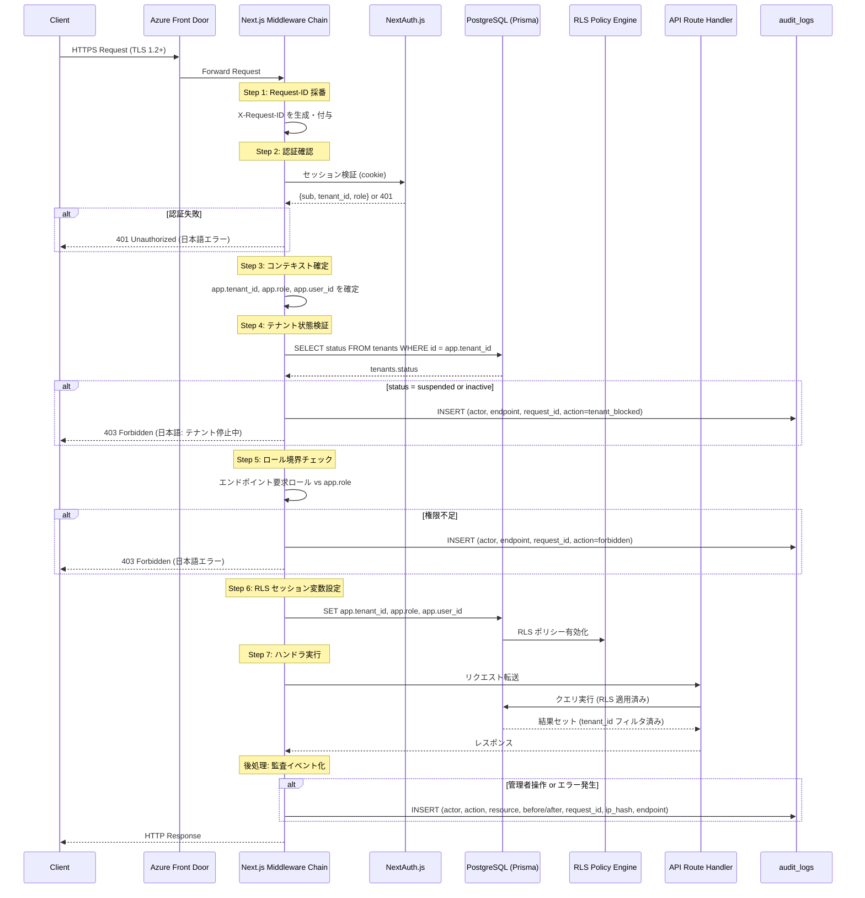
```mermaid
sequenceDiagram
    participant Client
    participant FrontDoor as Azure Front Door
    participant Middleware as Next.js Middleware Chain
    participant NextAuth as NextAuth.js
    participant DB as PostgreSQL (Prisma)
    participant RLS as RLS Policy Engine
    participant Handler as API Route Handler
    participant AuditLog as audit_logs

    Client->>FrontDoor: HTTPS Request (TLS 1.2+)
    FrontDoor->>Middleware: Forward Request

    Note over Middleware: Step 1: Request-ID 採番
    Middleware->>Middleware: X-Request-ID を生成・付与

    Note over Middleware: Step 2: 認証確認
    Middleware->>NextAuth: セッション検証 (cookie)
    NextAuth-->>Middleware: {sub, tenant_id, role} or 401

    alt 認証失敗
        Middleware-->>Client: 401 Unauthorized (日本語エラー)
    end

    Note over Middleware: Step 3: コンテキスト確定
    Middleware->>Middleware: app.tenant_id, app.role, app.user_id を確定

    Note over Middleware: Step 4: テナント状態検証
    Middleware->>DB: SELECT status FROM tenants WHERE id = app.tenant_id
    DB-->>Middleware: tenants.status

    alt status = suspended or inactive
        Middleware->>AuditLog: INSERT (actor, endpoint, request_id, action=tenant_blocked)
        Middleware-->>Client: 403 Forbidden (日本語: テナント停止中)
    end

    Note over Middleware: Step 5: ロール境界チェック
    Middleware->>Middleware: エンドポイント要求ロール vs app.role

    alt 権限不足
        Middleware->>AuditLog: INSERT (actor, endpoint, request_id, action=forbidden)
        Middleware-->>Client: 403 Forbidden (日本語エラー)
    end

    Note over Middleware: Step 6: RLS セッション変数設定
    Middleware->>DB: SET app.tenant_id, app.role, app.user_id
    DB->>RLS: RLS ポリシー有効化

    Note over Middleware: Step 7: ハンドラ実行
    Middleware->>Handler: リクエスト転送
    Handler->>DB: クエリ実行 (RLS 適用済み)
    DB-->>Handler: 結果セット (tenant_id フィルタ済み)
    Handler-->>Middleware: レスポンス

    Note over Middleware: 後処理: 監査イベント化
    alt 管理者操作 or エラー発生
        Middleware->>AuditLog: INSERT (actor, action, resource, before/after, request_id, ip_hash, endpoint)
    end

    Middleware-->>Client: HTTP Response
```

**処理順序の不可逆性**: Step 1〜6 は厳密に順序実行する。Step 2（認証）を通過しなければ Step 3（コンテキスト確定）に進めず、Step 4（テナント状態検証）を通過しなければ Step 6（RLS 設定）に進めない。この順序保証により、未認証リクエストが RLS 設定を迂回すること、停止テナントのリクエストがハンドラに到達することを構造的に排除する。

**所有権**: ミドルウェアチェーンは `auth-service` モジュールが単一所有し、各 API Route は Step 7 のハンドラのみを実装する。ミドルウェアの複製実装は禁止する。

## 3. ロール別リクエストフロー

### 3.1 central_admin のリクエストフロー

`central_admin` は `app.tenant_id = NULL` を許容し、全テナントのデータにアクセスできる。RLS ポリシーは `app.tenant_id IS NULL` の場合に全行を返却する。

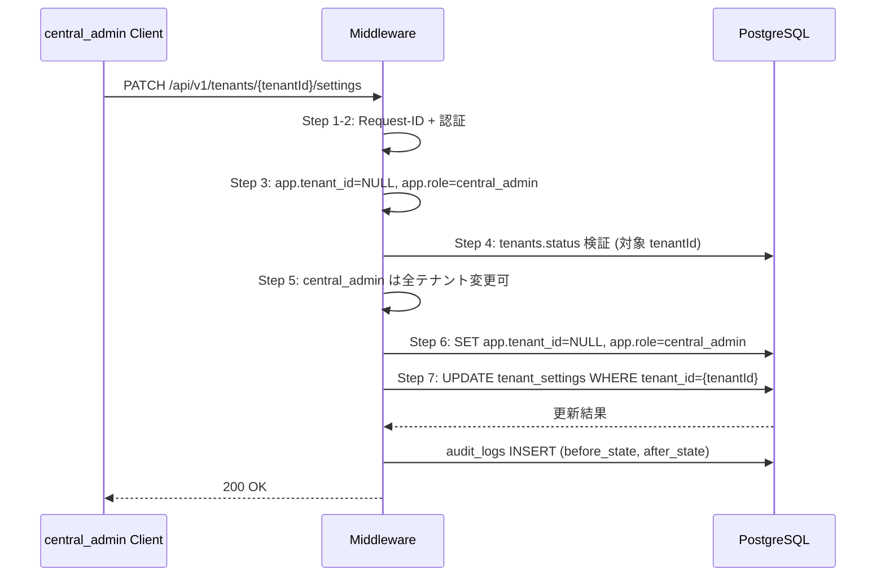
```mermaid
sequenceDiagram
    participant CA as central_admin Client
    participant MW as Middleware
    participant DB as PostgreSQL

    CA->>MW: PATCH /api/v1/tenants/{tenantId}/settings
    MW->>MW: Step 1-2: Request-ID + 認証
    MW->>MW: Step 3: app.tenant_id=NULL, app.role=central_admin
    MW->>DB: Step 4: tenants.status 検証 (対象 tenantId)
    MW->>MW: Step 5: central_admin は全テナント変更可
    MW->>DB: Step 6: SET app.tenant_id=NULL, app.role=central_admin
    MW->>DB: Step 7: UPDATE tenant_settings WHERE tenant_id={tenantId}
    DB-->>MW: 更新結果
    MW->>DB: audit_logs INSERT (before_state, after_state)
    MW-->>CA: 200 OK
```

### 3.2 tenant_admin のリクエストフロー

`tenant_admin` は所属 `tenant_id` 一致のデータのみアクセス可能。コース/モジュール/レッスンの作成・編集・削除は禁止される。

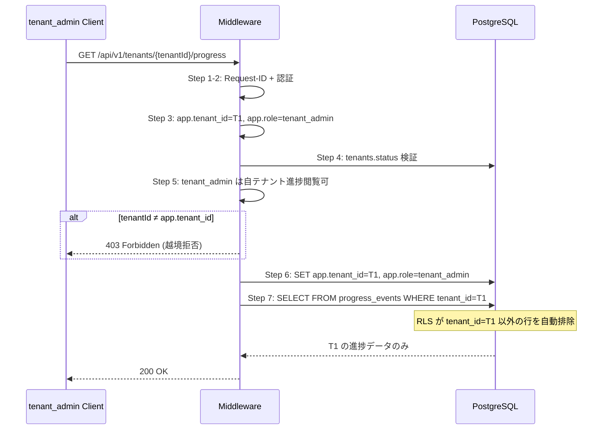
```mermaid
sequenceDiagram
    participant TA as tenant_admin Client
    participant MW as Middleware
    participant DB as PostgreSQL

    TA->>MW: GET /api/v1/tenants/{tenantId}/progress
    MW->>MW: Step 1-2: Request-ID + 認証
    MW->>MW: Step 3: app.tenant_id=T1, app.role=tenant_admin
    MW->>DB: Step 4: tenants.status 検証
    MW->>MW: Step 5: tenant_admin は自テナント進捗閲覧可

    alt tenantId ≠ app.tenant_id
        MW-->>TA: 403 Forbidden (越境拒否)
    end

    MW->>DB: Step 6: SET app.tenant_id=T1, app.role=tenant_admin
    MW->>DB: Step 7: SELECT FROM progress_events WHERE tenant_id=T1
    Note over DB: RLS が tenant_id=T1 以外の行を自動排除
    DB-->>MW: T1 の進捗データのみ
    MW-->>TA: 200 OK
```

### 3.3 learner のリクエストフロー

`learner` は自分自身の受講・進捗・提出・修了証のみ操作可能。

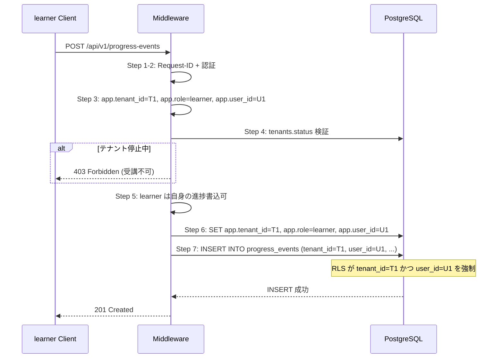
```mermaid
sequenceDiagram
    participant L as learner Client
    participant MW as Middleware
    participant DB as PostgreSQL

    L->>MW: POST /api/v1/progress-events
    MW->>MW: Step 1-2: Request-ID + 認証
    MW->>MW: Step 3: app.tenant_id=T1, app.role=learner, app.user_id=U1

    MW->>DB: Step 4: tenants.status 検証
    alt テナント停止中
        MW-->>L: 403 Forbidden (受講不可)
    end

    MW->>MW: Step 5: learner は自身の進捗書込可
    MW->>DB: Step 6: SET app.tenant_id=T1, app.role=learner, app.user_id=U1
    MW->>DB: Step 7: INSERT INTO progress_events (tenant_id=T1, user_id=U1, ...)
    Note over DB: RLS が tenant_id=T1 かつ user_id=U1 を強制
    DB-->>MW: INSERT 成功
    MW-->>L: 201 Created
```

## 4. テナント停止時のリクエスト拒否フロー

`tenants.status` が `suspended` または `inactive` の場合、以下の API は Step 4 で即時拒否される。

**拒否対象 API 一覧**:
- `POST /api/v1/enrollments`, `POST /api/enrollments`
- `POST /api/v1/progress-events`, `POST /api/progress`, `POST /api/learn/progress`
- `POST /api/video/progress`
- `GET /api/v1/videos/playback/{lessonId}`, `GET /api/video/lesson/{lessonId}`
- `POST /api/v1/notifications/email`, `POST /api/notifications`
- `POST /api/v1/notifications/line/webhook`（テナント宛配信）

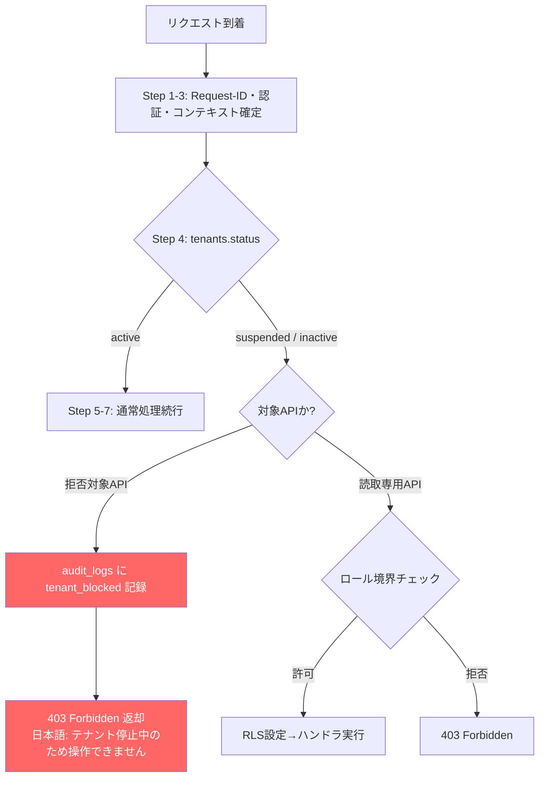
```mermaid
flowchart TD
    A[リクエスト到着] --> B[Step 1-3: Request-ID・認証・コンテキスト確定]
    B --> C{Step 4: tenants.status}
    C -->|active| D[Step 5-7: 通常処理続行]
    C -->|suspended / inactive| E{対象APIか?}
    E -->|拒否対象API| F[audit_logs に tenant_blocked 記録]
    F --> G[403 Forbidden 返却<br/>日本語: テナント停止中のため操作できません]
    E -->|読取専用API| H{ロール境界チェック}
    H -->|許可| I[RLS設定→ハンドラ実行]
    H -->|拒否| J[403 Forbidden]

    style F fill:#f66,color:#fff
    style G fill:#f66,color:#fff
```

**二重防御**: API ミドルウェア（Step 4）でのアプリケーションガードに加え、PostgreSQL RLS ポリシーでも `tenants.status` チェックを DB 側で強制する。アプリガードが万一迂回された場合でも、DB 書込拒否が発動する。

## 5. 動画再生リクエストライフサイクル

動画再生は同期処理（トークン発行）と非同期処理（進捗保存・Webhook受信）の境界が明確に分離される。

### 5.1 再生開始〜再開位置取得〜再生トークン発行

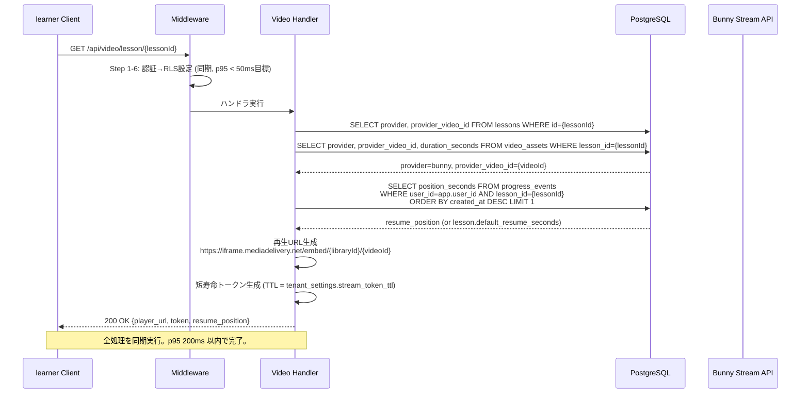
```mermaid
sequenceDiagram
    participant L as learner Client
    participant MW as Middleware
    participant Handler as Video Handler
    participant DB as PostgreSQL
    participant Bunny as Bunny Stream API

    L->>MW: GET /api/video/lesson/{lessonId}
    MW->>MW: Step 1-6: 認証→RLS設定 (同期, p95 < 50ms目標)

    MW->>Handler: ハンドラ実行
    Handler->>DB: SELECT provider, provider_video_id FROM lessons WHERE id={lessonId}
    Handler->>DB: SELECT provider, provider_video_id, duration_seconds FROM video_assets WHERE lesson_id={lessonId}
    DB-->>Handler: provider=bunny, provider_video_id={videoId}

    Handler->>DB: SELECT position_seconds FROM progress_events<br/>WHERE user_id=app.user_id AND lesson_id={lessonId}<br/>ORDER BY created_at DESC LIMIT 1
    DB-->>Handler: resume_position (or lesson.default_resume_seconds)

    Handler->>Handler: 再生URL生成<br/>https://iframe.mediadelivery.net/embed/{libraryId}/{videoId}
    Handler->>Handler: 短寿命トークン生成 (TTL = tenant_settings.stream_token_ttl)

    Handler-->>L: 200 OK {player_url, token, resume_position}
    Note over L,Handler: 全処理を同期実行。p95 200ms 以内で完了。
```

### 5.2 再生進捗の同期保存

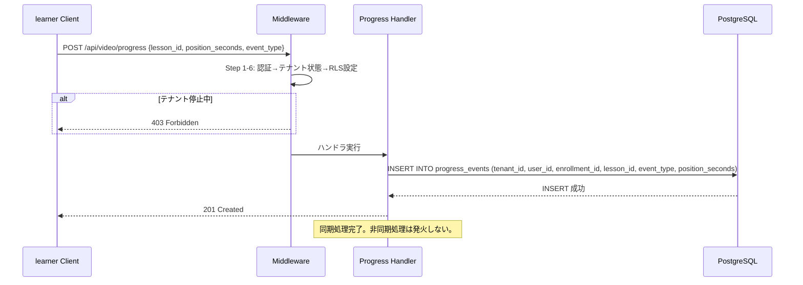
```mermaid
sequenceDiagram
    participant L as learner Client
    participant MW as Middleware
    participant Handler as Progress Handler
    participant DB as PostgreSQL

    L->>MW: POST /api/video/progress {lesson_id, position_seconds, event_type}
    MW->>MW: Step 1-6: 認証→テナント状態→RLS設定

    alt テナント停止中
        MW-->>L: 403 Forbidden
    end

    MW->>Handler: ハンドラ実行
    Handler->>DB: INSERT INTO progress_events (tenant_id, user_id, enrollment_id, lesson_id, event_type, position_seconds)
    DB-->>Handler: INSERT 成功
    Handler-->>L: 201 Created

    Note over Handler: 同期処理完了。非同期処理は発火しない。
```

### 5.3 Bunny Webhook 受信フロー

Bunny Stream からの Webhook は認証なし（署名検証のみ）で受信する。セッションベース認証の代わりに署名検証がゲートとなる。

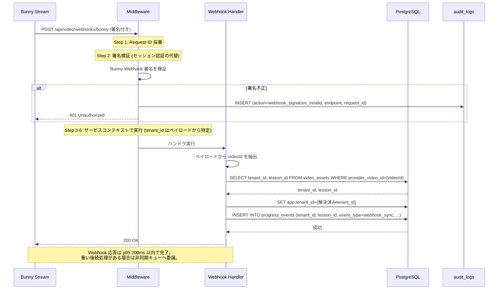
```mermaid
sequenceDiagram
    participant Bunny as Bunny Stream
    participant MW as Middleware
    participant Handler as Webhook Handler
    participant DB as PostgreSQL
    participant AuditLog as audit_logs

    Bunny->>MW: POST /api/video/webhooks/bunny (署名付き)

    Note over MW: Step 1: Request-ID 採番
    Note over MW: Step 2: 署名検証 (セッション認証の代替)
    MW->>MW: Bunny Webhook 署名を検証

    alt 署名不正
        MW->>AuditLog: INSERT (action=webhook_signature_invalid, endpoint, request_id)
        MW-->>Bunny: 401 Unauthorized
    end

    Note over MW: Step 3-6: サービスコンテキストで実行 (tenant_id はペイロードから特定)
    MW->>Handler: ハンドラ実行

    Handler->>Handler: ペイロードから videoId を抽出
    Handler->>DB: SELECT tenant_id, lesson_id FROM video_assets WHERE provider_video_id={videoId}
    DB-->>Handler: tenant_id, lesson_id

    Handler->>DB: SET app.tenant_id={解決済みtenant_id}
    Handler->>DB: INSERT INTO progress_events (tenant_id, lesson_id, event_type=webhook_sync, ...)
    DB-->>Handler: 成功

    Handler-->>Bunny: 200 OK
    Note over Handler,Bunny: Webhook 応答は p95 200ms 以内で完了。<br/>重い後続処理がある場合は非同期キューへ委譲。
```

### 5.4 Bunny 障害時のグレースフルデグラデーション

```mermaid
flowchart TD
    A[GET /api/video/lesson/{lessonId}] --> B[Step 1-6: 認証→RLS設定]
    B --> C[DB: lessons + video_assets 参照]
    C --> D{Bunny API 応答}
    D -->|正常| E[再生URL + トークン返却]
    D -->|タイムアウト / 5xx| F[動画再生不可フラグ設定]
    F --> G[レスポンス: lesson メタ情報 + テキスト + 再開位置]
    G --> H[UIで「動画は一時停止中ですが学習を継続できます」表示]

    I[POST /api/video/progress] --> J[Step 1-6]
    J --> K[progress_events INSERT: 通常通り受付]
    K --> L[進捗保存は Bunny 障害の影響を受けない]

    M[POST /api/v1/assessments/{id}/submit] --> N[Step 1-6]
    N --> O[クイズ/課題提出: 通常通り実行]

    style F fill:#f90,color:#fff
    style H fill:#f90,color:#fff
    style L fill:#0a0,color:#fff
    style O fill:#0a0,color:#fff
```

**所有権**: Bunny 障害検知と代替レスポンス生成は `video-delivery` モジュールが単一所有する。他モジュールは Bunny の状態を直接参照せず、`video-delivery` が提供する抽象化レイヤーを経由する。

## 6. 通知・Webhook リクエストライフサイクル

### 6.1 同期/非同期境界の定義

通知処理は API 応答 p95 200ms を達成するため、同期処理と非同期処理を明確に分離する。

| 処理 | 同期/非同期 | 完了タイミング | 記録先 |
|---|---|---|---|
| `notification_jobs` INSERT | 同期 | API レスポンス前 | `notification_jobs` |
| `audit_logs` INSERT（管理操作時） | 同期 | API レスポンス前 | `audit_logs` |
| メール送信（SendGrid/SES） | 非同期 | ジョブキュー経由 | `notification_jobs.status` |
| LINE/Lステップ送信 | 非同期 | ジョブキュー経由 | `line_delivery_events.result` |
| 4MS エクスポート | 非同期 | ジョブキュー経由 | `notification_jobs.status` |

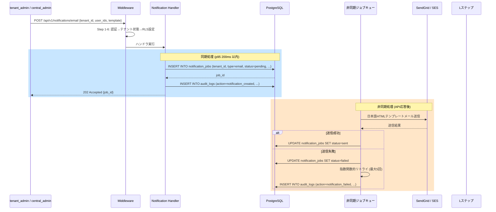
```mermaid
sequenceDiagram
    participant Admin as tenant_admin / central_admin
    participant MW as Middleware
    participant Handler as Notification Handler
    participant DB as PostgreSQL
    participant Queue as 非同期ジョブキュー
    participant SendGrid as SendGrid / SES
    participant LINE as Lステップ

    Admin->>MW: POST /api/v1/notifications/email {tenant_id, user_ids, template}
    MW->>MW: Step 1-6: 認証→テナント状態→RLS設定
    MW->>Handler: ハンドラ実行

    rect rgb(200, 230, 255)
        Note over Handler,DB: 同期処理 (p95 200ms 以内)
        Handler->>DB: INSERT INTO notification_jobs (tenant_id, type=email, status=pending, ...)
        DB-->>Handler: job_id
        Handler->>DB: INSERT INTO audit_logs (action=notification_created, ...)
        Handler-->>Admin: 202 Accepted {job_id}
    end

    rect rgb(255, 230, 200)
        Note over Queue,SendGrid: 非同期処理 (API応答後)
        Queue->>SendGrid: 日本語HTMLテンプレートメール送信
        SendGrid-->>Queue: 送信結果

        alt 送信成功
            Queue->>DB: UPDATE notification_jobs SET status=sent
        else 送信失敗
            Queue->>DB: UPDATE notification_jobs SET status=failed
            Queue->>Queue: 指数関数的リトライ (最大5回)
            Queue->>DB: INSERT INTO audit_logs (action=notification_failed, ...)
        end
    end
```

### 6.2 受講状況連動 LINE ナッジフロー

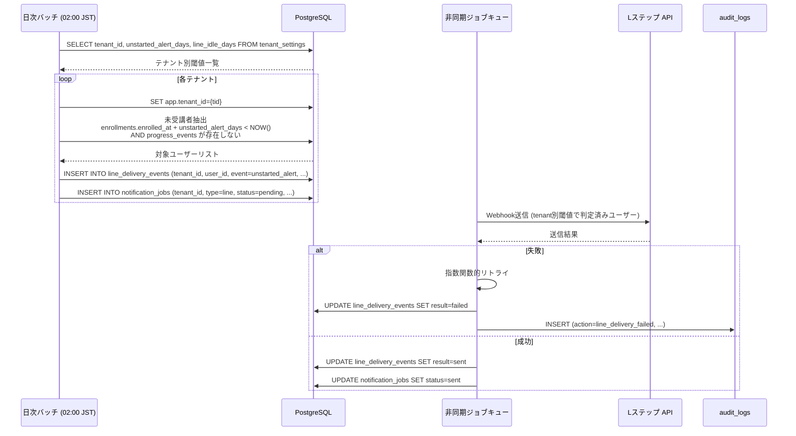
```mermaid
sequenceDiagram
    participant Cron as 日次バッチ (02:00 JST)
    participant DB as PostgreSQL
    participant Queue as 非同期ジョブキュー
    participant LINE as Lステップ API
    participant AuditLog as audit_logs

    Cron->>DB: SELECT tenant_id, unstarted_alert_days, line_idle_days FROM tenant_settings
    DB-->>Cron: テナント別閾値一覧

    loop 各テナント
        Cron->>DB: SET app.tenant_id={tid}
        Cron->>DB: 未受講者抽出<br/>enrollments.enrolled_at + unstarted_alert_days < NOW()<br/>AND progress_events が存在しない
        DB-->>Cron: 対象ユーザーリスト

        Cron->>DB: INSERT INTO line_delivery_events (tenant_id, user_id, event=unstarted_alert, ...)
        Cron->>DB: INSERT INTO notification_jobs (tenant_id, type=line, status=pending, ...)
    end

    Queue->>LINE: Webhook送信 (tenant別閾値で判定済みユーザー)
    LINE-->>Queue: 送信結果

    alt 失敗
        Queue->>Queue: 指数関数的リトライ
        Queue->>DB: UPDATE line_delivery_events SET result=failed
        Queue->>AuditLog: INSERT (action=line_delivery_failed, ...)
    else 成功
        Queue->>DB: UPDATE line_delivery_events SET result=sent
        Queue->>DB: UPDATE notification_jobs SET status=sent
    end
```

**所有権**: ナッジ判定ロジック（閾値比較、対象者抽出）は `notification-service` モジュールが単一所有する。`tenant_settings.line_idle_days` と `tenant_settings.unstarted_alert_days` の読み取りは `notification-service` のみが行い、他モジュールが独自にナッジ判定を再実装することを禁止する。

### 6.3 LINE Webhook 受信フロー

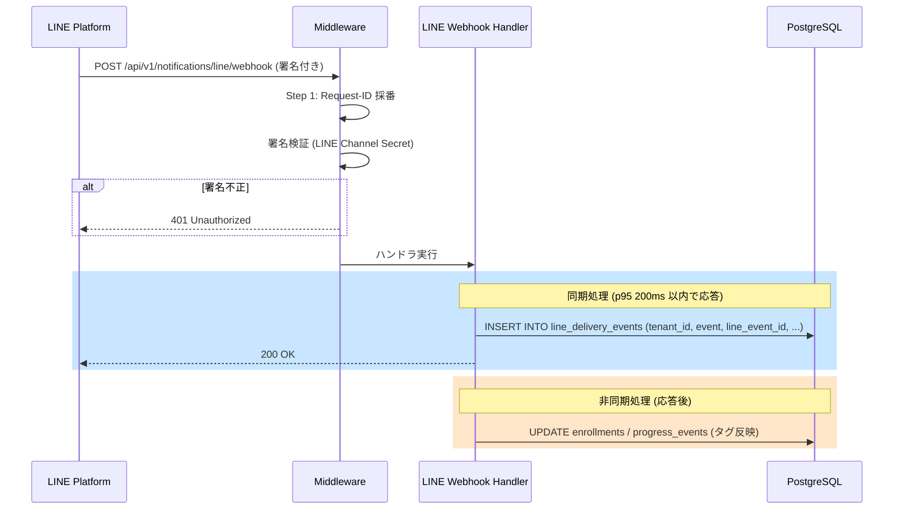
```mermaid
sequenceDiagram
    participant LINE as LINE Platform
    participant MW as Middleware
    participant Handler as LINE Webhook Handler
    participant DB as PostgreSQL

    LINE->>MW: POST /api/v1/notifications/line/webhook (署名付き)
    MW->>MW: Step 1: Request-ID 採番
    MW->>MW: 署名検証 (LINE Channel Secret)

    alt 署名不正
        MW-->>LINE: 401 Unauthorized
    end

    MW->>Handler: ハンドラ実行

    rect rgb(200, 230, 255)
        Note over Handler,DB: 同期処理 (p95 200ms 以内で応答)
        Handler->>DB: INSERT INTO line_delivery_events (tenant_id, event, line_event_id, ...)
        Handler-->>LINE: 200 OK
    end

    rect rgb(255, 230, 200)
        Note over Handler,DB: 非同期処理 (応答後)
        Handler->>DB: UPDATE enrollments / progress_events (タグ反映)
    end
```

## 7. 決済 Webhook リクエストライフサイクル

### 7.1 Stripe Webhook 受信フロー

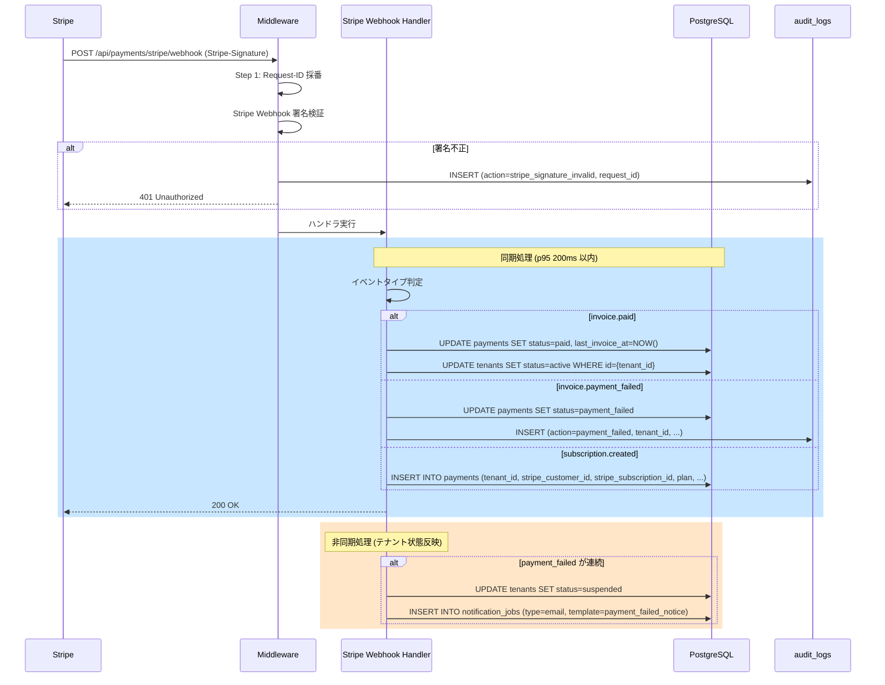
```mermaid
sequenceDiagram
    participant Stripe as Stripe
    participant MW as Middleware
    participant Handler as Stripe Webhook Handler
    participant DB as PostgreSQL
    participant AuditLog as audit_logs

    Stripe->>MW: POST /api/payments/stripe/webhook (Stripe-Signature)
    MW->>MW: Step 1: Request-ID 採番
    MW->>MW: Stripe Webhook 署名検証

    alt 署名不正
        MW->>AuditLog: INSERT (action=stripe_signature_invalid, request_id)
        MW-->>Stripe: 401 Unauthorized
    end

    MW->>Handler: ハンドラ実行

    rect rgb(200, 230, 255)
        Note over Handler,DB: 同期処理 (p95 200ms 以内)
        Handler->>Handler: イベントタイプ判定

        alt invoice.paid
            Handler->>DB: UPDATE payments SET status=paid, last_invoice_at=NOW()
            Handler->>DB: UPDATE tenants SET status=active WHERE id={tenant_id}
        else invoice.payment_failed
            Handler->>DB: UPDATE payments SET status=payment_failed
            Handler->>AuditLog: INSERT (action=payment_failed, tenant_id, ...)
        else subscription.created
            Handler->>DB: INSERT INTO payments (tenant_id, stripe_customer_id, stripe_subscription_id, plan, ...)
        end

        Handler-->>Stripe: 200 OK
    end

    rect rgb(255, 230, 200)
        Note over Handler: 非同期処理 (テナント状態反映)
        alt payment_failed が連続
            Handler->>DB: UPDATE tenants SET status=suspended
            Handler->>DB: INSERT INTO notification_jobs (type=email, template=payment_failed_notice)
        end
    end
```

### 7.2 テナント停止連動

Stripe の `invoice.payment_failed` を契機としたテナント停止は、`payment-service` モジュールが `tenants.status` を `suspended` に更新する。更新直後から、Section 4 で定義した全拒否対象 API が即時 403 を返却する。復旧は `invoice.paid` イベント受信で `tenants.status = active` へ戻す。

## 8. 4MS 連携リクエストライフサイクル

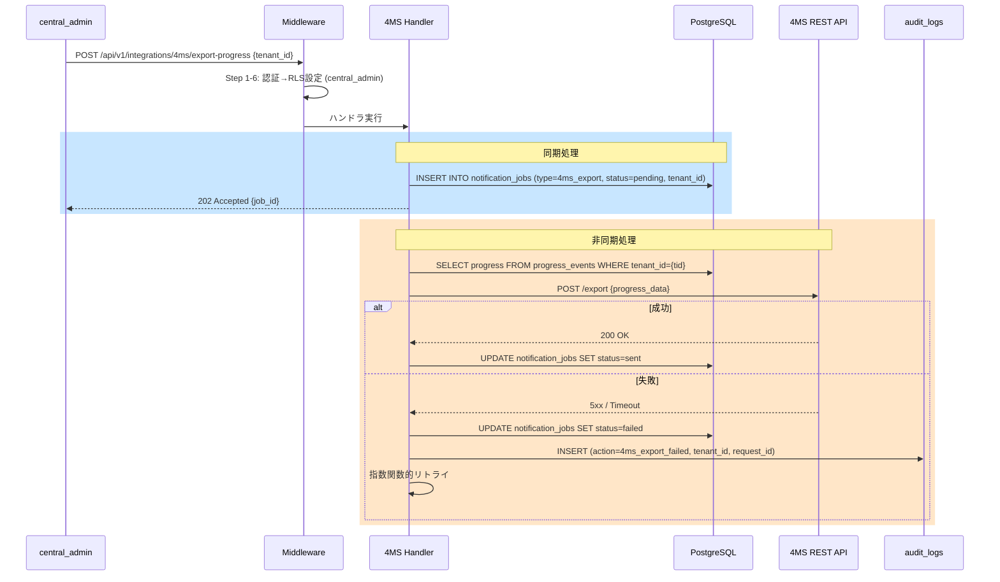
```mermaid
sequenceDiagram
    participant Admin as central_admin
    participant MW as Middleware
    participant Handler as 4MS Handler
    participant DB as PostgreSQL
    participant FourMS as 4MS REST API
    participant AuditLog as audit_logs

    Admin->>MW: POST /api/v1/integrations/4ms/export-progress {tenant_id}
    MW->>MW: Step 1-6: 認証→RLS設定 (central_admin)

    MW->>Handler: ハンドラ実行

    rect rgb(200, 230, 255)
        Note over Handler,DB: 同期処理
        Handler->>DB: INSERT INTO notification_jobs (type=4ms_export, status=pending, tenant_id)
        Handler-->>Admin: 202 Accepted {job_id}
    end

    rect rgb(255, 230, 200)
        Note over Handler,FourMS: 非同期処理
        Handler->>DB: SELECT progress FROM progress_events WHERE tenant_id={tid}
        Handler->>FourMS: POST /export {progress_data}

        alt 成功
            FourMS-->>Handler: 200 OK
            Handler->>DB: UPDATE notification_jobs SET status=sent
        else 失敗
            FourMS-->>Handler: 5xx / Timeout
            Handler->>DB: UPDATE notification_jobs SET status=failed
            Handler->>AuditLog: INSERT (action=4ms_export_failed, tenant_id, request_id)
            Handler->>Handler: 指数関数的リトライ
        end
    end
```

**所有権**: 4MS 連携のリクエスト構築・リトライ・結果保存は `integration-4ms` モジュールが単一所有する。エンドポイントは `/api/v1/integrations/4ms/*` プレフィックスに固定し、将来の追加エンドポイントも同一プレフィックス配下に追加する。

## 9. 認証フロー詳細シーケンス

### 9.1 Google OAuth ログイン

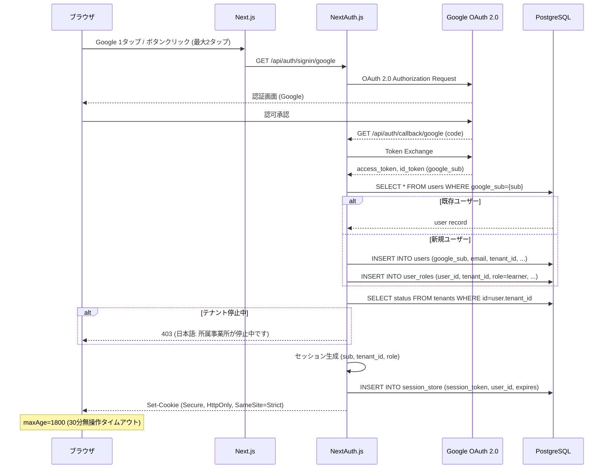
```mermaid
sequenceDiagram
    participant User as ブラウザ
    participant App as Next.js
    participant NextAuth as NextAuth.js
    participant Google as Google OAuth 2.0
    participant DB as PostgreSQL

    User->>App: Google 1タップ / ボタンクリック (最大2タップ)
    App->>NextAuth: GET /api/auth/signin/google
    NextAuth->>Google: OAuth 2.0 Authorization Request
    Google-->>User: 認証画面 (Google)
    User->>Google: 認可承認
    Google-->>NextAuth: GET /api/auth/callback/google (code)
    NextAuth->>Google: Token Exchange
    Google-->>NextAuth: access_token, id_token (google_sub)

    NextAuth->>DB: SELECT * FROM users WHERE google_sub={sub}
    alt 既存ユーザー
        DB-->>NextAuth: user record
    else 新規ユーザー
        NextAuth->>DB: INSERT INTO users (google_sub, email, tenant_id, ...)
        NextAuth->>DB: INSERT INTO user_roles (user_id, tenant_id, role=learner, ...)
    end

    NextAuth->>DB: SELECT status FROM tenants WHERE id=user.tenant_id
    alt テナント停止中
        NextAuth-->>User: 403 (日本語: 所属事業所が停止中です)
    end

    NextAuth->>NextAuth: セッション生成 (sub, tenant_id, role)
    NextAuth->>DB: INSERT INTO session_store (session_token, user_id, expires)
    NextAuth-->>User: Set-Cookie (Secure, HttpOnly, SameSite=Strict)
    Note over User: maxAge=1800 (30分無操作タイムアウト)
```

### 9.2 Credentials ログイン

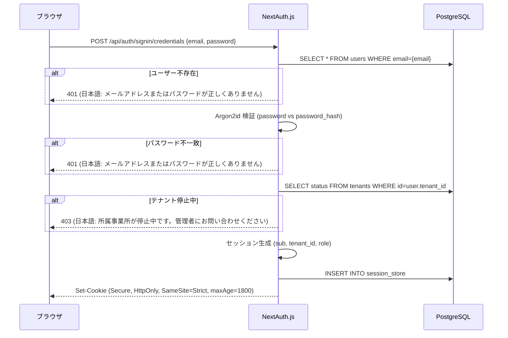
```mermaid
sequenceDiagram
    participant User as ブラウザ
    participant NextAuth as NextAuth.js
    participant DB as PostgreSQL

    User->>NextAuth: POST /api/auth/signin/credentials {email, password}
    NextAuth->>DB: SELECT * FROM users WHERE email={email}

    alt ユーザー不存在
        NextAuth-->>User: 401 (日本語: メールアドレスまたはパスワードが正しくありません)
    end

    NextAuth->>NextAuth: Argon2id 検証 (password vs password_hash)

    alt パスワード不一致
        NextAuth-->>User: 401 (日本語: メールアドレスまたはパスワードが正しくありません)
    end

    NextAuth->>DB: SELECT status FROM tenants WHERE id=user.tenant_id

    alt テナント停止中
        NextAuth-->>User: 403 (日本語: 所属事業所が停止中です。管理者にお問い合わせください)
    end

    NextAuth->>NextAuth: セッション生成 (sub, tenant_id, role)
    NextAuth->>DB: INSERT INTO session_store
    NextAuth-->>User: Set-Cookie (Secure, HttpOnly, SameSite=Strict, maxAge=1800)
```

### 9.3 セッション失効と再認証

```mermaid
flowchart TD
    A[API リクエスト到着] --> B{セッション cookie 存在?}
    B -->|なし| C[401: 再ログインしてください]
    B -->|あり| D{session_store.expires < NOW()?}
    D -->|期限切れ| E[401: セッション期限切れ。再ログインしてください]
    D -->|有効| F{最終操作から30分以上経過?}
    F -->|はい| G[セッション無効化 → 401]
    F -->|いいえ| H[セッション有効 → Step 3 へ続行]
    H --> I{tenants.status 再評価}
    I -->|active| J[通常処理]
    I -->|suspended/inactive| K[セッション強制失効 → 403]

    style C fill:#f66,color:#fff
    style E fill:#f66,color:#fff
    style G fill:#f66,color:#fff
    style K fill:#f66,color:#fff
```

## 10. 監査ログ記録フロー

### 10.1 監査記録の挿入タイミング

監査ログは API レスポンス返却前に同期的に記録する。非同期化による記録漏れを防止するため、`audit_logs` INSERT はトランザクション内で実行する。

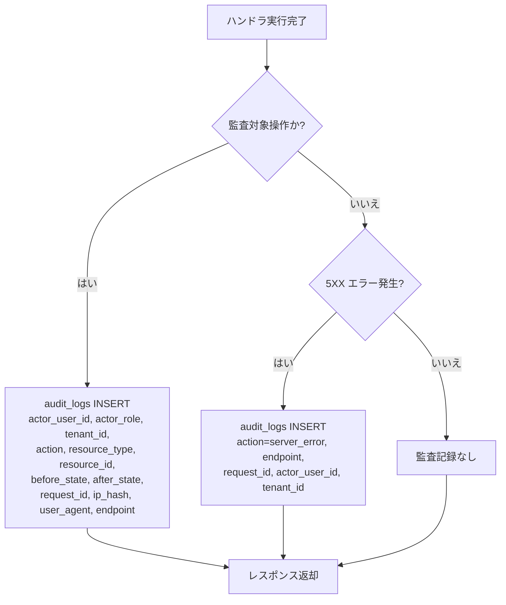
```mermaid
flowchart TD
    A[ハンドラ実行完了] --> B{監査対象操作か?}
    B -->|はい| C[audit_logs INSERT<br/>actor_user_id, actor_role, tenant_id,<br/>action, resource_type, resource_id,<br/>before_state, after_state,<br/>request_id, ip_hash, user_agent, endpoint]
    B -->|いいえ| D{5XX エラー発生?}
    D -->|はい| E[audit_logs INSERT<br/>action=server_error, endpoint,<br/>request_id, actor_user_id, tenant_id]
    D -->|いいえ| F[監査記録なし]
    C --> G[レスポンス返却]
    E --> G
    F --> G
```

**監査対象操作一覧**:

| 操作カテゴリ | 対象アクション | 記録内容 |
|---|---|---|
| テナント管理 | 作成/更新/停止/復旧 | before_state, after_state |
| ユーザー権限 | ロール付与/剥奪 | user_id, role, granted_by |
| コース管理 | 作成/編集/公開/削除 | course_id, 変更差分 |
| 配信設定 | tenant_settings 変更 | 変更前後の JSON diff |
| 通知配信 | メール/LINE 配信指示 | 対象ユーザー数, template |
| 外部連携失敗 | Stripe/LINE/Bunny/4MS エラー | endpoint, error_code, request_id |
| 認可違反 | 越境アクセス試行 | 要求先 tenant_id, 実際の tenant_id |
| サーバーエラー | 5XX 発生 | endpoint, request_id, actor_user_id |

### 10.2 90 日ローテーション

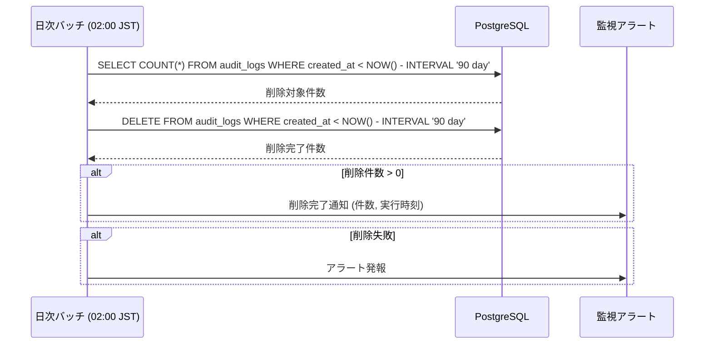
```mermaid
sequenceDiagram
    participant Cron as 日次バッチ (02:00 JST)
    participant DB as PostgreSQL
    participant Monitor as 監視アラート

    Cron->>DB: SELECT COUNT(*) FROM audit_logs WHERE created_at < NOW() - INTERVAL '90 day'
    DB-->>Cron: 削除対象件数

    Cron->>DB: DELETE FROM audit_logs WHERE created_at < NOW() - INTERVAL '90 day'
    DB-->>Cron: 削除完了件数

    alt 削除件数 > 0
        Cron->>Monitor: 削除完了通知 (件数, 実行時刻)
    end

    alt 削除失敗
        Cron->>Monitor: アラート発報
    end
```

## 11. エラーハンドリングフロー

### 11.1 統一エラーレスポンス構造

全 API エンドポイントは以下の統一エラー形式を返却する。エラー文言は日本語で、次アクション（再試行、再ログイン、管理者連絡先）を同時提示する。

| HTTP Status | 発生条件 | 日本語メッセージ例 | 監査記録 |
|---|---|---|---|
| 400 | 入力検証失敗 | 「入力内容に誤りがあります。{field}を確認してください」 | なし |
| 401 | 認証失敗/セッション切れ | 「セッションが切れました。再度ログインしてください」 | なし |
| 403 | 権限不足 | 「この操作を行う権限がありません。管理者にお問い合わせください」 | あり |
| 403 | テナント停止 | 「所属事業所が停止中のため操作できません。管理者にお問い合わせください」 | あり |
| 403 | 越境アクセス | 「アクセス権限がありません」 | あり |
| 500 | サーバーエラー | 「システムエラーが発生しました。しばらくしてから再試行してください」 | 必須 |

### 11.2 外部連携エラーのリトライフロー

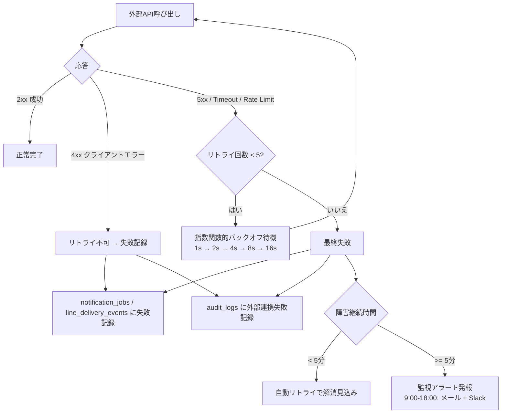
```mermaid
flowchart TD
    A[外部API呼び出し] --> B{応答}
    B -->|2xx 成功| C[正常完了]
    B -->|4xx クライアントエラー| D[リトライ不可 → 失敗記録]
    B -->|5xx / Timeout / Rate Limit| E{リトライ回数 < 5?}
    E -->|はい| F[指数関数的バックオフ待機<br/>1s → 2s → 4s → 8s → 16s]
    F --> A
    E -->|いいえ| G[最終失敗]
    G --> H[notification_jobs / line_delivery_events に失敗記録]
    G --> I[audit_logs に外部連携失敗記録]
    D --> H
    D --> I

    J{障害継続時間}
    G --> J
    J -->|< 5分| K[自動リトライで解消見込み]
    J -->|>= 5分| L[監視アラート発報<br/>9:00-18:00: メール + Slack]
```

**リトライ対象サービス**: Stripe、SendGrid/SES、LINE/Lステップ、Bunny Stream API、4MS REST API

## 12. RLS 越境防止の処理フロー

### 12.1 二重防御の実装位置

```mermaid
flowchart TD
    subgraph "Layer 1: Application Guard (Middleware)"
        A1[Step 3: app.tenant_id 確定]
        A2[Step 4: tenants.status 検証]
        A3[Step 5: ロール境界チェック]
        A4{パス内 tenantId vs app.tenant_id}
        A4 -->|不一致| A5[403 Forbidden]
        A4 -->|一致 or central_admin| A6[続行]
    end

    subgraph "Layer 2: PostgreSQL RLS"
        B1[SET app.tenant_id = {value}]
        B2[RLS Policy: WHERE tenant_id = app.tenant_id]
        B3[Query実行]
        B4{結果行の tenant_id}
        B4 -->|全行が app.tenant_id 一致| B5[正常結果返却]
        B4 -->|不一致行あり| B6[RLS により自動排除 → 空結果]
    end

    A6 --> B1

    style A5 fill:#f66,color:#fff
    style B6 fill:#f90,color:#fff
```

**RLS 適用対象テーブル**: `tenants`, `tenant_settings`, `users`, `user_roles`, `courses`, `modules`, `lessons`, `enrollments`, `progress_events`, `assessments`, `certificates`, `audit_logs`, `tenant_course_assignments`, `line_delivery_events`, `notification_jobs`, `payments`, `drip_schedules`, `course_deadlines`, `video_assets`

**越境アクセス成功率 0%** を構造的に保証するため:
1. Application Guard がパスパラメータの `tenantId` とセッションの `app.tenant_id` の一致を検証
2. RLS が DB レベルで `tenant_id` 不一致行を自動排除
3. `central_admin` 以外は `app.tenant_id IS NOT NULL` を強制
4. サービスアカウント/バッチジョブも `tenant_id` を明示的に設定（`tenant_admin` エミュレート不可）

## 13. 日次バッチジョブの実行フロー

02:00 JST に実行される日次ジョブ群の処理順序と依存関係を定義する。

```mermaid
flowchart TD
    A[02:00 JST 日次ジョブ開始] --> B[audit_logs 90日ローテーション]
    A --> C[RLS 整合性チェック]
    A --> D[バックアップ整合性チェック]
    A --> E[未受講者抽出 + ナッジ配信]

    B --> F{削除成功?}
    F -->|はい| G[削除件数をモニタリング通知]
    F -->|いいえ| H[アラート発報]

    C --> I{全テーブル RLS 有効?}
    I -->|はい| J[正常完了]
    I -->|いいえ| K[緊急アラート発報]

    D --> L{バックアップ整合?}
    L -->|はい| M[正常完了]
    L -->|いいえ| N[アラート発報]

    E --> O[notification_jobs + line_delivery_events 登録]
    O --> P[非同期配信キュー投入]
```

## 14. Ownership Boundaries

| モジュール | 所有する処理 | 他モジュールからの利用方法 |
|---|---|---|
| `auth-service` | ミドルウェアチェーン (Step 1-6)、セッション管理、RLS 変数設定 | 全 API Route が自動適用。直接呼び出し不可。 |
| `tenant-service` | テナント CRUD、`tenants.status` 管理、`tenant_settings` CRUD | `auth-service` が Step 4 で status を参照。他モジュールは API 経由。 |
| `video-delivery` | Bunny 抽象化レイヤー、トークン生成、障害検知、デグラデーション判定 | `course-service` / `learning-service` が再生情報を取得する際に呼び出し。 |
| `notification-service` | ナッジ判定、メール/LINE 配信、`notification_jobs` / `line_delivery_events` 管理 | バッチジョブおよび API ハンドラが配信を要求する際に呼び出し。 |
| `payment-service` | Stripe Webhook 処理、`payments` 管理、テナント停止/復旧トリガー | Webhook 受信のみ。他モジュールは `payments` テーブルを直接参照しない。 |
| `audit-service` | `audit_logs` INSERT、90日ローテーション、RLS 整合性チェック | ミドルウェアとハンドラが記録を委譲。直接 SQL は禁止。 |
| `integration-4ms` | 4MS REST API 通信、エクスポート/同期ジョブ管理 | API エンドポイント経由のみ。 |
| `course-service` | コース/モジュール/レッスン CRUD、ドリップ配信、期限管理 | API エンドポイント経由。`video-delivery` を内部利用。 |
| `enrollment-service` | 受講登録、完了処理、`enrollments` 管理 | API エンドポイント経由。 |
| `learning-service` | `progress_events` 管理、再開位置計算 | API エンドポイント経由。`video-delivery` を内部利用。 |
| `assessment-service` | クイズ/課題提出、採点、`certificates` 発行 | API エンドポイント経由。 |

## 15. Implementation Implications

### 15.1 ミドルウェアチェーンの実装方針

- ミドルウェアは Next.js の `middleware.ts` と API Route 内の共通ラッパー関数の組み合わせで実装する
- Step 1-5 は `middleware.ts` で実行し、Step 6（RLS 変数設定）は Prisma クライアント拡張で各クエリ前に `SET` を発行する
- 各 API Route ハンドラは `withAuth(handler, { requiredRole, tenantScopedParams })` 形式のラッパーで包み、Step 1-6 の適用漏れを防止する

### 15.2 RLS 変数設定の実装

- Prisma の `$executeRawUnsafe` で `SET app.tenant_id = $1; SET app.role = $1; SET app.user_id = $1` を実行する
- トランザクション内で RLS 変数設定→クエリ実行→監査記録を一括で行う
- `central_admin` の場合は `SET app.tenant_id = ''` として全テナント可視化ポリシーを発動させる

### 15.3 非同期処理の実装

- 非同期ジョブは `notification_jobs` テーブルをキューとして利用し、ワーカーがポーリングする
- Webhook 応答後の非同期処理は、レスポンス返却後に `process.nextTick` または同等メカニズムで発火する
- 外部連携リトライは `notification_jobs.status` と `retry_count` で管理し、指数関数的バックオフ（1s, 2s, 4s, 8s, 16s）を適用する

### 15.4 性能目標達成のための設計制約

- ミドルウェアチェーン（Step 1-6）の処理時間を p95 50ms 以内に抑える
- `tenants.status` 参照はインメモリキャッシュ（TTL 30秒）を許容し、DB ラウンドトリップを削減する
- 監査ログ INSERT は非同期化せず同期で行うが、バッチ INSERT（同一リクエスト内の複数監査イベント）を許容する
- Webhook ハンドラは重い処理を非同期キューに委譲し、200 応答を即時返却する

## 16. Conventions / Invariants Compliance

### 16.1 `module:auth` + `db:rls_policies` への適合

本設計は認証→認可→RLS→テナント状態検証の順序を Section 2 のシーケンス図で厳密に定義し、全 API で統一的に適用する。具体的には:

- **認証**: NextAuth.js によるセッション検証を Step 2 で必須実行（Section 2, 9）
- **認可**: RBAC ロール境界チェックを Step 5 で実行し、`tenant_admin` のコンテンツ編集禁止を含む全ロール制約を適用（Section 3）
- **RLS**: Step 6 で `app.tenant_id`, `app.role`, `app.user_id` を DB セッション変数に設定し、20 テーブル全てで行レベル制御を有効化（Section 12）
- **テナント状態**: Step 4 で `tenants.status` を毎リクエスト再評価し、`suspended`/`inactive` 時は拒否対象 API を即時 403（Section 4）
- **越境防止**: Application Guard（Layer 1）と PostgreSQL RLS（Layer 2）の二重防御で越境成功率 0% を構造的に保証（Section 12）

### 16.2 `nfr:performance` + `design:notification-service` への適合

本設計は同期/非同期境界を全処理フローで明示し、p95 200ms 達成を構造的に担保する。具体的には:

- **同期/非同期境界**: Section 6.1 の表で全処理の同期/非同期区分を明示。API レスポンスに含まれるのは DB INSERT（`notification_jobs`, `audit_logs`）のみ。メール送信・LINE 送信・4MS エクスポートは全て非同期
- **Webhook 応答**: Bunny（Section 5.3）、LINE（Section 6.3）、Stripe（Section 7.1）の全 Webhook で署名検証→最小同期処理→200 応答を p95 200ms 以内で完了する構造を定義
- **監査ログ記録位置**: Section 10.1 で監査ログは API レスポンス返却前の同期挿入と定義。5XX 発生時も同期で `audit_logs` に記録（Section 10.1, 11.1）
- **ミドルウェア性能**: Step 1-6 の処理時間を p95 50ms 以内とし、残り 150ms をハンドラ処理に充当（Section 15.4）
- **リトライ戦略**: 外部連携は指数関数的バックオフで最大 5 回リトライ。5 分超の障害は監視アラート発報（Section 11.2）

## 17. Open Questions

1. `tenants.status` のインメモリキャッシュ TTL（現設計: 30秒）は、テナント停止の即時反映要件と性能要件のバランスとして適切か。2026-04-15 のアーキテクチャレビューで確定する。
2. Webhook 受信時の非同期処理実装を `process.nextTick` 方式とするか、専用ワーカープロセスとするかを 2026-04-30 の実装ガイドラインで確定する。
3. `notification_jobs` テーブルをジョブキューとして利用する方式で、同時接続 50 名時のポーリング負荷が許容範囲内かを 2026-05-15 の負荷テストで検証する。
4. `audit_logs` の同期 INSERT が p95 200ms 制約に与える影響を定量評価し、バッチ INSERT の必要性を 2026-05-15 の負荷テストで判断する。
5. Bunny 障害時の代替表示文言テンプレート（テキスト + クイズ継続画面）を 2026-07-31 までに確定する。
