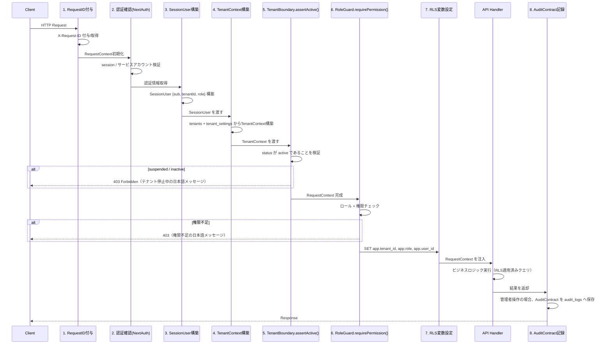
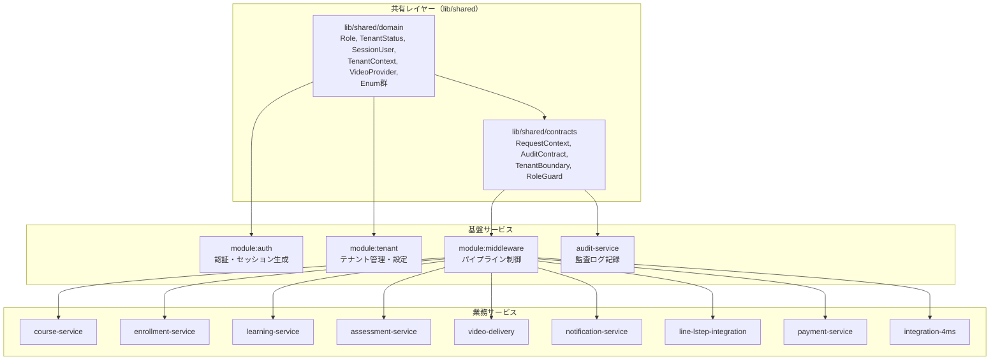
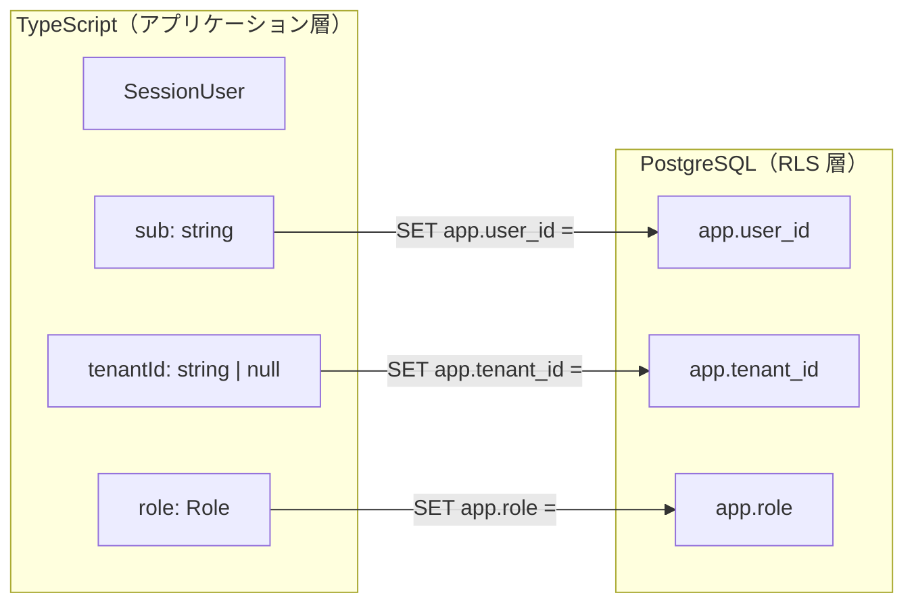
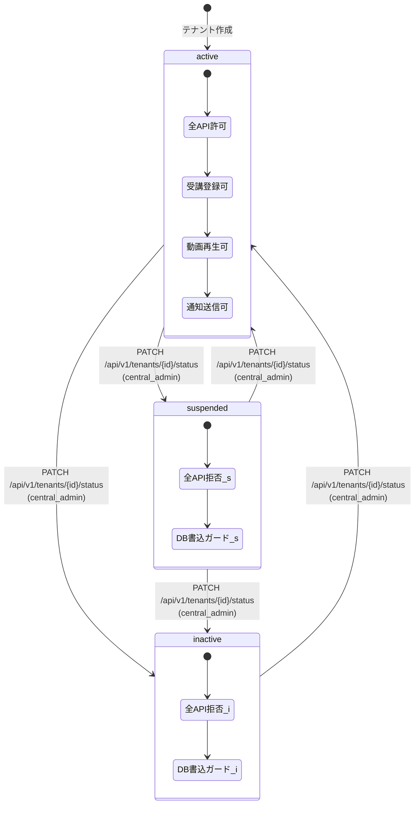
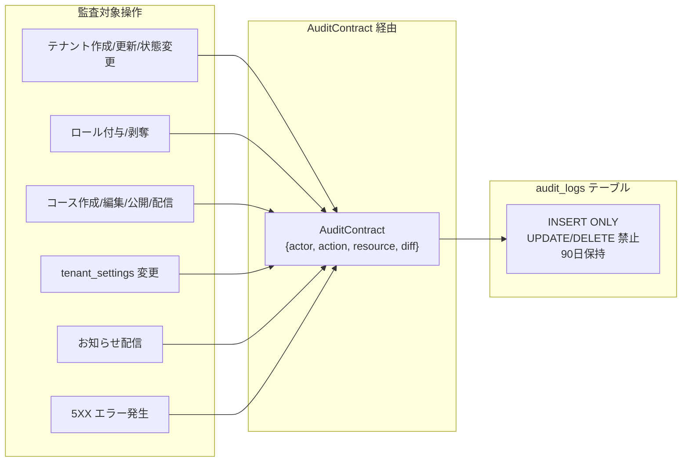

# 共有ドメインモデル詳細設計書

Node ID: `design:shared-domain-model`
タイトル: `共有ドメインモデル詳細設計書`
対象: `lms.4ms-system.com`
最終審査目標: 2026-09-01

## 1. Overview

本設計書は、the-app・ラボ LMS v2.0 において複数モジュール（`module:auth`、`module:tenant`、`module:middleware`、`module:api`）が共有するドメインモデル・型・契約を**単一の正本（canonical source）**として定義する。

LMS の全サービスレイヤー（`auth-service`、`tenant-service`、`course-service`、`enrollment-service`、`learning-service`、`assessment-service`、`notification-service`、`line-lstep-integration`、`payment-service`、`video-delivery`、`integration-4ms`、`audit-service`）は、ここで定義される共有型・enum・コンテキストオブジェクトを **import 再利用**し、独自に再定義してはならない。

技術スタック: `Next.js` + `TypeScript` + `Prisma ORM` + `NextAuth.js` + `Azure Database for PostgreSQL`（Azure Japan East リージョン）

### 1.1 本設計書の目的

- 共有概念（Role、TenantStatus、SessionUser、TenantContext、AuditContract、RequestContext）の正本モジュールを宣言し、重複定義を禁止する
- request context・audit contract・tenant boundary の所有権を明示し、import 再利用の前提を確立する
- `db:rls_policies` で使用される `app.tenant_id` / `app.role` / `app.user_id` セッション変数と TypeScript 型の一貫性を保証する
- 各モジュール間の依存方向を単方向化し、循環参照を防止する

### 1.2 Conventions / Invariants への適合宣言

| Convention Target | 適合方法 |
|---|---|
| `module:auth`, `module:tenant`, `db:rls_policies` | Role / TenantStatus / SessionUser / TenantContext を `lib/shared/domain` に単一定義し、`module:auth` と `module:tenant` は必ずこの正本を import する。RLS セッション変数 `app.tenant_id` / `app.role` / `app.user_id` に対応する TypeScript 型を SessionUser として一元管理する。重複定義を禁止し、越境成功率 0% を型レベルとRLS二重防御で保証する |
| `module:middleware`, `module:api` | RequestContext と AuditContract を `lib/shared/contracts` に定義し、全 API ミドルウェアが import する。tenant boundary 判定ロジックは TenantContext の `assertActive()` に集約し、各 API ハンドラでの再実装を禁止する。監査契約は `audit_logs` テーブルの INSERT のみ許可する統一フォーマットを提供する |

### 1.3 セキュリティ・アクセス制御の設計反映

- **テナント分離**: `SessionUser.tenantId` → `app.tenant_id` のRLSマッピングを単一箇所（ミドルウェア）で実行し、全テーブルで行レベル制御を強制する
- **RBAC**: `Role` enum と `Permission` マッピングを `module:auth` が正本として保持し、`tenant_admin` のコンテンツ編集禁止を `content:write` 権限の未付与で担保する
- **監査**: `AuditContract` を通じた統一監査フォーマットにより、管理者操作・5XX・設定変更を `audit_logs` に90日保持する
- **PII保護**: `users` の氏名・メール・`progress_events` の学習履歴はRLS + ロール境界で最小表示化を強制する

### 1.4 性能・可用性の設計反映

- API p95応答時間 200ms 以内（Webhook含む）を達成するため、`RequestContext` 構築を軽量化しRLS変数設定を1クエリに集約する
- 主要ページ 2秒以内（4G）を維持するため、`TenantContext` はキャッシュ不可制約下でも `tenants` + `tenant_settings` を1 JOINで取得する
- 可用性 99.5%（月間3.6時間以内停止）に対し、共有型の型安全性によるランタイムエラー削減で寄与する
- セッションタイムアウト30分（`maxAge=1800`）を `module:auth` が一元制御する
- Bunny Stream障害時は `VideoProvider` 抽象化により動画以外の全機能（認証・進捗保存・評価・通知）を継続する

## 2. Mermaid Diagrams

### 2.1 共有ドメインモデル全体構造

```mermaid
graph TB
    subgraph "lib/shared/domain（正本モジュール）"
        Role["Role<br/>central_admin | tenant_admin | learner"]
        TenantStatus["TenantStatus<br/>active | suspended | inactive"]
        TenantPlan["TenantPlan<br/>テナント契約プラン"]
        SessionUser["SessionUser<br/>sub, tenant_id, role"]
        TenantContext["TenantContext<br/>tenant_id, status, plan, settings"]
        VideoProvider["VideoProvider<br/>bunny_stream | youtube"]
        LessonType["LessonType<br/>video | text | quiz | assignment"]
        EnrollmentStatus["EnrollmentStatus<br/>enrolled | in_progress | completed | dropped"]
        ProgressEventType["ProgressEventType<br/>start | resume | pause | complete"]
        NotificationChannel["NotificationChannel<br/>email | line"]
        PaymentStatus["PaymentStatus<br/>active | past_due | canceled | unpaid"]
    end

    subgraph "lib/shared/contracts（共有契約）"
        RequestContext["RequestContext<br/>requestId, session, tenantContext"]
        AuditContract["AuditContract<br/>actor, action, resource, diff"]
        TenantBoundary["TenantBoundary<br/>isAccessible(), assertActive()"]
        RoleGuard["RoleGuard<br/>requireRole(), canAccess()"]
    end

    subgraph "消費モジュール（import のみ）"
        AuthService["auth-service"]
        TenantService["tenant-service"]
        CourseService["course-service"]
        EnrollmentService["enrollment-service"]
        VideoDelivery["video-delivery"]
        AuditService["audit-service"]
        Middleware["API Middleware"]
    end

    Role --> SessionUser
    TenantStatus --> TenantContext
    TenantPlan --> TenantContext
    SessionUser --> RequestContext
    TenantContext --> RequestContext
    RequestContext --> AuditContract
    TenantContext --> TenantBoundary
    Role --> RoleGuard

    RequestContext --> AuthService
    RequestContext --> TenantService
    RequestContext --> CourseService
    RequestContext --> EnrollmentService
    RequestContext --> VideoDelivery
    RequestContext --> AuditService
    RequestContext --> Middleware
```



**所有権と再利用の原則**: `lib/shared/domain` と `lib/shared/contracts` は独立パッケージとして管理する。各サービスモジュール（`auth-service` 〜 `integration-4ms`）は import のみ許可され、これらのファイルの変更は全サービスへの影響を伴うためPRレビュー必須とする。`domain` は `contracts` に依存されるが逆方向の依存は禁止する。`contracts` 内の `RequestContext` がすべてのAPIハンドラへの注入ポイントとなり、`SessionUser` → RLS変数設定を一元化する。

### 2.2 ミドルウェアパイプラインと共有モデルの連携



**所有権と実装境界**: ミドルウェアパイプライン全体は `module:middleware` が所有する。各ステップで使用する型（`SessionUser`、`TenantContext`、`RequestContext`、`AuditContract`）は `lib/shared` から import し、ミドルウェア内での型の再定義は禁止する。ステップ5の `TenantBoundary.assertActive()` がテナント停止時の全API拒否（受講登録・動画再生・進捗保存・通知送信）を一箇所で担保し、ステップ7のRLS変数設定がDB層での越境防止を担保する。これによりアプリケーションガード + PostgreSQL RLSの二重防御が成立する。

### 2.3 モジュール依存方向



**依存方向ルール**: 共有レイヤーは基盤・業務サービスに依存しない（逆方向の import 禁止）。基盤サービス間の循環参照も禁止し、`module:auth` → `module:tenant` の参照は `lib/shared/domain` 経由のみで行う。業務サービスは `lib/shared` と `module:middleware` が注入する `RequestContext` のみに依存する。Prisma 生成型は `lib/shared/domain` 型へマッピングした上で使用し、DB層の型がAPI層に直接漏洩しない。

### 2.4 RLS セッション変数マッピング



**マッピング境界**: `SessionUser` からRLS変数への設定はミドルウェアステップ7（`module:middleware` 所有）でのみ実行する。`central_admin` は `app.tenant_id IS NULL` で全テナント閲覧を許可する。サービスアカウント・バッチジョブも同一のセッション変数設定を必須とし、`tenant_admin` のエミュレートは禁止する。`test:test_tenant_isolation` により全主要テーブルで越境 `SELECT/INSERT/UPDATE/DELETE` の成功率 0% をCIで保証する。

### 2.5 テナント状態遷移



**制御責任**: 状態遷移は `central_admin` のみが `PATCH /api/v1/tenants/{tenantId}/status` で実行する。遷移時に `AuditContract` を通じて `audit_logs` へ `before_state` / `after_state` を記録する。`suspended` / `inactive` への遷移は即時反映され、次のリクエストから `TenantBoundary.assertActive()` が `403` を返す。停止判定はAPIミドルウェアとDB書込ガードの二重化で担保する。停止時に拒否されるAPI: `POST /api/v1/enrollments`、`POST /api/enrollments`、`POST /api/v1/progress-events`、`POST /api/progress`、`POST /api/learn/progress`、`POST /api/video/progress`、`GET /api/v1/videos/playback/{lessonId}`、`GET /api/video/lesson/{lessonId}`、`POST /api/v1/notifications/email`、`POST /api/v1/notifications/line/webhook`、`POST /api/notifications`。

### 2.6 監査契約のCRUD境界



**監査の所有権**: `AuditContract` は `audit-service` が所有する。全サービスモジュールは管理者操作や5XXエラー時にこの契約を通じてのみ `audit_logs` に書き込む。直接 INSERT は禁止する。監査ログ閲覧は `central_admin` が全テナント（`GET /api/audit/logs`）、`tenant_admin` が自テナントのみ（`GET /api/audit-logs`）に制限される。日次ローテーションジョブ（02:00 JST）で `created_at < NOW() - INTERVAL '90 day'` のレコードを削除する。

## 3. Ownership Boundaries

### 3.1 共有 Enum / Value Object 所有権

#### Role（ロール）

**正本所在**: `lib/shared/domain/role.ts`
**所有者**: `module:auth`
**消費者**: 全モジュール

```typescript
export const Role = {
  CENTRAL_ADMIN: 'central_admin',
  TENANT_ADMIN: 'tenant_admin',
  LEARNER: 'learner',
} as const;

export type Role = (typeof Role)[keyof typeof Role];
```

| 値 | DB格納値 | RLS `app.role` | 権限概要 |
|---|---|---|---|
| `central_admin` | `central_admin` | `central_admin` | 全テナント・全機能の閲覧/作成/更新/削除 |
| `tenant_admin` | `tenant_admin` | `tenant_admin` | 所属テナント内の受講者・進捗・レポート閲覧。コース編集不可 |
| `learner` | `learner` | `learner` | 自身の受講・進捗・提出・修了証のみ |

- `user_roles.role` カラムと1:1で対応する
- `central_admin` は `tenant_id = NULL` で全テナント操作を許可する
- `tenant_admin` のコンテンツ編集禁止は、RoleGuard で `CONTENT_WRITE` 権限を `central_admin` のみに付与することで強制する

#### TenantStatus（テナント状態）

**正本所在**: `lib/shared/domain/tenant-status.ts`
**所有者**: `module:tenant`
**消費者**: `module:auth`、`module:middleware`、`module:api`、全サービスモジュール

```typescript
export const TenantStatus = {
  ACTIVE: 'active',
  SUSPENDED: 'suspended',
  INACTIVE: 'inactive',
} as const;

export type TenantStatus = (typeof TenantStatus)[keyof typeof TenantStatus];
```

| 状態 | APIアクセス | 受講登録 | 動画再生 | 進捗保存 | 通知送信 |
|---|---|---|---|---|---|
| `active` | 許可 | 許可 | 許可 | 許可 | 許可 |
| `suspended` | 拒否（`403`） | 拒否 | 拒否 | 拒否 | 停止 |
| `inactive` | 拒否（`403`） | 拒否 | 拒否 | 拒否 | 停止 |

- `tenants.status` カラムと1:1対応
- 停止判定はAPIミドルウェアとDB書込ガードの**二重化**で担保する

#### VideoProvider（動画プロバイダ）

**正本所在**: `lib/shared/domain/video-provider.ts`
**所有者**: `video-delivery` モジュール
**消費者**: `course-service`、`learning-service`

```typescript
export const VideoProvider = {
  BUNNY_STREAM: 'bunny_stream',
  YOUTUBE: 'youtube',
} as const;

export type VideoProvider = (typeof VideoProvider)[keyof typeof VideoProvider];
```

- `lessons.video_provider` および `video_assets.provider` カラムと対応
- URL固定化を禁止し、`provider` + `provider_video_id` の組み合わせでアダプタ経由解決する
- Bunny Stream を既定とし、`https://iframe.mediadelivery.net/embed/{libraryId}/{videoId}` 形式で再生URLを生成
- Bunny API障害時は動画再生のみ停止し、テキスト・クイズ・進捗保存・通知・認証は `VideoProvider` 抽象化により継続可能

#### その他の共有 Enum

**正本所在**: `lib/shared/domain/enums.ts`
**所有者**: 各ドメインサービス（下表参照）

| Enum | 値 | DBカラム | 所有者 |
|---|---|---|---|
| `LessonType` | `video`, `text`, `quiz`, `assignment` | `lessons.lesson_type` | `course-service` |
| `EnrollmentStatus` | `enrolled`, `in_progress`, `completed`, `dropped` | `enrollments.status` | `enrollment-service` |
| `ProgressEventType` | `start`, `resume`, `pause`, `complete` | `progress_events.event_type` | `learning-service` |
| `NotificationChannel` | `email`, `line` | `notification_jobs.channel` | `notification-service` |
| `PaymentStatus` | `active`, `past_due`, `canceled`, `unpaid` | `payments.status` | `payment-service` |
| `CertificateStatus` | `issued`, `revoked` | `certificates.status` | `assessment-service` |
| `DripReleaseType` | `after_days`, `at_date` | `drip_schedules.release_type` | `course-service` |
| `NotificationJobStatus` | `pending`, `sent`, `failed`, `canceled` | `notification_jobs.status` | `notification-service` |

### 3.2 共有コンテキストオブジェクト所有権

#### SessionUser

**正本所在**: `lib/shared/domain/session-user.ts`
**所有者**: `module:auth`
**消費者**: `module:middleware`、全APIハンドラ

```typescript
export interface SessionUser {
  /** NextAuth sub claim — users.id に対応 */
  sub: string;
  /** 所属テナントID — central_admin の場合は null */
  tenantId: string | null;
  /** RBAC ロール */
  role: Role;
}
```

- NextAuth.js セッション cookie から取得される最小クレームセット
- RLSセッション変数との対応: `sub` → `app.user_id`、`tenantId` → `app.tenant_id`、`role` → `app.role`
- 毎リクエストで `tenantId` と `tenants.status` を再評価する（キャッシュ不可）
- `SessionUser` の生成は `NextAuth.js` コールバック内（`module:auth`）のみで行う。他モジュールは `RequestContext` 経由で読み取り専用参照する

#### TenantContext

**正本所在**: `lib/shared/domain/tenant-context.ts`
**所有者**: `module:tenant`
**消費者**: `module:middleware`、全APIハンドラ

```typescript
export interface TenantContext {
  tenantId: string;
  status: TenantStatus;
  plan: string;
  settings: TenantSettings;
}

export interface TenantSettings {
  lineIdleDays: number;
  unstartedAlertDays: number;
  notificationFlags: Record<string, boolean>;
  brandingJson: Record<string, unknown>;
  logoUrl: string | null;
  themeColor: string | null;
  streamTokenTtl: number;
}
```

- `tenants` テーブルと `tenant_settings` テーブルから毎リクエスト構築する
- `central_admin` が特定テナントを操作する場合、対象テナントの `TenantContext` を明示的にロードする
- `TenantContext.status` のチェックは `TenantBoundary.assertActive()` に集約する
- `TenantSettings` のフィールドは `tenant_settings` テーブルのカラム（`line_idle_days`、`unstarted_alert_days`、`notification_flags`、`branding_json`、`logo_url`、`theme_color`、`stream_token_ttl`）と1:1対応する

#### RequestContext

**正本所在**: `lib/shared/contracts/request-context.ts`
**所有者**: `module:middleware`
**消費者**: 全APIハンドラ、`audit-service`

```typescript
export interface RequestContext {
  /** X-Request-ID ヘッダ値（ミドルウェアが付与） */
  requestId: string;
  /** 認証済みセッション情報 */
  session: SessionUser;
  /** テナント実行コンテキスト */
  tenantContext: TenantContext | null;
  /** クライアント IP ハッシュ（監査用） */
  ipHash: string;
  /** User-Agent 文字列（監査用） */
  userAgent: string;
  /** リクエスト受信タイムスタンプ */
  timestamp: Date;
}
```

- ミドルウェアチェーンの最初のステップで構築し、後続のハンドラへ渡す
- `requestId` は `X-Request-ID` ヘッダから取得、未設定時は UUID v4 を自動生成する
- `tenantContext` は `central_admin` の全体操作時に `null` となる（テナント横断クエリ）
- `ipHash` は生IPを保存せずハッシュ化した値のみ保持する（PII保護）

#### AuditContract

**正本所在**: `lib/shared/contracts/audit-contract.ts`
**所有者**: `audit-service`
**消費者**: `module:middleware`、管理者操作を行う全サービス

```typescript
export interface AuditContract {
  actorUserId: string;
  actorRole: Role;
  tenantId: string | null;
  action: string;
  resourceType: string;
  resourceId: string;
  beforeState: Record<string, unknown> | null;
  afterState: Record<string, unknown> | null;
  requestId: string;
  ipHash: string;
  userAgent: string;
  endpoint: string;
}
```

- `audit_logs` テーブルへの書き込み契約を定義する
- `RequestContext` から `actorUserId`、`actorRole`、`tenantId`、`requestId`、`ipHash`、`userAgent` を自動マッピングする
- `beforeState` / `afterState` はJSON差分として保存し、更新・削除は原則禁止する
- 保持期間: 90日。`created_at < NOW() - INTERVAL '90 day'` を毎日 02:00 JST に自動削除する
- 5XX発生時は `actor_user_id`、`endpoint`、`request_id` を必須保存する

| 操作カテゴリ | `action` 値例 | `resource_type` | 必須差分 |
|---|---|---|---|
| テナント作成 | `tenant.create` | `tenant` | `afterState` |
| テナント状態変更 | `tenant.status_change` | `tenant` | `beforeState` + `afterState` |
| ロール変更 | `role.grant` / `role.revoke` | `user_role` | `beforeState` + `afterState` |
| コース公開 | `course.publish` | `course` | `afterState` |
| 設定変更 | `settings.update` | `tenant_settings` | `beforeState` + `afterState` |
| 5XX発生 | `error.5xx` | 発生エンドポイント | `afterState`（エラー情報） |

#### TenantBoundary

**正本所在**: `lib/shared/contracts/tenant-boundary.ts`
**所有者**: `module:middleware`
**消費者**: 全APIハンドラ

```typescript
export interface TenantBoundary {
  /** テナントが active 状態であることを保証。違反時は 403 を throw */
  assertActive(ctx: TenantContext): void;

  /** 指定リソースが現在のセッションからアクセス可能か判定 */
  isAccessible(session: SessionUser, resourceTenantId: string): boolean;

  /** central_admin の全テナント横断アクセスを判定 */
  isCrossTenantAllowed(session: SessionUser): boolean;
}
```

- `assertActive()`: `TenantStatus.SUSPENDED` または `TenantStatus.INACTIVE` の場合、即時 `403 Forbidden` を返却する
- `isAccessible()`: `central_admin` は常に `true`、`tenant_admin` / `learner` は `session.tenantId === resourceTenantId` の場合のみ `true`
- 越境アクセスは `403` を返し、`200` での情報漏えいを許容しない
- DB RLS（`app.tenant_id` 一致チェック）と本ガードの**二重防御**により越境成功率を0%に固定する

#### RoleGuard

**正本所在**: `lib/shared/contracts/role-guard.ts`
**所有者**: `module:auth`
**消費者**: `module:middleware`、全APIハンドラ

```typescript
export const Permission = {
  TENANT_READ: 'tenant:read',
  TENANT_WRITE: 'tenant:write',
  TENANT_STATUS_CHANGE: 'tenant:status_change',
  CONTENT_READ: 'content:read',
  CONTENT_WRITE: 'content:write',
  ENROLLMENT_READ: 'enrollment:read',
  ENROLLMENT_WRITE: 'enrollment:write',
  PROGRESS_READ: 'progress:read',
  PROGRESS_WRITE: 'progress:write',
  REPORT_READ: 'report:read',
  NOTIFICATION_WRITE: 'notification:write',
  AUDIT_READ: 'audit:read',
  USER_MANAGE: 'user:manage',
  SETTINGS_WRITE: 'settings:write',
  CERTIFICATE_READ: 'certificate:read',
  ASSESSMENT_SUBMIT: 'assessment:submit',
  VIDEO_PLAYBACK: 'video:playback',
} as const;

export type Permission = (typeof Permission)[keyof typeof Permission];
```

| Permission | `central_admin` | `tenant_admin` | `learner` |
|---|---|---|---|
| `tenant:read` | 全テナント | 自テナント | - |
| `tenant:write` | 全テナント | - | - |
| `tenant:status_change` | 全テナント | - | - |
| `content:read` | 全テナント | 自テナント配信分 | 自テナント配信分 |
| `content:write` | 全テナント | - | - |
| `enrollment:read` | 全テナント | 自テナント | 自分のみ |
| `enrollment:write` | 全テナント | 自テナント | - |
| `progress:read` | 全テナント | 自テナント | 自分のみ |
| `progress:write` | 全テナント | 自テナント | 自分のみ |
| `report:read` | 全テナント | 自テナント | 自分のみ |
| `notification:write` | 全テナント | 自テナント | - |
| `audit:read` | 全テナント | 自テナント | - |
| `user:manage` | 全テナント | 自テナント（閲覧・登録・編集） | - |
| `settings:write` | 全テナント | - | - |
| `certificate:read` | 全テナント | 自テナント | 自分のみ |
| `assessment:submit` | - | - | 自分のみ |
| `video:playback` | 全テナント | 自テナント | 自テナント配信分 |

- `tenant_admin` に `content:write` が付与されないことで、コース/モジュール/レッスンの作成・編集・削除が禁止される
- 権限チェックはAPIミドルウェア内で `RoleGuard.requirePermission(session.role, requiredPermission)` として実行する
- テナントスコープ判定は `TenantBoundary.isAccessible()` と組み合わせる

### 3.3 所有権サマリテーブル

| 共有型/契約 | 正本モジュール | ファイルパス | 変更時の影響範囲 |
|---|---|---|---|
| `Role` | `module:auth` | `lib/shared/domain/role.ts` | 全モジュール |
| `TenantStatus` | `module:tenant` | `lib/shared/domain/tenant-status.ts` | 全モジュール |
| `TenantPlan` | `module:tenant` | `lib/shared/domain/tenant-plan.ts` | `payment-service`、`tenant-service` |
| `SessionUser` | `module:auth` | `lib/shared/domain/session-user.ts` | 全ミドルウェア、全API |
| `TenantContext` | `module:tenant` | `lib/shared/domain/tenant-context.ts` | 全ミドルウェア、全API |
| `TenantSettings` | `module:tenant` | `lib/shared/domain/tenant-context.ts` | `notification-service`、`video-delivery`、UI |
| `VideoProvider` | `video-delivery` | `lib/shared/domain/video-provider.ts` | `course-service`、`learning-service` |
| `RequestContext` | `module:middleware` | `lib/shared/contracts/request-context.ts` | 全APIハンドラ |
| `AuditContract` | `audit-service` | `lib/shared/contracts/audit-contract.ts` | 管理操作系全サービス |
| `TenantBoundary` | `module:middleware` | `lib/shared/contracts/tenant-boundary.ts` | 全APIハンドラ |
| `RoleGuard` | `module:auth` | `lib/shared/contracts/role-guard.ts` | 全APIハンドラ |
| `Permission` | `module:auth` | `lib/shared/contracts/role-guard.ts` | 全APIハンドラ |

### 3.4 Webhook / サービスアカウントの共有モデル適用

外部連携の Webhook エンドポイントはセッション認証ではなく署名検証で認可されるが、共有モデルの適用ルールは変わらない。

| Webhookエンドポイント | 認証方式 | tenant_id取得元 | 共有モデル適用 |
|---|---|---|---|
| `POST /api/video/webhooks/bunny` | Bunny署名検証 | ペイロード内 metadata | `TenantBoundary` で対象テナントの `active` を確認 |
| `POST /api/payments/stripe/webhook` | Stripe署名検証 | `payments.tenant_id` ルックアップ | `TenantContext` ロード後に状態反映 |
| `POST /api/payment/webhook/stripe` | Stripe署名検証 | 同上 | 同上 |
| `POST /api/v1/notifications/line/webhook` | LINE署名検証 | イベント内ユーザー → `users.tenant_id` | 停止テナントなら処理スキップ |
| `POST /api/integrations/line/events` | LINE署名検証 | 同上 | 同上 |

- サービスアカウント/バッチジョブは `tenant_admin` をエミュレートせず、実行時に明示的な `tenant_id` を設定する
- 外部連携（Stripe、SendGrid/SES、Lステップ、Bunny、4MS）は指数関数的リトライを実装する
- 5分未満の連続障害は自動再試行、超過時は監視アラートを発報する

## 4. Implementation Implications

### 4.1 ファイル構成

```
lib/
└── shared/
    ├── domain/
    │   ├── role.ts                 # Role enum
    │   ├── tenant-status.ts        # TenantStatus enum
    │   ├── tenant-plan.ts          # TenantPlan enum
    │   ├── session-user.ts         # SessionUser interface
    │   ├── tenant-context.ts       # TenantContext, TenantSettings interfaces
    │   ├── video-provider.ts       # VideoProvider enum
    │   ├── enums.ts                # LessonType, EnrollmentStatus 等
    │   └── index.ts                # barrel export
    └── contracts/
        ├── request-context.ts      # RequestContext interface
        ├── audit-contract.ts       # AuditContract interface
        ├── tenant-boundary.ts      # TenantBoundary interface + 実装
        ├── role-guard.ts           # Permission, RoleGuard interface + 実装
        └── index.ts                # barrel export
```

### 4.2 禁止事項

1. **型の再定義禁止**: `Role` 型を各サービス内で `type MyRole = 'admin' | 'user'` のように再定義してはならない
2. **直接DB値参照禁止**: `if (row.role === 'central_admin')` ではなく `if (row.role === Role.CENTRAL_ADMIN)` を使用する
3. **ミドルウェアバイパス禁止**: `RequestContext` を経由せずに直接DBクエリを発行してはならない（RLS変数未設定のリスク）
4. **tenant_id ハードコード禁止**: テストを含め、`tenant_id` は必ず `SessionUser.tenantId` または明示パラメータから取得する
5. **audit_logs の UPDATE/DELETE禁止**: `AuditContract` 経由の INSERT のみ許可する

### 4.3 Prisma スキーマとの整合

- Prisma の `enum` 定義と `lib/shared/domain` の TypeScript enum を同一値で保つ
- Prisma Client が生成する型は `lib/shared/domain` 型へのマッピング関数を通して使用する
- マイグレーション時に enum 値を追加する場合は、必ず `lib/shared/domain` の対応 enum も同時更新する

### 4.4 DBテーブルと共有Enumのマッピング

| DBテーブル | DBカラム | 共有Enum | RLS対象 |
|---|---|---|---|
| `user_roles` | `role` | `Role` | あり |
| `tenants` | `status` | `TenantStatus` | あり |
| `tenants` | `plan` | `TenantPlan` | あり |
| `lessons` | `lesson_type` | `LessonType` | あり |
| `lessons` | `video_provider` | `VideoProvider` | あり |
| `video_assets` | `provider` | `VideoProvider` | あり |
| `enrollments` | `status` | `EnrollmentStatus` | あり |
| `progress_events` | `event_type` | `ProgressEventType` | あり |
| `notification_jobs` | `channel` | `NotificationChannel` | あり |
| `notification_jobs` | `status` | `NotificationJobStatus` | あり |
| `payments` | `status` | `PaymentStatus` | あり |
| `certificates` | `status` | `CertificateStatus` | あり |
| `drip_schedules` | `release_type` | `DripReleaseType` | あり |

- RLSは全テーブルで `app.tenant_id` を基準に `SELECT/INSERT/UPDATE/DELETE` を制御する
- `central_admin` は `app.tenant_id IS NULL` で全テナント閲覧を許可する

### 4.5 RLSセッション変数マッピング詳細

| TypeScript フィールド | RLSセッション変数 | 設定タイミング | 備考 |
|---|---|---|---|
| `SessionUser.sub` | `app.user_id` | 各リクエストのミドルウェア | `users.id` に対応 |
| `SessionUser.tenantId` | `app.tenant_id` | 各リクエストのミドルウェア | `central_admin` 時は `NULL` 許可で全テナント閲覧 |
| `SessionUser.role` | `app.role` | 各リクエストのミドルウェア | `central_admin` / `tenant_admin` / `learner` |

### 4.6 依存ルール

1. **共有レイヤーは基盤・業務サービスに依存しない**（逆方向の import 禁止）
2. **基盤サービス間の循環参照禁止**: `module:auth` → `module:tenant` の参照は `lib/shared/domain` 経由のみ
3. **業務サービスは `lib/shared` と `module:middleware`（が注入する `RequestContext`）のみに依存する**
4. **Prisma 生成型は `lib/shared/domain` 型へマッピングした上で使用する**: DB層の型がAPI層に直接漏洩しない

### 4.7 画面権限制御への影響

`RoleGuard` と `Permission` の組み合わせが以下の画面アクセス制御を一元的に決定する。

| 画面 | `central_admin` | `tenant_admin` | `learner` |
|---|---|---|---|
| ダッシュボード | 全体集計 | 自社要約 | 自分のみ |
| コース管理（作成/編集/公開） | 可 | 不可 | 不可 |
| 受講者管理 | 全テナント | 自社のみ | 不可 |
| 事業所管理 | 可 | 不可 | 不可 |
| 進捗確認 | 全テナント | 自社のみ | 自分のみ |
| レポート | 全テナント | 自社のみ | 自分のみ |
| お知らせ管理 | 全体/テナント別作成可 | 自社向け閲覧のみ | 自分宛閲覧のみ |
| 修了証ダウンロード | 全体運用可 | 自社内閲覧 | 自分のみ |
| 設定 | 中央のみ | 不可 | 不可 |

### 4.8 非機能要件への共有モデルの寄与

| NFR | 閾値 | 共有モデルの寄与 |
|---|---|---|
| API p95応答時間 | 200ms以内（Webhook含む） | `RequestContext` の構築を軽量化し、RLS変数設定を1クエリに集約する |
| ページ読み込み | 2秒以内（4G） | `TenantContext` のキャッシュ不可制約下でも、`tenant_settings` は1 JOINで取得する |
| 可用性 | 99.5%（月間3.6時間以内停止） | 共有型の型安全性によりランタイムエラーを削減する |
| テナント越境成功率 | 0% | `SessionUser` → RLS変数の一元マッピング + `TenantBoundary` 二重ガード |
| 監査保持 | 90日 | `AuditContract` の統一フォーマットにより全モジュールの監査データを一貫保存する |
| セッションタイムアウト | 無操作30分 | `SessionUser` の `maxAge=1800` を `module:auth` が一元制御する |
| Bunny障害時継続 | 動画以外の全機能継続 | `VideoProvider` の抽象化により、障害判定を `video-delivery` モジュールに閉じ込める |
| DR復旧 | 24時間以内 | 共有型が Prisma schema と1:1対応することで、DB復旧後のアプリ整合性を保証する |
| バックアップ | 日次7日保持 | `AuditContract` のフォーマット統一により、監査データの復元検証を自動化する |
| 同時接続 | 初期20名、中期50名、同時視聴50名 | 共有型による型安全性がリクエスト処理のオーバーヘッドを最小化する |

### 4.9 テスト観点

- `test:test_tenant_isolation` をCI必須化し、全主要テーブルで越境 `SELECT/INSERT/UPDATE/DELETE` の成功率0%を保証する
- `AC-INV-01/02`: テナント越境アクセス0% — `TenantBoundary` + RLS二重防御
- `AC-INV-03/04`: Bunny障害時のLMS本体継続稼働 — `VideoProvider` 抽象化
- `AC-INV-05/06`: 30分タイムアウトとRBAC境界 — `SessionUser` + `RoleGuard`
- `AC-SEC-01〜06`: HTTPS、NextAuth、監査、PII管理 — `AuditContract` + `ipHash`
- `AC-DB-01〜07`: テーブルキー整合・RLS・監査追跡・90日保持 — 共有Enum + DBマッピング整合
- `AC-TEN-01〜05`: テナント停止時の全API拒否 — `TenantBoundary.assertActive()`
- 共有型の変更に対する自動影響範囲検出をCIパイプラインに組み込む

## 5. Open Questions

- `TenantPlan` の具体的な値（プラン名、機能制限マッピング）を 2026-04-30 までに確定する必要がある。現時点では `tenants.plan` カラムの文字列値として扱い、enum 化は値確定後に実施する
- `central_admin` が特定テナントコンテキストで操作する際の `TenantContext` ロード戦略（URLパラメータ vs ヘッダ vs セッション切替）を 2026-04-15 までに決定する
- `Permission` 粒度の最終確定: 現在の17権限が過不足ないかを実装フェーズ初期（2026-04-30 まで）にレビューする
- `lib/shared` パッケージの変更に対する自動影響範囲検出（依存モジュールのCIトリガー）をCIパイプライン設計時に組み込む
- `tenant_settings` の初期値（`lineIdleDays`、`unstartedAlertDays`）を 2026-04-30 までに中央管理者画面へ確定する
- `drip_schedules` と `course_deadlines` の編集UIを指定日（`release_at`）と日数（`release_after_days`）で同一画面にどう提示するかを 2026-03-31 までに固定する
- 4MSの `export` と `sync` を同時実行するか時間差運用するかを 2026-07-31 の実装ガイドラインとして確定する
- Bunny障害時の代替表示文言テンプレート（テキスト＋クイズ継続画面）を 2026-07-31 までに定義する
- テナント月次請求停止・復旧時の `tenant_course_assignments` 再適用条件を 2026-04-15 前後のRLS対象表確定タイミングに合わせて最終決定する
